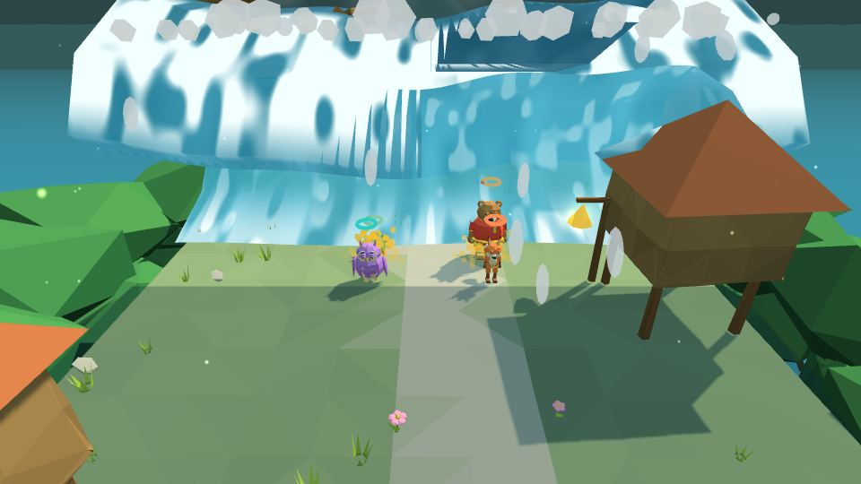
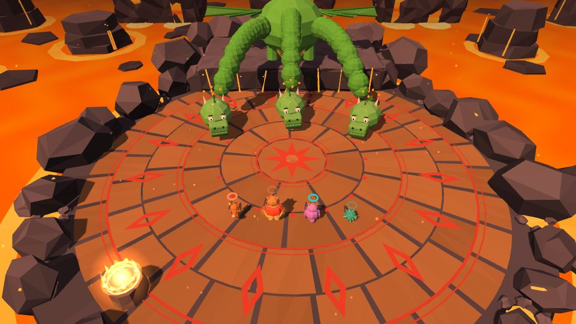
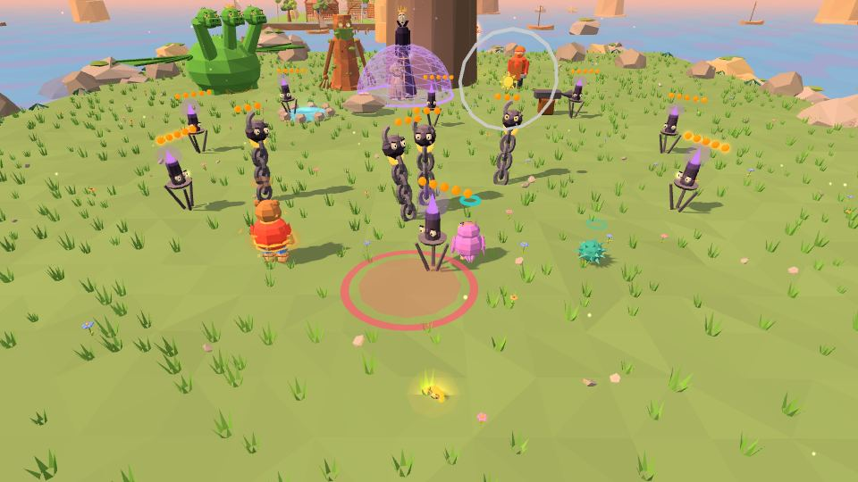

# Боссы

В конце каждого мира — босс. Боссы в «Златой цепи» не злодеи: это существа, которых закружил морок или обида. Победить — значит распутать, успокоить или договориться. У каждого босса над головой подсказка, что делать прямо сейчас.

| Мир | Босс | Уровень | Награда |
|---|---|---|---|
| 1 | 🌲 [Леший-Путаник](#-леший-путаник) | 1-Б | Сказ 1, первая цепь на дубе |
| 2 | 🌊 [Водяной](#-водяной) | 2-Б | Сказ 2 «Колокола Китежа» |
| 3 | 🐦 [Соловей-Разбойник](#-соловей-разбойник) | 3-Б | Сказ 3 «Соловьиная песня» |
| 4 | 🐉 [Змей Горыныч](#-змей-горыныч) | 4-Б | Горыныч — друг и ездовой змей, Сказ 4 «Одно сердце» |
| 5 | 💀 [Кощей Бессмертный](#-кощей-бессмертный-) | 5-Б1, 5-Б2 | Златая цепь, финал 🔒 |

Ворота к боссу открываются, когда Кузьма скуёт **12 звеньев** мира (на Буяне — 9 из 15 на терем). См. [[Экономика]].

---

## 🌲 Леший-Путаник

**Уровень:** 1-Б · **Мир:** [[Дремучий лес|Мир-1-Дремучий-лес]]

- **Руки-коряги**: защищайтесь и бейте; рука в Пробое ложится **мостиком** на плечо Лешего.
- **Двойники**: струна по ногам, настоящего Лешего видно **Совиным взором** [[Пелагеи|Пелагея]].
- **Карусель**: Богатырский щит, богатырский выход, **Богатырский мах** вдвоём.
- **Облик**: Леший ростом с ель — гнездо с птенцами на голове, рога с листьями, борода-мох; три удара по макушке сбивают их по одному, и он то удивляется, то обижается, то смущается. Руки-коряги — большие «пауки» от плеч Лешего, заливка круга на земле показывает, куда ударит ладонь. Арена меняется по этапам: сумерки, ночь со светляками, ярмарка с фонариками, рассвет; из-за ёлок выглядывают лешачата.
 

## 🌊 Водяной

**Уровень:** 2-Б · **Мир:** [[Подводный Китеж|Мир-2-Подводный-Китеж]]

Сначала — **погоня с валом** (≈190 м): деревня на сваях (котёнок едет до омута), дуб, мельница (Потап держит колесо), кувшинки в лад, ручей, развилка со шлюзом, камыш, лодка Садко и прыжок с обрыва.

Бой с дедушкой Водяным в четыре этапа:
1. **Сом-перевозчик** — сом бросается на мель, [[Прошка]] сбивает ус рогаткой, [[Потап]] тянет «раз-два-три».
2. **Водяные кони** — сыграл у раковины, конь замер, на него садится другой — на остров, удар по короне.
3. **Омут-зеркало** — Совиный взор, метка рогаткой, кувшинка-плот.
4. **Великий вал** — колокола Китежа на «БОМ!», вал расступается, общий удар.

В одиночку работает «оставленный держит». Колокола Китежа убаюкивают Водяного.
 

## 🐦 Соловей-Разбойник

**Уровень:** 3-Б · **Мир:** [[Небесное царство|Мир-3-Небесное-царство]]

Сначала — **подход «Прямоезжая дорожка»** (≈170 м): Соловей свистит издалека, свист сдувает стоящих на открытом — прячься за камни, деревья и за щит [[Потапа|Потап]]. Колода поперёк дорожки (Потап откатывает), травы-муравы (Йоша поливает тропку), мост из лепестков и мост из поклонившихся деревьев (после свиста), застава дочек-соловушек (Потап держит подворотню, подушки сбивает [[Прошка]]), тающие облачка, уступы дуба-сторожа и калитка в ободе гнезда.

Бой по былине — «свистит по-соловьиному, кричит по-звериному, шипит по-змеиному»; над Соловьём табличка «что делать сейчас»:
1. **Свист соловьиный** — белая волна (прыжок), синяя (за широкий щит Потапа); щёки дует — [[Йоша]] под щитом плещет ему в клюв. Второе дыхание: дуб кланяется — Йоша поливает корни, другой дёргает Соловья за хвост.
2. **Крик звериный** — ночь, звери-тени; свет пера одного и щит другого — «солнечный зайчик» в глаза, Соловей падает — в свете пера бей.
3. **Шип змеиный** — ветряные змеи, перья-стрелы, пике; Потап подкидывает друга в вихрь — родео на Соловье (наклоняйся против крена); мёртвая петля — колокол на «БОМ».
4. **Полный свист** — выдох (ветер к краю — за щит Потапа), вдох: Совиный взор [[Пелагеи|Пелагея]] видит золотой жёлудь, Прошка стреляет; три выстрела — три голоса, гнездо разматывается; Богатырский мах вдвоём.

В одиночку работает «оставленный держит». Потом Соловей разучился петь, и Пелагея подпевает ему в такт.
 

## 🐉 Змей Горыныч

**Уровень:** 4-Б · **Мир:** [[Огненная Смородина|Мир-4-Огненная-Смородина]]

- **Три головы — три запала**: левая сонная (медленный 🟡), правая голодная (🔴), средняя плюёт огнём (🔵).
- Пробой головы держится 12 секунд (на вдохе — 18): не погасили соседнюю — первая просыпается.
- После двух голов средняя рычит: по арене бегут лавовые трещины и бьют гейзеры.
- **Вдох**: головы втягивают искры; у средней — жёлудь для рогатки; сытую гасит Йоша; Совиный взор показывает слабое место.
- **Большой вдох** («Вдо-о-ох!») тянет всех к пасти — щит тянет слабее.
- **Узда** горячая: её несут двумя клещами с двух сторон и надевают «раз-два-три» вместе.

> «Ну, поймали. Уговор есть уговор — возить буду.»

Горыныч становится другом: возит героев на Буян и ведёт полёт в 5-3.
 

## 💀 Кощей Бессмертный 🔒

**Уровни:** 5-Б1 «Кощей в тереме», 5-Б2 «Кощей Бессмертный и Златая цепь» · **Мир:** [[Остров Буян|Мир-5-Остров-Буян]]

**5-Б1 «Кощей в тереме».** Вместо полоски босса — цель **«Выстоять»** (Кот заранее пишет на песке «В тереме — не победить»). Тени-двойники перенимают любимую защиту. Кощей поднимает иглу: 30 секунд закрываем Пелагею — он забирает тетрадку: «Не бойся. Я её не порву. Я хочу прочитать.»

**5-Б2 «Кощей Бессмертный и Златая цепь» — Битва с Кощеем.** Пролог — полёт на Горыныче «Через леса, через моря», затем двенадцать стадий в трёх актах:
- **Акт I · Чёрная строка** — 1. Чёрные свечи у Лукоморья · 2. Леший · 3. Видения и кудель Кикиморы;
- **Акт II · Неведомые дорожки** — четыре страницы-портала: 4. Избушка на курьих ножках · 5. Колокола и прилив · 6. Соловей и ветер на облаках · 7. Кузница и огонь; между ними — полёты домой на ступе Яги и на Горыныче;
- **Акт III · Там царь Кащей над златом чахнет** — 8. Ливень и похищение · 9. Витязи из моря · 10. Груды злата · 11. «Без имён» · 12. «Златая цепь на дубе том».

Друзья из прошлых миров приходят на помощь в совместных приёмах; Кот учёный держит цепь. **Подсказок в бою нет совсем** — ни карточек, ни значков, ни стрелок: как и в первой главе, всё понятно по тому, что происходит на поле. Озвучены пока не все реплики — остальные идут субтитрами.
 

## Как звучит бой с боссом
Перед боем — имя босса с узором и низкий гул, секунда тишины, и начинается тема. На каждом новом этапе — короткая музыкальная фраза,
тема становится выше и быстрее, вокруг босса меняют цвет искры. Когда босс открыт для удара, он светится золотом и тихо звякает.
Последний удар — замедление, тишина и колокольная россыпь.

