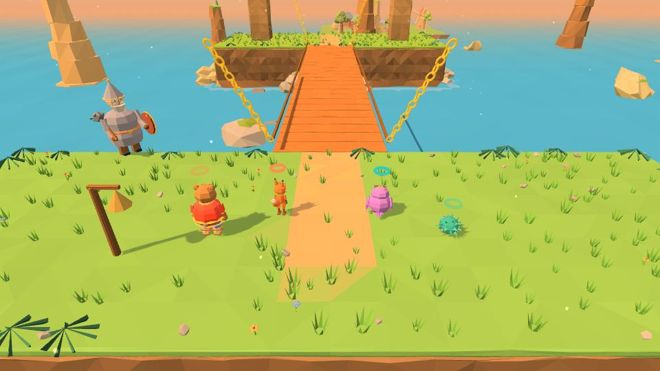

# Застава трёх богатырей

| 🛡️ **Застава** | |
|---|---|
| **Где** | у знака Заставы на [[Лукоморье]] |
| **Открывается** | за 2 самоцвета |
| **Испытаний** | 3 — по одному на богатыря |
| **Награда** | доспех богатыря в примерочной + лучшее время на табличке |

У каждого испытания одна цель — **«богатырское время»**. Уложился — получаешь доспех богатыря для героя (он навсегда ложится в примерочную, среди шапок), а Застава помнит лучшее время.

| Богатырь | Испытание | Суть |
|---|---|---|
| **Илья Муромец** | «Крен Калинова моста» | мост кренится к весу; Потап весит за троих; порывы ветра гасят переносом веса |
| **Добрыня Никитич** | «Семерых одним махом» | три волны мороков |
| **Алёша Попович** | «Колокольная перекличка» | запомнить порядок колоколов: низкие — удар, на башнях — рогатка |

## Советы
- **Илья**: держите Потапа в центре и переносите остальных навстречу крену.
- **Добрыня**: копите синюю шкалу на первых волнах — богатырский выход на последней.
- **Алёша**: проговаривайте порядок вслух — так запоминать вдвоём проще.
