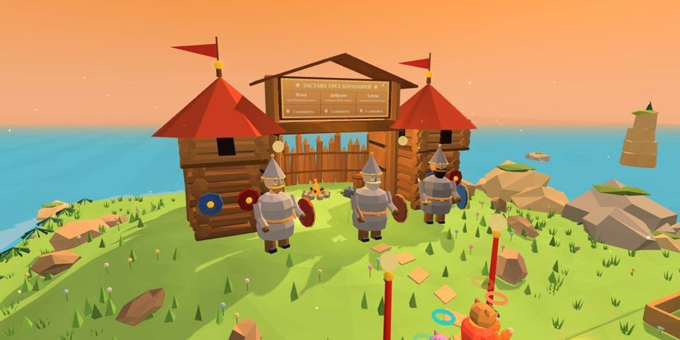

# Застава трёх богатырей

| 🛡️ **Застава** | |
|---|---|
| **Где** | на холме южного мыса [[Лукоморье]] — между лавкой Векши и курятником Рябы, к воротам ведёт тропа от лужайки |
| **Открывается** | за 2 самоцвета |
| **Испытаний** | 3 — по одному на богатыря |
| **Награда** | доспех богатыря в примерочной + лучшее время на табличке |

## Как выглядит Застава
Южный мыс острова поднимается холмом высотой 1,5 м; по склону от лужайки идёт тропа из плит. На холме — **срубные башни с шатровыми крышами**, **частокол**, **ворота** и **три богатыря** перед ними: Добрыня, Илья и Алёша. За воротами — двор с костром.

- **Ворота и фонари показывают состояние.** Пока нет двух самоцветов, ворота на засове, фонари серые, вымпелы тусклые. Хватает самоцветов (или испытание уже куплено) — створки распахиваются, фонари и костёр загораются, вымпелы краснеют, и во двор можно зайти.
- **Доска над воротами.** Для каждого богатыря: цена испытания (**2 самоцвета**), «открыто», **лучшее время** или «доспех ★». У ног богатыря с доспехом горит золотое кольцо, у богатыря с открытым испытанием — светлое.
- **Подойти к богатырям и нажать «удар»** — откроется меню испытаний. Подпись «Застава · испытания богатырей» видна издалека.
- Камера хаба смотрит с юга, поэтому с обычной камеры Заставу видно, только когда подходишь к ней; **правый стик** поворачивает камеру (одиночная игра — на полный круг), и холм с воротами хорошо виден с лужайки.

У каждого испытания одна цель — **«богатырское время»**. Уложился — получаешь доспех богатыря для героя (он навсегда ложится в примерочную, среди шапок), а Застава помнит лучшее время.

| Богатырь | Испытание | Суть |
|---|---|---|
| **Илья Муромец** | «Крен Калинова моста» | мост кренится к весу; Потап весит за троих; порывы ветра гасят переносом веса |
| **Добрыня Никитич** | «Семерых одним махом» | три волны мороков |
| **Алёша Попович** | «Колокольная перекличка» | запомнить порядок колоколов: низкие — удар, на башнях — рогатка |

## Советы
- **Илья**: держите Потапа в центре и переносите остальных навстречу крену.
- **Добрыня**: копите синюю шкалу на первых волнах — богатырский выход на последней.
- **Алёша**: проговаривайте порядок вслух — так запоминать вдвоём проще.
