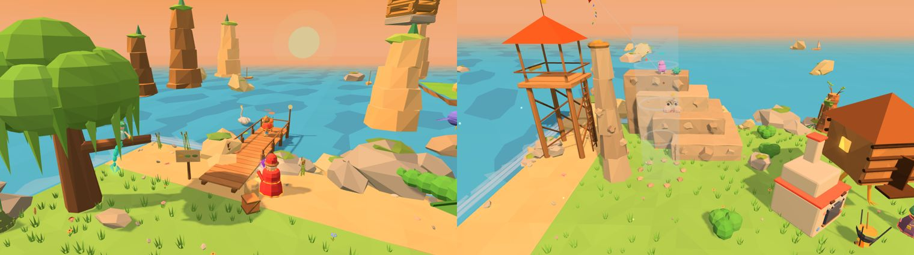

# Лукоморье

| 🌳 **Лукоморье** | |
|---|---|
| **Что это** | хаб игры: сюда герои возвращаются между уровнями |
| **Главное** | дуб и Златая цепь, Кот Учёный, карта-рушник |
| **Занятия** | кузня, лавка Векши, примерочная, огород, Курочка Ряба, Застава; у моря — рыбалка, загадки русалки, вышка-дозор, кухня Яги, воздушный змей |
| **Влияет на прохождение** | только кузня (звенья открывают боссов) — остальное для отдыха |

> *У лукоморья дуб зелёный; / Златая цепь на дубе том…*

## Карта местности
| Где | Что |
|---|---|
| в центре | **дуб** с Златой цепью и **Кот Учёный** |
| у моря | **волшебный стан** с картой-рушником |
| у моря слева | **причал Садко** (рыбалка), **ветла с русалкой** (загадки) |
| у моря справа | **вышка-дозор**, **Скала Ветрила** с восходящим потоком и шпилем, **избушка на курьих ножках** (кухня Яги) |
| справа от дуба | **кузня Кузьмы**, **лавка Векши**, **примерочная** |
| слева от дуба | **огород Дедки**, изба **Курочки Рябы** |
| на южном мысу | **[[Застава трёх богатырей|Застава-трёх-богатырей]]** — на холме 1,5 м: башни, частокол, ворота, три богатыря |

## 🗺️ Карта-рушник
Подойдите к волшебному стану и нажмите прыжок — раскатывается вышитая карта. На ней видно найденные звенья, орешки, самоцвет уровня и ворота босса с цепью. **← →** листают миры. Когда уровень выбран, вышитая картинка мира оживает, героев закручивает золотой нитью и уносит в неё. За самоцвет можно **вышить карту тайников** — над орешками уровня встанут столбы света.

## ⚒️ Кузня Кузьмы
Здесь звенья становятся цепью. [[Прошка]] бьёт три раза в такт, Кузьма поправляет каждый удар; от мира к миру Прошка куёт всё самостоятельнее. Каждое скованное звено ложится на цепь на дубе, дуб зеленеет, а Кот сидит на цепи там, докуда она скована. **12 звеньев мира** открывают ворота к боссу («Не лупи. Слушай металл.»).

## 🐿️ Лавка белки Векши
Герой стоит на подиуме и вращается, а справа — прилавок с вкладками **«Шапки · На шею · За спину · Наряды · Пляски · Лукоморье»**. Пока товар выбран, он уже надет — вещь видно до покупки. Купленное хранится **на всю игру**, даже после «Новой игры».

| Раздел | Что | Сколько |
|---|---|---|
| Шапки | в том числе три доспеха богатырей с Заставы | 13 |
| На шею | | 4 |
| За спину | крылья бабочки трепещут на ходу | 5 |
| Наряды | | 5 |
| Пляски | «Барыня», «Берёзка», «Бурлацкая», «Змейка», «Калинка» — на «Ко мне!» | 5 |
| Лукоморье | фонарики на дубе, клумба, качели, флажки, самовар у Кота, ступа-санки, фоторежим «Лубок» | 7 |

Часть товаров открывается после уровней: гусли после 2-1, венок после 3-1, треуголка после 3-4, овечья шкура после 5-1… На закрытой карточке — замок и подпись, где взять.

**Управление в лавке:** ← → вкладка, ↑ ↓ товар, прыжок — купить/надеть, Смена — другой герой, свой приём — «Лавка / Гардероб», защита — выйти.

## 👗 Примерочная
Меню без покупок: шапка, на шею, за спину, наряд, пляска. ← → перебирают купленное, у каждого из четверых свой наряд. Свой приём — **«Сюрприз!»**: случайный наряд из того, что уже есть.

## 🥕 Огород Дедки
Четыре грядки и бочка с лейкой. Семена: **морковка, горох, подсолнух, репка**. Политое семечко сразу проклёвывается, дальше растёт на стадию за каждый поход в уровень — если перед походом полили (над сухой грядкой — капля, над спелой — звезда).

| Урожай | Орешки |
|---|---|
| морковка, горох | 2 |
| подсолнух | 3 |
| репка | 8 |

**Репку тянут всем миром**: четверо цепочкой «дедка за репку», оба игрока жмут удар в долю. Три дружных рывка — репка вытянута.

## 🐔 Курочка Ряба
Носите зерно из мешка, сыпьте курочке, гладьте её. Сытая и довольная курочка после похода несёт яйцо — каждое третье **золотое**; иногда вылупляется цыплёнок (до четырёх). Яйца — за орешки: 2 за простое, 6 за золотое. Когда в гнезде золотое яйцо, к нему бежит **мышка** — шугните её (+1 орешек).

## 🐈 Кот Учёный
За [[самоцветы|Экономика]] Кот рассказывает **сказки-лубки** про героев мира и **пляшет на цепи**. Первой строкой в его меню — **«Наши сказки»**: книга сказов, которые герои сложили сами (см. [[Сказы и концовки|Сказы-и-концовки]]). На поляне у дуба стоят помощник последнего сказа и сувениры всех сказок.

Остров раздвинут вширь: в двух углах у моря — пять новых занятий. Всё необязательно, приносит орешки и пополняет лукошко для кухни Яги. Рыба, грибы и ягоды копятся в общем **лукошке**: рыба — с причала, грибы — под деревьями (после похода вырастают в новых местах), ягоды — на кустах у Скалы Ветрила (после похода — снова).

## 🎣 Причал Садко
Деревянный причал уходит в море; у входа — доска **«Рыбий альбом»**, после 2-1 на берегу стоит **Садко** с гуслями и подыгрывает. В воде у причала всё время плавают **тени рыб**: мелочь — у самого причала, крупные — подальше, тень **Золотой рыбки** (после 2-3) — с блёстками. На краю причала удар — рыбалка:
1. **Заброс.** Камера сверху: стрелками водить кружок по воде (← → — левее/правее, ↑ ↓ — дальше/ближе), удар — закинуть туда, где тень.
2. **Ждём.** Рыба подплывает и трогает поплавок раз-другой («Трогает… не спеши!») — подсечёшь раньше, спугнёшь. Прыжок — подёргать поплавок: тени рядом подплывут. Удар, когда никто не трогает, — перезакинуть.
3. **Клюёт!** Поплавок ныряет, камера наезжает — удар, пока не сорвалась.
4. **Вываживание.** Справа — шкала **лески**: держать удар — подматывать (леска натягивается), отпускать, когда она в красном («Леска звенит!»); долго в красном — **леска лопнет** (мелочь не порвёт). Рыба рвётся вбок — стрелка «рыба рвётся влево» — тянуть **в другую сторону**. Средние и крупные **выпрыгивают** — прыжок в этот миг подсекает и отнимает у рыбы силы. Свежая крупная рыба у причала **рвётся прочь** — её надо утомить (шкала «силы рыбы»).
5. **Подсачек.** У причала вокруг рыбы сжимается кольцо — удар, когда оно маленькое (вдвоём — любой из двоих). Промахнулся трижды — рыба вырвалась ещё на пару метров.
6. Герой показывает улов: **вес** и рекорд в альбоме.

| Тени | Улов | Вес | Орешки |
|---|---|---|---|
| мелкие, у причала | ёрш, пескарь | до 200 г | 1 |
| средние | карась, окунь, лещ (после 2-1) | до 2 кг | 2–3 |
| крупные, вдали | щука, сом (после 2-3), осётр (после 2-Б) | до 15 кг | 4–6 |

Каждая рыба — страница альбома и рыба в лукошко для кухни Яги; новый рекорд веса — +1 орешек. **Золотая рыбка**: «Чего тебе надобно?» — **лукошко орешков** (+10), **обновка из лавки** даром или **«плыви на волю»** (+3, и рыбка станет заплывать чаще).

## 🧜 Русалка на ветвях
На ветле у берега сидит русалка, чешет косы золотым гребнем. Под ней удар — **три загадки** подряд, у каждой три ответа. Угадали сразу — 2 орешка, со второй попытки — 1 (неверный ответ зачёркивается). Загадок три десятка — народные («Сидит дед, во сто шуб одет…», «Красна девица сидит в темнице…»); на загадки про лису, медведя, ежа и сову откликаются Прошка, Потап, Йоша и Пелагея.

## 🔭 Вышка-дозор и «Книга невиданных зверей»
У вышки удар — герой взбирается наверх и смотрит в **подзорную трубу**: направления — водить трубой, держать удар — приблизить, прыжок — книга, защита — слезть. Наведите перекрестие на зверя и подержите — **зарисовано**: первая встреча +3 орешка и страница книги, потом +1 раз за поход. **Совиный взор** (свой приём, после 1-4) на 3 секунды обводит всех, кто прячется. Звери появляются по мере сказки и после каждого похода перебираются на новые места.

| Зверь | Где искать | Появляется |
|---|---|---|
| Заяц-побегаец, Уточка | в траве, на воде | сразу |
| Колобок | катится по песку | после 1-3 |
| Кикимора | в камышах | после 1-5 |
| Леший | за деревьями | после 1-Б |
| Чудо-юдо Рыба-кит | далеко в море — фонтан | после 2-2 |
| Жар-птица | на крыше | после 3-1 |
| Пушок-ягнёнок | на лугу, на скале | после 3-2 |
| Сирин | на морском камне | после 3-3 |
| Гуси-лебеди | в небе над морем | после 3-5 |
| Змей Горыныч | высоко в небе | после 4-Б |
| Царевна-Лебедь | у причала | после 5-1 |

Книгу можно открыть и внизу — у пюпитра возле лестницы.

## 🏚️ Избушка на курьих ножках: кухня Яги
После каждого похода избушка стоит **к лесу передом, к вам задом**. Удар у крыльца — «Избушка, избушка! Встань к лесу задом, ко мне передом!» — и она поворачивается, топая курьими ногами (в первый раз +2 орешка). Выходит Баба Яга: на костре котёл, удар — **кухня**. Выбрали блюдо — варим: **← →** по очереди мешают, а когда огонёк сжимается — удар, «поддать жару» (три раза). Получается от одной до трёх звёзд: чем больше, тем больше орешков.

| Блюдо | Что нужно | Орешки |
|---|---|---|
| Каша из топора | топор (один раз — как в сказке) | 3 |
| Уха | 2 рыбы | 5 |
| Грибная похлёбка | 2 гриба | 4 |
| Ягодный кисель | 2 ягоды | 4 |
| Рыбник | рыба и гриб — печёт Печка (после 3-5) | 7 |
| Пирог с ягодами | 3 ягоды — печёт Печка (после 3-5) | 7 |

Сварили все шесть — Яга дарит лукошко орешков (+10).

## 🪁 Скала Ветрила
Каменная скала ступенями — на неё запрыгивают. На камне лицо **Ветра-Ветрила**: после 3-2 оно просыпается и дует.
- **Воздушный змей**: на вершине удар. ← → ведут змея, прыжок или удар — подёрнуть вверх; порывы ветра сносят вбок (стрелки «ветер →»). За 40 секунд провести змея сквозь **6 облачков** — по орешку за каждое и +3 за все. После первого полёта змей так и реет над скалой.
- **Восходящий поток** у подножия: кто в него шагнёт, того поднимает до верхушки **шпиля**; на шпиле **гнездо** — +3 орешка, раз за поход. Со шпиля можно спрыгнуть на площадку вышки, а Пелагея спланирует.

## Почему так устроено
Хаб собран по лучшим детским играм: огород растёт от похода к походу, как в *Animal Crossing*; курочка — живой питомец, как в *Tamagotchi*; одежда как самовыражение, как в *Super Mario Odyssey* и *Toca Boca*; репка вдвоём — как мини-игры *It Takes Two*. Всё необязательно и не влияет на прохождение.
