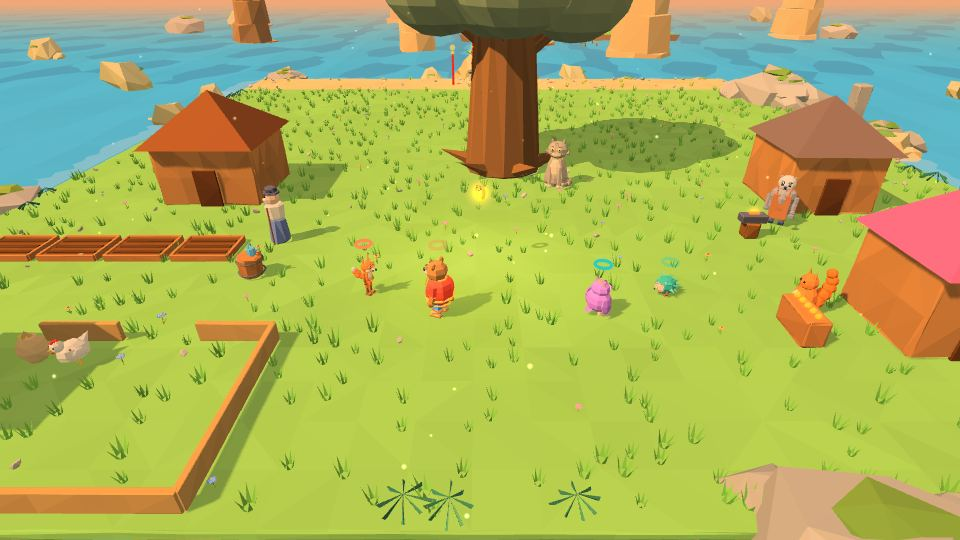

# Лукоморье

| 🌳 **Лукоморье** | |
|---|---|
| **Что это** | хаб игры: сюда герои возвращаются между уровнями |
| **Главное** | дуб и Златая цепь, Кот Учёный, карта-рушник |
| **Занятия** | кузня, лавка Векши, примерочная, огород, Курочка Ряба, Застава |
| **Влияет на прохождение** | только кузня (звенья открывают боссов) — остальное для отдыха |

> *У лукоморья дуб зелёный; / Златая цепь на дубе том…*

## Карта местности
| Где | Что |
|---|---|
| в центре | **дуб** с Златой цепью и **Кот Учёный** |
| у моря | **волшебный стан** с картой-рушником |
| справа от дуба | **кузня Кузьмы**, **лавка Векши**, **примерочная** |
| слева от дуба | **огород Дедки**, изба **Курочки Рябы** |
| на южном мысу | **[[Застава трёх богатырей|Застава-трёх-богатырей]]** — на холме 1,5 м: башни, частокол, ворота, три богатыря |

## 🗺️ Карта-рушник
Подойдите к волшебному стану и нажмите прыжок — раскатывается вышитая карта. На ней видно найденные звенья, орешки, самоцвет уровня и ворота босса с цепью. **← →** листают миры. Когда уровень выбран, вышитая картинка мира оживает, героев закручивает золотой нитью и уносит в неё. За самоцвет можно **вышить карту тайников** — над орешками уровня встанут столбы света.

## ⚒️ Кузня Кузьмы
Здесь звенья становятся цепью. [[Прошка]] бьёт три раза в такт, Кузьма поправляет каждый удар; от мира к миру Прошка куёт всё самостоятельнее. Каждое скованное звено ложится на цепь на дубе, дуб зеленеет, а Кот сидит на цепи там, докуда она скована. **12 звеньев мира** открывают ворота к боссу («Не лупи. Слушай металл.»).

## 🐿️ Лавка белки Векши
Герой стоит на подиуме и вращается, а справа — прилавок с вкладками **«Шапки · На шею · За спину · Наряды · Пляски · Лукоморье»**. Пока товар выбран, он уже надет — вещь видно до покупки. Купленное хранится **на всю игру**, даже после «Новой игры».

| Раздел | Что | Сколько |
|---|---|---|
| Шапки | в том числе три доспеха богатырей с Заставы | 13 |
| На шею | | 4 |
| За спину | крылья бабочки трепещут на ходу | 5 |
| Наряды | | 5 |
| Пляски | «Барыня», «Берёзка», «Бурлацкая», «Змейка», «Калинка» — на «Ко мне!» | 5 |
| Лукоморье | фонарики на дубе, клумба, качели, флажки, самовар у Кота, ступа-санки, фоторежим «Лубок» | 7 |

Часть товаров открывается после уровней: гусли после 2-1, венок после 3-1, треуголка после 3-4, овечья шкура после 5-1… На закрытой карточке — замок и подпись, где взять.

**Управление в лавке:** ← → вкладка, ↑ ↓ товар, прыжок — купить/надеть, Смена — другой герой, свой приём — «Лавка / Гардероб», защита — выйти.

## 👗 Примерочная
Меню без покупок: шапка, на шею, за спину, наряд, пляска. ← → перебирают купленное, у каждого из четверых свой наряд. Свой приём — **«Сюрприз!»**: случайный наряд из того, что уже есть.

## 🥕 Огород Дедки
Четыре грядки и бочка с лейкой. Семена: **морковка, горох, подсолнух, репка**. Политое семечко сразу проклёвывается, дальше растёт на стадию за каждый поход в уровень — если перед походом полили (над сухой грядкой — капля, над спелой — звезда).

| Урожай | Орешки |
|---|---|
| морковка, горох | 2 |
| подсолнух | 3 |
| репка | 8 |

**Репку тянут всем миром**: четверо цепочкой «дедка за репку», оба игрока жмут удар в долю. Три дружных рывка — репка вытянута.

## 🐔 Курочка Ряба
Носите зерно из мешка, сыпьте курочке, гладьте её. Сытая и довольная курочка после похода несёт яйцо — каждое третье **золотое**; иногда вылупляется цыплёнок (до четырёх). Яйца — за орешки: 2 за простое, 6 за золотое. Когда в гнезде золотое яйцо, к нему бежит **мышка** — шугните её (+1 орешек).

## 🐈 Кот Учёный
За [[самоцветы|Экономика]] Кот рассказывает **сказки-лубки** про героев мира и **пляшет на цепи**.

## Почему так устроено
Хаб собран по лучшим детским играм: огород растёт от похода к походу, как в *Animal Crossing*; курочка — живой питомец, как в *Tamagotchi*; одежда как самовыражение, как в *Super Mario Odyssey* и *Toca Boca*; репка вдвоём — как мини-игры *It Takes Two*. Всё необязательно и не влияет на прохождение.
