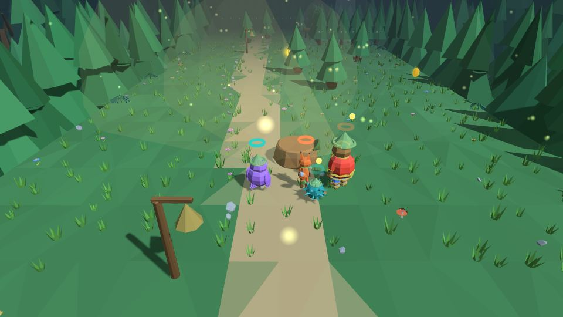
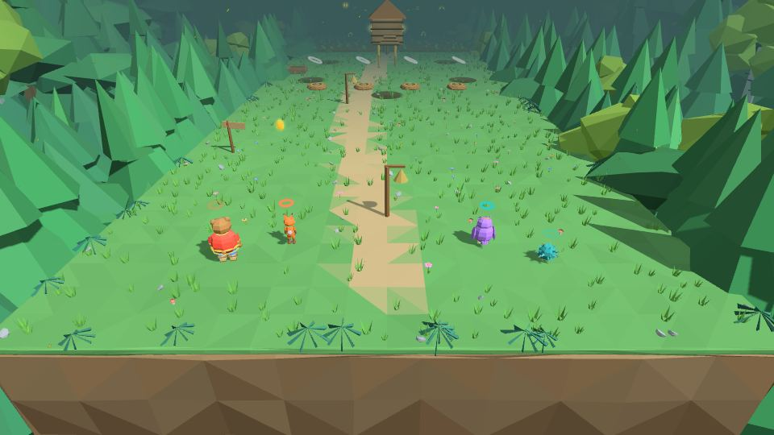
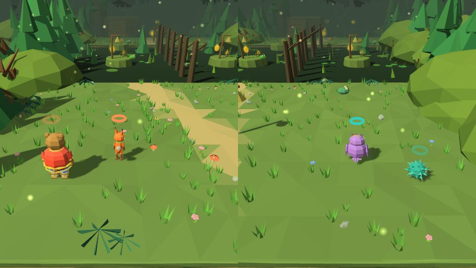
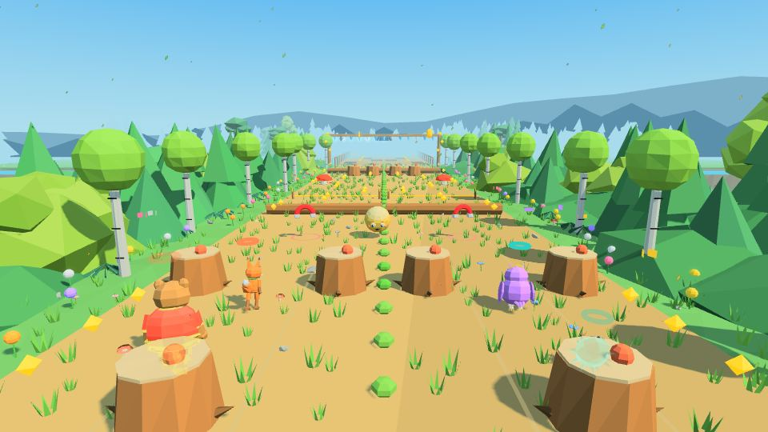
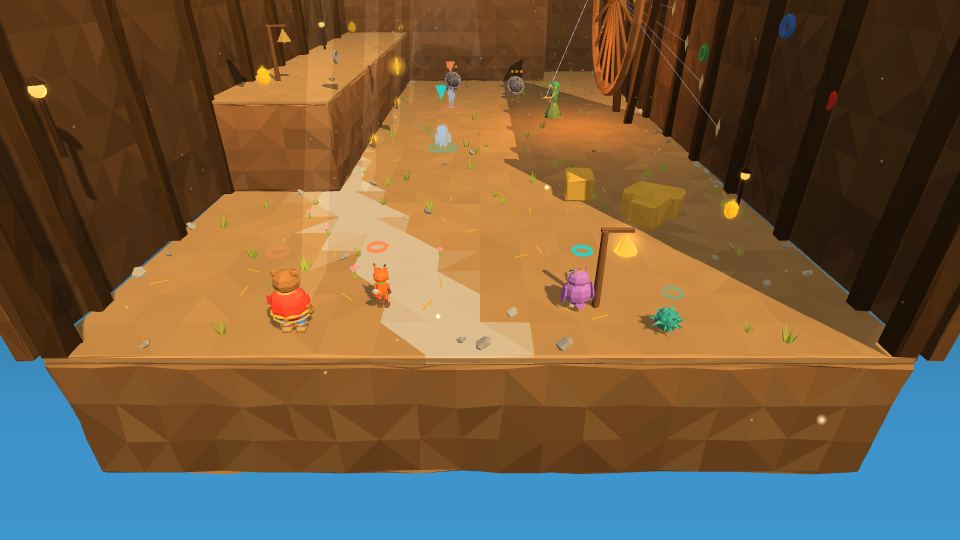
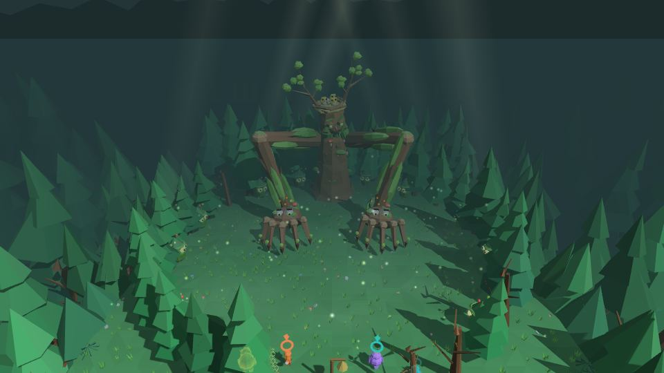

# Мир 1 · Дремучий лес

| 🌲 **Дремучий лес** | |
|---|---|
| **Чудо-вещь** | 🧶 [клубок-путеводитель](Чудо-вещи#-клубок-путеводитель) |
| **Уровни** | 1-1 · 1-2 · 1-3 🎵 · 1-4 · 1-5 · 1-Б 👑 |
| **Звенья** | 19 (ворота к боссу — 12 скованных) |
| **Босс** | Леший-Путаник |
| **Особый морок** | Тать-Паутинник (1-2) |
| **Цвет вышивки** | зелёный |

Лес, где ёлки ходят, пока на них не смотрят, а в избушке на курьих ножках живёт Баба Яга. Звенышко ведёт героев и подсказывает.

---

## Версия мира 1 для детей 7–11 лет
Пролог и уровни 1-1 … 1-Б мягче, чем остальные миры (подробности — `zlataya_cep/docs/27_kids_world1.md`):
- **Лёгкий путь** в этом мире: вспышка до удара 0,9 с (в остальных мирах 0,7), окно отбива 0,40 (0,35), Пробой 9 с (6), красный знак — кувырок — идёт в 1,5 раза дольше, а кувырок за 0,8 с до удара засчитывается. На **Среднем** — Пробой 5 с и красный знак на 20 % дольше.
- **Подсказки и баннеры** остаются на экране в 2,5 раза дольше; **помощь по задаче** приходит быстрее (ореол цели — через 10 секунд на Лёгком, 13 на Среднем, а не через 20; призрачный показ — через 20 / 27, а не через 40).
- **Задачи читаются вслух** записанным голосом (Байя; около 770 записей, включая уроки боссов, русский голос в системе не нужен; голоса браузера в игре нет, текст без записи не читается): каждая — один раз; **H** или **LB** — «Повтори»; выключается в меню паузы. В мирах 2–5 чтение вслух включается пунктом «Читать во всех мирах» (авто — если кто-то идёт Ёжиком или Лисёнком).
- В мирах 2–3 эти настройки сходят плавно — см. [[Бой]]; в мирах 4–5 их нет.
- Над **активным героем** — стрелка цвета игрока.
- Упавший игрок видит подсказку «Ты отдыхаешь — не страшно!».
- **1-3 «Колобок»**: окно попадания в долю ±0,20 с на Лёгком и ±0,12 с на Среднем (было ±0,15 и ±0,10); богатырский — как был.
- **1-1**: калитка остаётся открытой, как только две лапки подержали вместе секунду.

---

## 1-1 «Избушка, повернись»

**Звенья:** 4 · **Новое:** пеньки, кикиморки, клубок

- **Пеньки «на раз-два-три»** — прыгают вместе.
- **Кикиморки** — жёлтый сигнал и отбив (см. [[Бой]]).
- **Уборка двора**: кикиморки намусорили — девять вещей несут в одну кучу (рыбьи кости, огрызок, битый горшок, дырявое ведро, тряпка, лапоть, сломанная ложка, гнилая капуста — каждая лежит на грязном пятне, над ней вьются мухи и тянется зелёный дымок; подобранное остаётся лежать в куче); **корыто** поднимают только вдвоём. За чистый двор Яга дарит каждому **клубок-путеводитель**.
- **Нить-тропка** через засаженные грядки (пешком не пройти — вязкая земля выталкивает обратно), нить к нити, подкидка Потапа.
- **Финал — калитка-упрямица**: четыре плиты, две снаружи и две внутри; калитка открыта, пока нажаты обе наружные или обе внутренние. Если две лапки подержать вместе секунду, калитка **остаётся открытой насовсем** — расставлять всю четвёрку по очереди не нужно (хватает «оставленный держит»: один игрок ставит героя на лапку, меняет героя и встаёт на другую). У калитки, пока оба героя здесь, **экран не делится** — обе лапки и калитка в одном кадре.
- Ролик «Яга ставит задачу» — шесть планов: наезд на дверь, Яга крупно, двор с лужами, Прошка, Яга поверх очков, кикиморки.
 

## 1-2 «Кикиморино болото»

**Звенья:** 4 · **Новое:** струны на колышках, кувырок, Тать-Паутинник · самый длинный уровень мира (360 м)

- **Струна на колышке** висит, пока её не смотаешь; с высокой ветки по струне съезжают, повиснув.
- **Толстую струну** держит только [[Потап]]: тонкая нить тонет в трясине в 3,5 м от берега, а в тумане Пелагее не спланировать.
- **Кувырок** — новый приём.
- **Тать-Паутинник** грызёт пустую струну: встань на неё — отступит.
- **«Журавль и Цапля»**: гать из четырёх струн между избушками; на кочках — три Паутинника.
- **Огоньки-обманщики** в тумане: рогатка по огоньку — ложный лопается «Хи-хи!», настоящий поднимает тропу. Нить над туманом тонет («Буль!»): перебросить её через трясину нельзя, только тропа из кочек. Подсказка второго игрока по ходу: «жди», пока Прошка щёлкает огонёк; тропа открыта — «прыгай по кочкам»; неполитая засохшая кочка — «полей» (она на второй и четвёртой тропе).
- **«Царевна-лягушка»**: Прошка сбивает стрелу Ивана-царевича — кувшинки всплывают в лад «Ква!»; завядшую оживляет Йоша.
- **Бесёнок Балды** зовёт наперегонки вокруг омута — бегом не обогнать, но можно хитростью: струна через омут или «братишка» у флажка. Потом «подними-ка кобылу» — колоду поднимает Потап.
- **Живое болото**: чудо болотное у гати выталкивает со струны (щит держит), лягушки, камыш, кувшинки.
 

## 1-3 «Колобок» 🎵

**Звенья:** 3 · **Тип:** гусельный раннер в пяти частях

У каждого игрока три дорожки, тропинка бежит сама. Струны поперёк тропы подкидывают, если прыгнуть под бубенец; звери выкатываются на дорожку — щит в такт; «Лад» подряд — искры ×2 и ×3.

| Часть | Темп | Что там |
|---|---|---|
| Солнечная опушка | 96 | коряги, подкова-магнит, гриб-прыгун |
| Через речку | 104 | дыры в мосту, бочки, перо — гусь несёт по искрам |
| Лисья тропа | 112 | лиса сзади: три спотыкания — стащит пять искр |
| Волчья чаща | 116 | бой на бегу: волк (уйти), медведь (щит в такт), кабан (прыжок), вожак — щит вдвоём |
| Гуси-лебеди | 120 | полёт над долиной, ворона, коршун, гроза |

**Финал** — пляска на гуслях в три стадии: «раз-два», «перекличка», «хоровод». Не взял звено части и промахнулся — часть повторяется.
 

## 1-4 «Леший водит»

**Звенья:** 4 · **Орешки:** 7 · **Новое:** ходячие ёлки, Совиный взор, «Ау!», мини-босс Аука

- **Ёлки ходят, пока на них никто не смотрит**; луч светлячка есть и у оставленного героя.
- Ролик: ели смыкаются вокруг Пелагеи — из кольца она держит тропу взглядом.
- Йоша поливает ель-замок, Прошка сбивает три замка-шишки — каждую со своего следа.
- Ель привязывается клубком у колышка. На своей поляне Леший кричит «А ну-ка, найдите меня!» и убегает в ёлки: **Совиный взор** показывает и его, и серебряную тропу к нему; нить по серебру, и за настоящим проходом — «Ай! Нашли меня, ишь!».
- **«Друг за друга»**: две тропки за низкой изгородью. Ёлки своей тропки твой взгляд не держит — только взгляд с другой тропки: один стоит у изгороди и смотрит на тропку друга, другой бежит, потом меняются. В одиночку — оставь героя лицом к другой тропке.
- **«Хоровод ёлок»**: три кольца ёлок кружат вокруг пня со звеном. Ёлки держатся за руки лентами — между ними не пролезть никому, даже Йоше; вход — только **золотые воротца**. Глянешь на кольцо — оно замирает (ленты в инее), дальние кольца за ним кружат. Пройди в воротца замершего кольца — оно встанет насовсем (ленты золотые); дошёл до пня — хоровод кланяется и открывает выход.
- **«Леший водит по кругу»**: поляна-петля. Встань на пень-эхо и аукни (кнопка «Ко мне!» здесь — **«Ау!»**): настоящий выход откликается золотым огоньком — беги туда, пока горит. Ложный проход возвращает к пню. Три поляны подряд — и круг разорван; со второй поляны по тропе ходят ёлки, а пустые проходы отвечают серым эхом. В одиночку оставленный на пне герой аукает сам.
- **Мини-босс Аука-Перекличка** — пузатый лесной дух в шапке-мухоморе. Этап 1 «Где я?»: прячется в одном из четырёх дупел — аукни, настоящее дупло отзовётся золотом; выскочил — отбей синий «ау-шар» щитом в последний миг (оглушён — бей) и сойди с красной дорожки листа-бумеранга. Этап 2 «Подголоски»: зовёт лешачат, с боков сходятся стены ходячих ёлок — один держит стену взглядом, другой распутывает лешачат. Этап 3 «Большое АУ!»: топот — по земле бежит белое кольцо (прыгай); надул щёки — встаньте на два пня-эхо и аукните разом, или прячьтесь за Широкий щит Потапа. В одиночку: стену держит оставленный герой, на «большое АУ» его оставляют на одном пне — он аукнет вместе с тобой; враги в одиночке бьют только того, кем играешь. В конце Аука признаётся, что с ним никто не перекликался, и ведёт героев к выходу. Голос Аука — своя запись (Piper).
 

## 1-5 «Кикиморина прялка»

**Звенья:** 4 · **Новое:** паутинка, мотовило, ткацкий стан, сторожевые нити · **Мини-босс:** Веретенник

Подворье Кикиморы из пяти частей, путь около 120 м:
- **Сени-мотальня.** Кикиморки-прядильщицы и **мотовило-противовес**: две площадки на одной нити. Стоят на обеих — кто тяжелей, тот вниз, другой — вверх, на полати (Потап весит за двоих; поровну — стоят). Наверху клубок на мотовило — нить наматывается и поднимает оставшегося.
- **Ткацкая.** Через провал ткут мост: один стоит на **подножке** (зев открыт), второй бросает клубок-челнок в зев — пять полос, и полотно-мост готово.
- **Овин.** **Паутинка** из двух струн крест-накрест: в кольцах стоят контуры — кто куда встаёт, точки показывают бросок, дуга — прыжок; паутинка сама несёт на следующий этаж. **Прялка** утягивает струны — жёлудь в веретено или старая нить через Совиный взор. На чердаке веретено вырывается у Кикиморы и улетает на повить.
- **Сушильня.** **Сторожевые нити** видны только Совиным взором (вблизи чуть мерцают): низкую — перепрыгнуть, высокую — обойти в просвет (Йоша пролезает под ней). Задел — «дзынь», с потолка падает нитяной морок. Дверь открывает засов на двоих: обе плиты разом. Пока оба героя в сушильне, **экран общий** — обе плиты засова и дверь в кадре.
- **Повить — мини-босс Веретенник** (два этапа). Кокон из чёрной кудели не пробить: две струны в колышки крест-накрест — паутинка; встань за ней, и Веретенник влетит в неё рывком — кокон слетит, острие засветится (≤ 3 удара за окно, с паутинки сверху — вдвое). Красная дорожка — рывок: кувырок в сторону, а Прошка рогаткой в острие сбивает разгон. Белая низкая нить метёт по кругу — прыжок. После рывка остаётся липкая кудель — по ней медленно. Этап 2: нитяные мороки и **три веретена** — настоящее в золотом кольце видно Совиным взором.
- Камера: стены подворья не пускают камеру наружу при вращении.
 

## 1-Б «Леший-Путаник» 👑

Руки-коряги, двойники и карусель с Богатырским махом. Подробно — **[Боссы](Боссы#-леший-путаник)**.

**После босса**: праздник и **Сказ 1** (Игрок 2 выбирает начало, Игрок 1 — помощника, конец — вдвоём), Кузьма вешает на дуб первую цепь, ролик **«Голос»** 🔒.
 

---
← [[Пролог]] · [[Миры]] · [[Мир 2 · Подводный Китеж|Мир-2-Подводный-Китеж]] →
