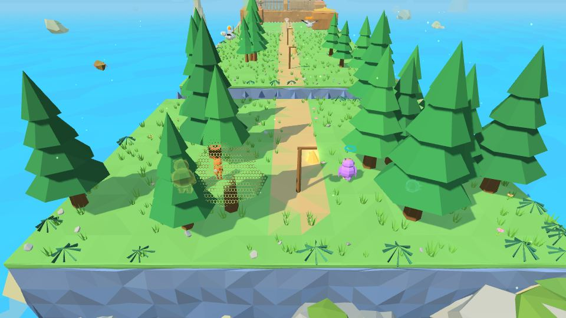
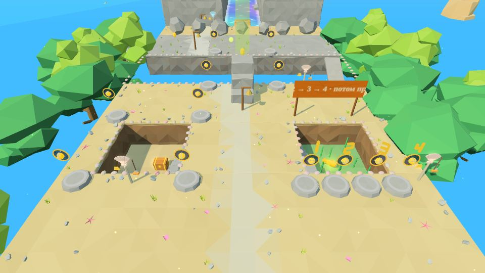
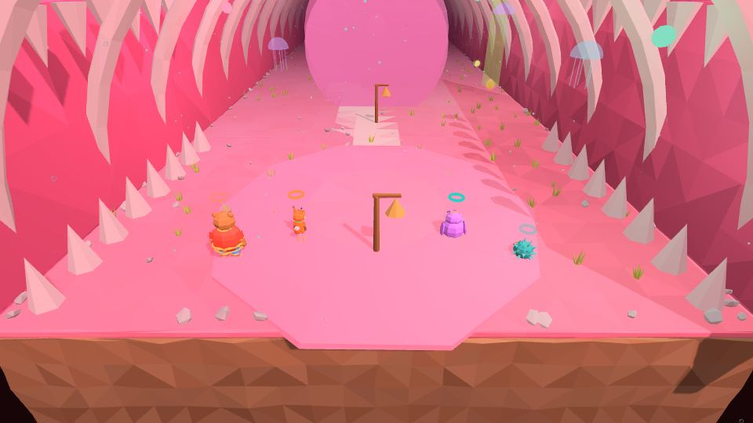
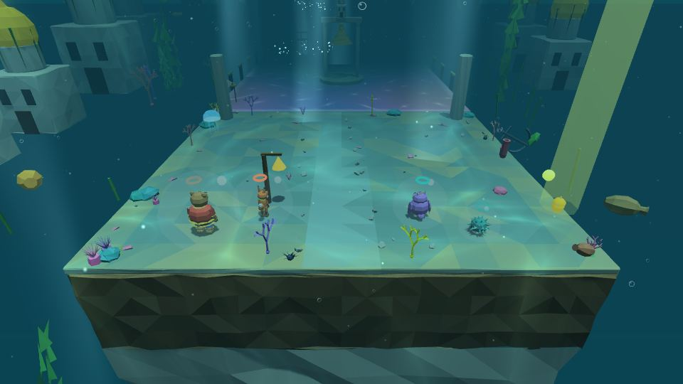

# Мир 2 · Подводный Китеж

| 🌊 **Подводный Китеж** | |
|---|---|
| **Чудо-вещь** | 🎼 [гусли Садко](Чудо-вещи#-гусли-садко) — прилив ↔ отлив |
| **Уровни** | 2-1 · 2-2 · 2-3 👥 · 2-4 · 2-5 · 2-Б 👑 |
| **Звенья** | 20 |
| **Босс** | Водяной |
| **Особый морок** | Тягун (2-5) |
| **Весточка помощника** | из Сказа 1: светлячок Лешего, ступа Яги или пружинка Колобка |
| **Цвет вышивки** | синий |

В этом мире Ёжик и Лисёнок играют по смягчённым окнам (замах 0,82 с, отбив 0,38, Пробой 8 с; подсказки в 2,2 раза дольше) — см. [[Бой]]; у длинных задач над полным текстом есть крупная короткая строка (≤ 12 слов), её же читает голос.

Город на дне озера, который «забыл звонить». Перед первым походом Пелагея читает по тетрадке, шёпотом: «Кот говорил: под водой есть город…». Во всём Китеже стены между камерой и героем становятся прозрачными.

---

## 2-1 «Гусли Садко»

**Звенья:** 4 · **Новое:** гусли, прилив и отлив, щуки

- Идём по дну в пузырях воздуха. Йоша сращивает мёртвой водой струну Садко — и Садко дарит **гусли** («Только в Китеже не молчите»).
- Звено на столбе фонтана достают приливом. Ролик «Пустая книга»: переплёт без страниц, на корешке «Не про меня».
- У каждого своя сторона улицы: в прилив лодки всплывают до крыш, в отлив открываются подвалы с орешками; в доме-колодце вода работает как **лифт**.
- У каждой воды стоит **мерная рейка**: синяя метка — прилив, жёлтая — отлив, поплавок держится на глади. Рейка воды, которую сейчас поменяют гусли героя, мигает золотом.
- **Щуки-мороки** пускают синие пузыри — отбил пузырь, и щука «сама себя». В правом канале Переливной улицы щука охотится на любого героя, что зашёл в её воду, — в одиночной игре тоже.
- Порядок участков — от простого к парному. Сначала **шлюзы**: две ступени воды, каждую поднимаешь приливом сам, сверху лестница вниз. Потом **Переливная улица**: вода в двух каналах одна, Потап держит заслонку на дне, прилив у одного — отлив у другого.
- Дальше: **торговые ряды** (Жемчужница в пруду — отлив), Звонкая мостовая, палаты Морского царя, **две раковины** (левой — прилив, правой — отлив, одновременно), сад Китежа и **Рак-Отшельник**.
- **Оставленный держит.** Сменил героя — прежний остаётся и делает своё: Потап держит заслонку, гусляр доигрывает напев 15 секунд. Над доигрывающим — круг-таймер с секундами. В палатах царя это показывают в ролике: призрак играет первый голос, герой сменён — оставленный играет сам, второй идёт ко второму стулу.
- **Ворота Китежа.** Рак срезал водоросли, и за аркой виден сам город: купола зажигаются один за другим, колокола вызванивают напев Садко. После ролика уровень пройден.
  - Бой с Раком — два этапа, сверху полоса «Рак-Отшельник · этап N / 2»: 1) сыграть на гуслях у ракушки-музыкалки, рак заслушается — Потап вытягивает его из раковины; 2) рак без домика удирает: зажать с двух сторон, песок отбивать щитом, зарывшегося находит Совиный взор Пелагеи. Подсказки короткие («Рак пляшет — бей F!»).
 

## 2-2 «Чудо-юдо Рыба-кит»

**Звенья:** 4 · **Новое:** общая вода

- Потап забыл былину; деревня на спине кита.
- **Вода общая**: гусли кладут над раковиной просьбу с мордочкой героя; через 2 секунды вода меняется у обоих (или сразу, если друг сыграет в ответ).
- Двор → огород и мачта (Игроку 1 нужен прилив, Игроку 2 отлив) → фонтан: в прилив подбрасывает до облаков.
- Раки-щипачи вязнут в грядках; чайки и прилипалы.
- **Трещина в хвостовом плавнике**: Потап валит сосну.
- **Колыбельная киту** в три куплета: в лад с волной от дыхала, сонные звёздочки Совиным взором, четыре голоса разом.
 

## 2-3 «Невод» 👥

**Звенья:** 3 · **Тип:** на четверых

- У камня со знаком клубка RB берёт клубок; четыре нити Йоша сращивает мёртвой водой — получается **невод**. Угол держит тот, кто стоит на камне (оставленный тоже); меньше трёх углов — невод провисает.
- Три задачи: сундук со дна; невод-мост над течением; **золотая рыбка** — четыре кольца в ряд «1 → 2 → 3 → 4 · потом прилив».
- После рыбьего суда **Ёрш** ведёт к Рыбе-киту: лодка по течению, заросли рубят с лодки, на отмели четыре уса щекочут разом (верхние — рогаткой). Кит зевает — «Глоть!» — и сразу 2-4.
 

## 2-4 «В брюхе у кита»

**Звенья:** 5 · **Новое:** общий экран, пульс сердца

- Внутри тепло и светло: рёбра, светящийся планктон, медузы — всё пульсирует под стук сердца.
- **Глотка** → **перепонки** (раскрываются в такт сердцу) → **желудочное озеро** с кораблём: Йоша поливает клапан, Прошка сбивает колокол — Йоша впервые просит: «Прошка! Позвони в колокол! Пожалуйста!»
- **Кислые лужи**, тинники и пузырники → **сердце**: клапаны-батуты, пузырь ловит Пелагею.
- Три **реснички** бьют вдвоём одновременно — кит чихает, и всех выносит на берег. «Я не сам. Я попросил.»
 

## 2-5 «Китеж звонит»

**Звенья:** 4 · **Новое:** колокола, Тягун

- Каждый колокол звонит, только когда вода стоит на его отметке.
- Скриптованная ошибка: в Голосовой звоннице над Пелагеей нотка, а звука нет — колокол со звеном уходит на дно; спуск отливом через весь город.
- Низкая звонница (отлив и рогатка), звонница на приливе, двойная — за 5 секунд; город растёт под ногами.
- **Главный колокол** на четверых раскачивают прыжком на «ТРИ», а хватает его шёпота Пелагеи «Бом».
- У главного колокола — **Тягун**: под водой неуязвим, отлив выносит его на мель — бей сбоку.
 

## 2-Б «Водяной» 👑

Погоня с валом и бой в четыре этапа: «Сом-перевозчик», «Водяные кони», «Омут-зеркало», «Великий вал». Новые приёмы показывают короткие уроки. Подробно — **[Боссы](Боссы#-водяной)**.

**После босса**: **Сказ 2 «Колокола Китежа»** — Кот без голоса, поэтому рассказывает Пелагея, шёпотом, но сама. Начало выбирает Игрок 1, помощника — Игрок 2.
 

---
← [[Мир 1 · Дремучий лес|Мир-1-Дремучий-лес]] · [[Миры]] · [[Мир 3 · Небесное царство|Мир-3-Небесное-царство]] →
