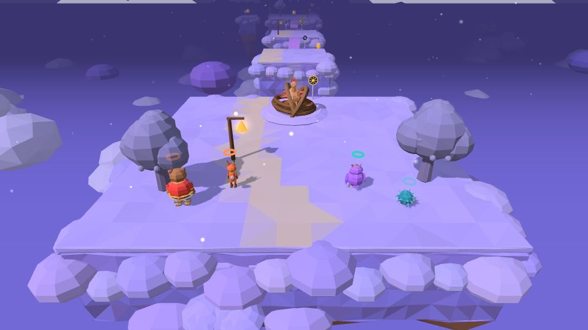
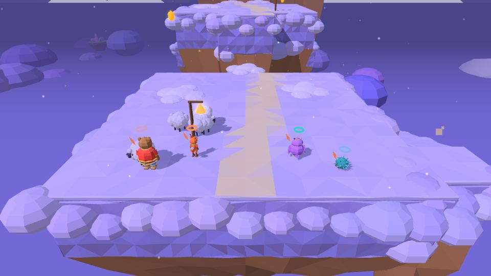
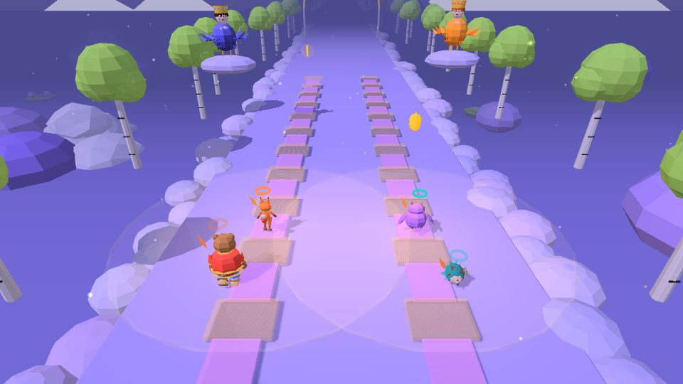
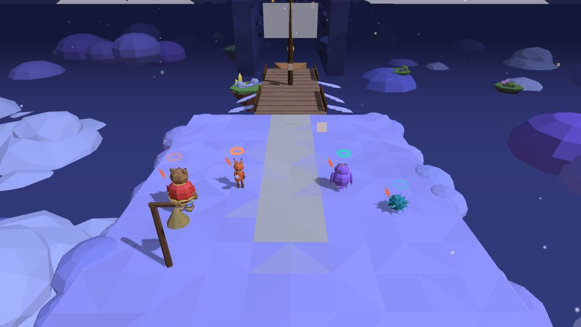
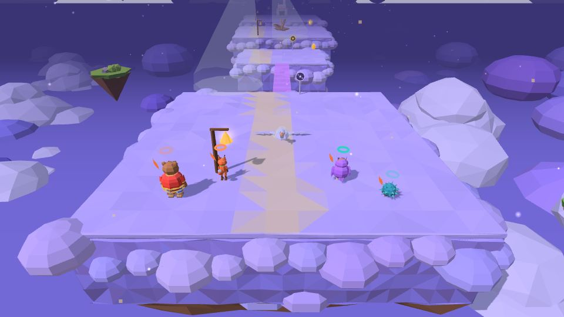
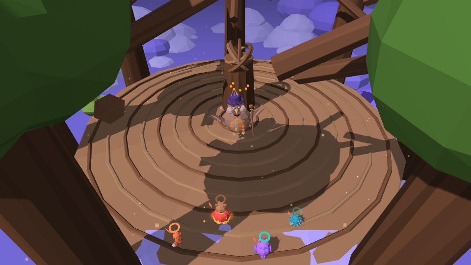

# Мир 3 · Небесное царство

| ☁️ **Небесное царство** | |
|---|---|
| **Чудо-вещь** | 🪶 [перо Жар-птицы](Чудо-вещи#-перо-жар-птицы) — свет |
| **Уровни** | 3-1 · 3-2 · 3-3 🎵 · 3-4 · 3-5 · 3-Б 👑 |
| **Звенья** | 20 |
| **Босс** | Соловей-Разбойник |
| **Особый морок** | Двусветный мотылёк (3-1) |
| **Весточка помощника** | из Сказа 2: Садко (окно в долю шире), Рыба-кит (подшивает издалека), Золотая рыбка (подсказка сразу) |
| **Цвет вышивки** | сиреневый |

В этом мире Ёжик и Лисёнок играют по ещё более слабым детским окнам (замах 0,76 с, отбив 0,37, Пробой 7 с; подсказки в 1,8 раза дольше) — см. [[Бой]]; у длинных задач над полным текстом есть крупная короткая строка (≤ 12 слов), её же читает голос.

Сад над облаками, где стало темно. Пелагея читает по тетрадке уже не шёпотом, а тихо. Светомостки (золотые) держат только в свете, тенемостки (лиловые) — только в темноте.

---

## 3-1 «Сад молодильных яблок»

**Звенья:** 4 · по сказкам «О молодильных яблоках и живой воде» и «Иван-царевич, Жар-птица и серый волк»

- Состарившаяся **Жар-птица** отдаёт последние перья; тени Кощея покрали яблоки.
- Светомостик, тенемостик, «три шага по золотому, три по лиловому»; серая яблоня оживает от трёх секунд света.
- Тёмные аллеи с тенями и **Двусветным мотыльком** (раскрыт, только когда светят двое).
- **Молодильное яблочко**: подойдёшь — в руки, удар — бросок другу; поднесёшь к старому — помолодеет: **Дед-Садовник**, **трухлявый мост**, **Дуб-старик**.
- Светящееся яблочко нельзя пронести по лиловым мосткам — его **перебрасывают**.
- **Спящая стража** — пугала просыпаются от пера и звона струн; **тени-воришки** боятся света.
- Мини-босс **Кощеев Ворон**: ослепить двумя чашами-солнышками и молодить яблочками в воронёнка. Царь-яблоко молодит Жар-птицу.
 

## 3-2 «Облачные пастбища»

**Звенья:** 4 · **Новое:** облака-лифты

- Облако под горящим пером поднимается, в темноте опускается, поднятое тает за 15 секунд. Живая вода Йоши делает облако **пухлым** — держит Потапа.
- Барашки складываются мостиком к свету; грозовые тучки.
- Ягнёнок **Пушок** в грозовой нити — польёт Йоша, и он станет **пружинкой**.
- **Ветер-Ветрило** сдувает и гасит перо — укрытие за Потапом и стожками.
- **Радуга-дуга**: Йоша поливает тучку (толстушку выжимает Потап) — пошёл дождик; зажги перо **рядом с тучкой** (с любой стороны) — встанет радуга, по ней проходят, пока идёт дождь.
- **Овчарня**: девять барашков к свету; мини-босс **Громовой Баран** — отец Пушка.
- **Громовой Баран** — три этапа; перед каждым — обучающие карточки (кнопка на карточке срабатывает по-настоящему), в бою — живые подсказки со стрелкой:
  1. **Таран** — Йоша поливает стожок (пухлый), со светом встань за ним: Баран бежит на свет и вязнет; в свете бей, Потап — за рога.
  2. **Гроза** — Баран тучей наверху, молния бьёт в тень-круг (кувырок или щит). Тучку полить/выжать, перо рядом — радуга; по ней наверх, в свете бей, от кольца по туче — прыжок.
  3. **Пушок** — Баран увяз в стожке — веди Пушка светом пера к батюшке; рядом с бегущим Бараном Пушок пугается.
 

## 3-3 «Сирин и Алконост» 🎵

**Звенья:** 3 · **Тип:** гусельный раннер на «Во поле берёза стояла», девять частей, темп 84 → 104

Перья вспыхивают в такт — прыгай на вспышку. **Эхо** (повтори за птицей), **припев**, **протяжные ноты** (держи прыжок — паришь), **гроза** (щит в такт), **дуэт** (у Прошки ритм Сирин, у Пелагеи — Алконоста), **перья в небе**, **хоровод**. В последнем куплете поёт одна Пелагея.
 

## 3-4 «Летучий корабль»

**Звенья:** 4 · **Новое:** крен палубы

- Корабль летит, пока герой со светом стоит у фонаря на мачте (Пелагея-фонарщица).
- **Палуба кренится** туда, где больше веса: Потап весит 3, остальные по 1; по крену съезжают.
- В ущелье Потапа переводят к другому борту, чтобы крыло прошло над камнем; порыв ветра — Потап держит защиту.
- Вёдра-крылья Прошки (изобретение 3 из 3) улетают вниз.
- **Вороны-мороки** с чёрными ключами хватают фонарь.
 

## 3-5 «Гуси-лебеди»

**Звенья:** 5 · **Новое:** стелс

- От каждого гуся падает белый **конус взгляда**: свет пера в конусе — гусь ныряет и уносит героя.
- **Тишка** едет у Йоши на спине.
- Укрытия по сказке: **печка** (пирожок), **яблонька** (кислое яблочко и живая вода), **речка с кисельными берегами** (рогатка по запруде и Совиный взор) — все четверо внутри за 8 секунд.
- Яга на ступе выбрасывает чёрный ключ в пропасть 🔒.
 

## 3-Б «Соловей-Разбойник» 👑

Подход «Прямоезжая дорожка» (≈170 м, свист сдувает — прячься за укрытия и щит Потапа), потом бой в четыре этапа по былине: свист соловьиный, крик звериный, шип змеиный, полный свист. Подробно — **[Боссы](Боссы#-соловей-разбойник)**.

**После босса** 🔒: **Сказ 3 «Соловьиная песня»**, праздник — и ролик **«Сказок не будет»**: Кощей рвёт цепь на дубе, забирает Звенышко и уходит в море. Дуб стоит голым, Кот молчит.
 

---
← [[Мир 2 · Подводный Китеж|Мир-2-Подводный-Китеж]] · [[Миры]] · [[Мир 4 · Огненная Смородина|Мир-4-Огненная-Смородина]] →
