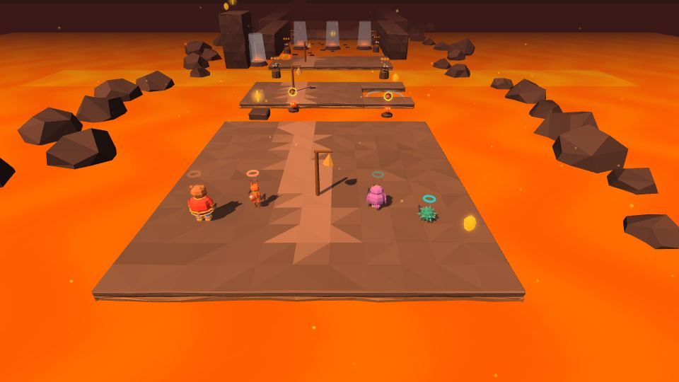
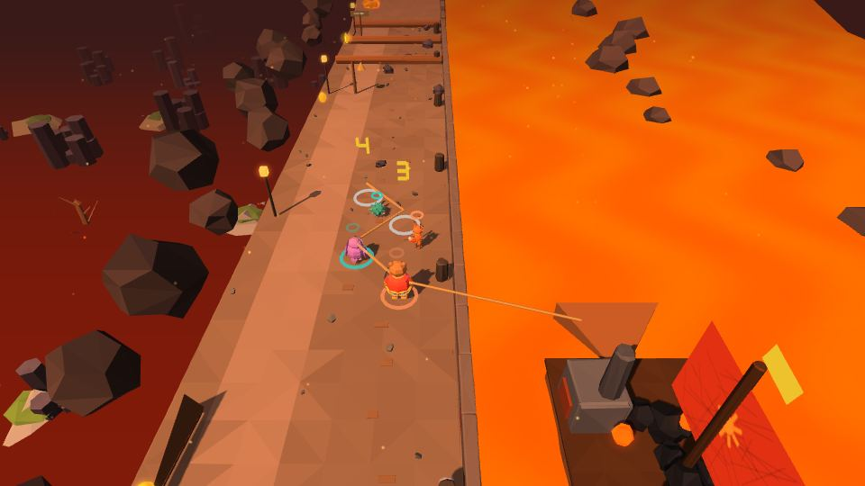
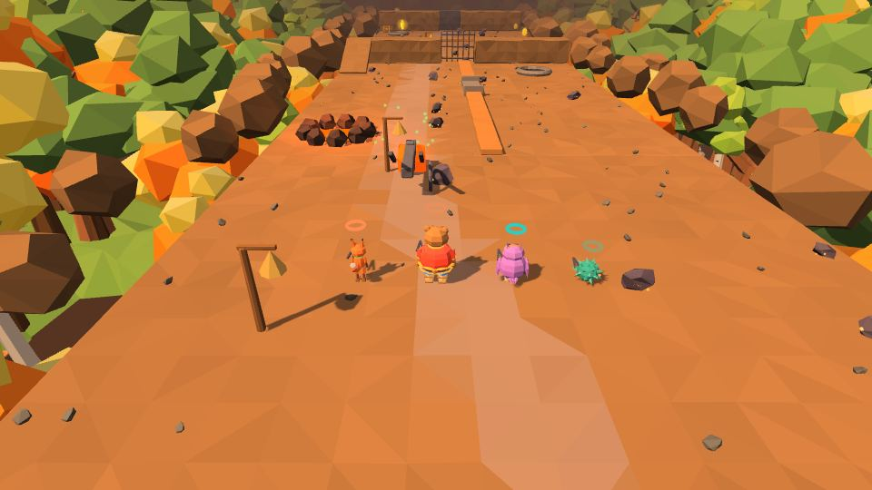
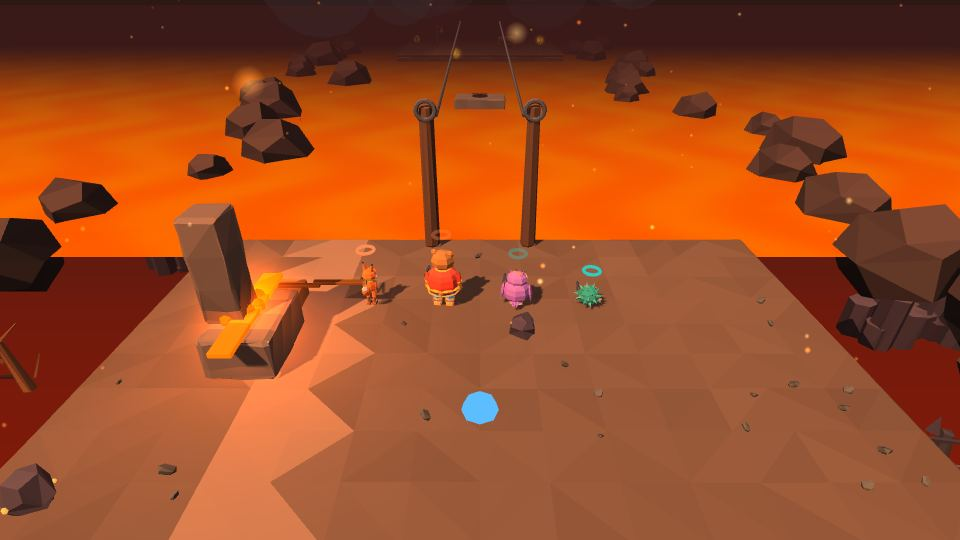

# Мир 4 · Огненная Смородина

| 🔥 **Огненная Смородина** | |
|---|---|
| **Чудо-вещь** | 🔧 [кузнечные клещи](Чудо-вещи#-кузнечные-клещи) |
| **Уровни** | 4-1 · 4-2 · 4-3 👥 · 4-4 · 4-5 · 4-Б 👑 |
| **Звенья** | 20 |
| **Босс** | Змей Горыныч |
| **Особый морок** | Печник (4-4) |
| **Подсказки** | Звенышка нет 🔒 — подсказки читает Пелагея по тетрадке |
| **Весточка помощника** | из Сказа 3: перо Жар-птицы, птичка Сирин или ступа Яги |
| **Цвет вышивки** | огненный |

Огненная река и кузни. Лава здесь — как пропасть: упал — вернёшься к колокольчику, без урона. Горячее берут только клещами; живая вода Йоши остужает.

---

## 4-1 «Кузня Кузьмы и Демьяна»

**Звенья:** 4 · **Новое:** ковка клещей

- Кузнецы окаменели. Ковка по станциям **«1 · МЕХИ → 2 · КУЁМ → 3 · ЗАКАЛКА → 4 · ГОТОВО»**: Пелагея качает мехи прыжками, Прошка бьёт в такт, Йоша закаливает в корыте; клещи улетают на стойку — когда там все четыре, каждый герой получает свои.
- Двери жаром: слиток на холодную плиту, уголь в печь подъёмника, горячий гвоздь в щель засова.
- **Чугунные болваны** в раскалённых латах: полить, сорвать нагрудник клещами, бить.
- **«В четыре руки»**: большую заготовку поднимают вдвоём и куют на большой наковальне; кольцо звенит, как колокол, — и кузнецы оживают. «Хорошо сковано. Вчетвером?»
 

## 4-2 «Река Смородина»

**Звенья:** 4 · **Новое:** корка на лаве

- Живая вода по лаве — **корка** 1,2 × 2 м держит 8 секунд и мигает перед тем, как утонуть.
- У каждого своё дело: Йоша делает корку, Прошка прикрывает рогаткой от ящерок, Потап ловит и подкидывает.
- Бурлящая струя: корку делают в тихой заводи и несут клещами; на широком разливе корка — плот.
- Паровые столбы, горячий камень в жерло — столб как лифт.
- **Лавопад в три яруса**: «Сиди тут. Я сам найду обход.» — «Потап, смотри на меня. Я пойду. Если что — ловишь.»
- Огненная завеса и запруда со щеколдой.
 

## 4-3 «Эй, ухнем» 👥

**Звенья:** 3 · **Тип:** на четверых

- Потап запевает «Эй, ухнем»; на **«ух-нем»** все жмут RT — каждый герой в кольце добавляет силу, все четверо — рывок. Лямку держит и оставленный.
- Брёвна на пути: кольцо проходит, только если его герой прыгнул.
- В гору баржа идёт только с огнём: двое держат лямку, двое носят уголь клещами в топку (три угля — 30 секунд).
- Кузьма встречает баржу у ворот и снимает шапку.
 

## 4-4 «Змиевы валы»

**Звенья:** 4 · **Новое:** плуг и борозды

- Клещами за раскалённый лемех — **плуг** едет за героем и пашет борозду; лава течёт по бороздам со скоростью шага.
- Совиный взор показывает, куда лава хочет течь; мёртвая вода Йоши — борозда зарастает.
- Чугунную дверь Потап вышибает плечом; **змеёныши** в лаве сильные, на сухом ленивые.
- **Печник**: остывший неуязвим — уголь из жаровни клещами, и он горит 5 секунд.
 

## 4-5 «Калинов мост»

**Звенья:** 5 · **Новое:** асимметричная сцена

- Жёлуди по крюкам опускают цепи; калёные доски клещами на цепи, Йоша сращивает стыки.
- Кикимора: «Должна была — отдаю».
- **Держать мост** (Игрок 1, Потап): стик против качания, синие капли — щит, красная дрожь — упереться. «Не сила богатыря держит — земля его держит».
- **Переход** (Игрок 2): стыки чинит Йоша, пролёты перелетает Пелагея.
- «Иди. Я держу» — бег Потапа по рушащемуся мосту. «Ты держал». — «А ты чинил».
 

## 4-Б «Змей Горыныч» 👑

Три головы — три запала, вдох и узда. Подробно — **[Боссы](Боссы#-змей-горыныч)**.

**Обучение этапа 2** — три коротких урока (до 25 секунд, одна механика в каждом), каждый — перед тем, как приём понадобится; пропуск — прыжок: вдвоём 1 с, одному 2 с, в паузе — «Показать урок ещё раз»:
1. **Жёлудь** — Прошка стреляет из рогатки в жёлудь над средней головой (урок идёт при входе в этап).
2. **Огонь и вода** — Потап поднимает широкий щит от огня, Йоша поливает сытую голову живой водой (при первом огне или сытой голове).
3. **Вдох и взор** — на большом вдохе держим щит; Пелагея включает Совиный взор и бьёт по чешуйке (перед первым большим вдохом).

**После босса** 🔒: полёт на спине Горыныча, ролик **«Ученик»** (головы рассказывают на лубках про мальчишку с молотом), **Сказ 4 «Одно сердце»**. Горыныч дремлет у моря — теперь он друг.
 

---
← [[Мир 3 · Небесное царство|Мир-3-Небесное-царство]] · [[Миры]] · [[Мир 5 · Остров Буян|Мир-5-Остров-Буян]] →
