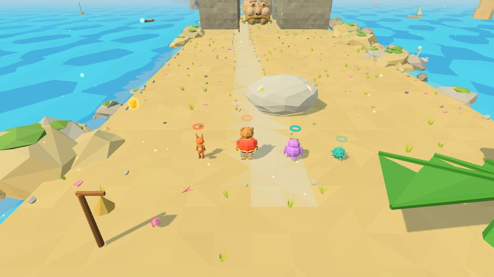
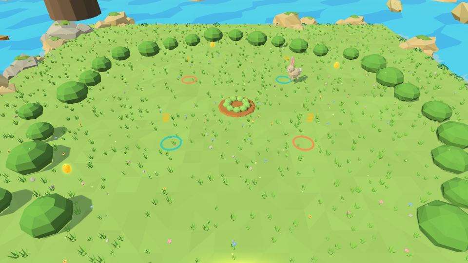
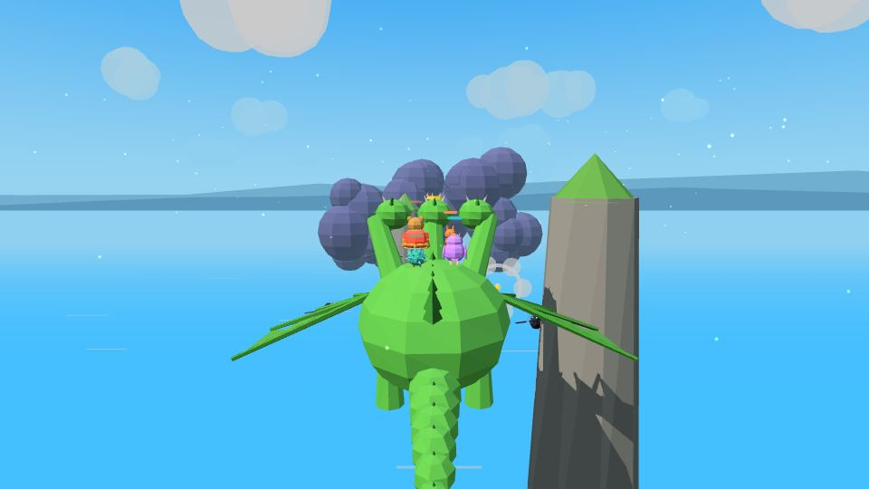
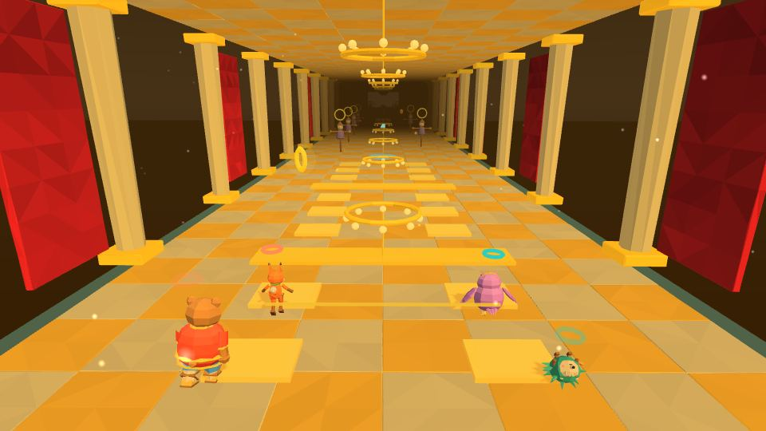
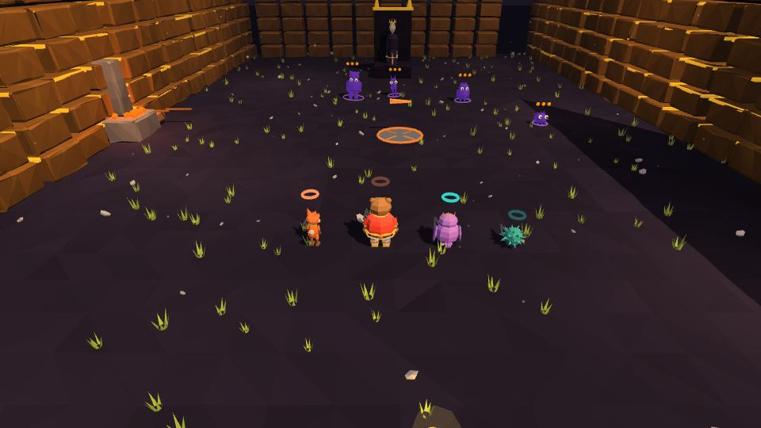

# Мир 5 · Остров Буян

| 🏝️ **Остров Буян** | |
|---|---|
| **Чудо-вещь** | ✨ [вещь по знаку на земле](Чудо-вещи#-вещь-по-знаку-остров-буян) |
| **Уровни** | 5-1 · 5-2 👥 · 5-3 🐉 · 5-4 🎵 · 5-Б1 👑 · 5-Б2 👑 |
| **Звенья** | 15 (на терем — 9 из 15) |
| **Босс** | Кощей Бессмертный 🔒 |
| **Особый морок** | Хамелей (5-1) |
| **Весточка помощника** | из Сказа 4: Демьян, Кикимора или Леший |
| **Цвет вышивки** | бирюзовый |

Мир устроен как сама сказка: **дуб на острове, сундук на дубе, заяц в сундуке, утка в зайце, яйцо в утке, игла в яйце** — каждый уровень на ступень ниже. Горыныч по уговору везёт героев на Буян. С 5-4 снова звенит Звенышко.

---

## 5-1 «Сундук на дубе»

**Звенья:** 5 · три части, самый большой уровень игры

**I. «Остров на море лежит».** «Лиху в глаз не смотрите». Заводь **Лебедя** (по «Салтану»): коршун пикирует на Лебедь — рогатка по метке или волна гуслями. **Голова в ущелье** (по «Руслану»): Потап со щитом идёт против ветра, Йоша щекочет нос — «Апчхи!». **Хрустальный залив**: хрусталики передают свет пера — один светит, другой идёт по лучу-мосту. Белка в хрустальном доме дарит орешки; на лугу — пугала и **Хамелей**. В дупле — игрушки Кощея и **зеркальце**: «Я ли на свете всех сильней?» — «Ты силён, Кощеюшка… Да только ты — один».

**II. «Дуб».** Ярусы по вещам: клубок (паутинка наверх), гусли (прилив в дупле), перо (свето- и тенемостки), клещи (горячий ключ в скважину).

**III. «Лихо».** Сундук висит на пятой цепи в лапе Лиха. **Побег в овечьих шкурах** — в отаре Лихо не видит. **Бой без ударов в три фазы**: зеркальце (Лихо видит себя и пугается), счёт овечек (прыжки через бревно — Лихо засыпает на восьмой), колыбельная на гуслях и щекотка лапы пером. Крышку поднимают вдвоём — из сундука выскакивает **заяц**. «Не буди лихо, пока оно тихо».
 

## 5-2 «Заяц» 👥

**Звенья:** 3 · **Тип:** на четверых

«Зайца не поймать. Зайца загоняют.» — «Слушаем ежа». Четыре героя — столбы: между стоящими ближе 10 м натягивается нить, заяц бежит к самой длинной мерцающей нити или в дырку. Три круга, каждый меньше; «Ко мне!» зовёт оставленного друга закрыть дырку. Финал — Потап бросает Прошку на зайца, заяц чихает — утка в небо.
 

## 5-3 «Утка» 🐉

**Звенья:** 4 · **Тип:** полёт на Горыныче

Игрок 1 ведёт левую голову, Игрок 2 — правую, итог — среднее; тянут вместе — разгон. X — огонь по Кощеевым воронам, B — синее перо обратно. Тучи Кощея: на «три» вместе RT — средняя голова прожигает тучу. Утку догоняют вместе, яйцо ловит Пелагея.
 

## 5-4 «Яйцо» 🎵

**Звенья:** 3 · **Тип:** гусельный на «Калинку» (88 → 104)

Кощеев бальный зал, золотой и перевёрнутый. Прыжок на каждую плитку в долю; широкая полоса — пол переворачивается. Знаки на ленте работают сами: струны, светомостки, вода гуслей. Пугала в припеве бьют жёлтым. Клетку из чёрных ниток режет Йоша мёртвой водой. Последний припев на подушке — и ролик **«Моё»** 🔒.
 

## 5-Б1 «Кощей в тереме» 👑

Цель — **«Выстоять»**. Тени-двойники перенимают любимую защиту. Подробно — **[[Боссы]]** 🔒.

Перед походом за яйцом Кот пишет на Лукоморье на мокром песке «В тереме — не победить». После терема — сцена **«Без имён»**: имена героев пропадают даже в субтитрах.
 

## 5-Б2 «Кощей Бессмертный и Златая цепь» 👑

Финал игры. Пролог и двенадцать стадий боя в трёх актах (Лукоморье, четыре страницы-портала, полёты домой), без подсказок в бою — правила каждой стадии показывает обучающая катсцена после основного ролика; в конце — сцена «Цепь». Подробно — **[[Боссы]]** и **[[Сказы и концовки|Сказы-и-концовки]]** 🔒.
 

---
← [[Мир 4 · Огненная Смородина|Мир-4-Огненная-Смородина]] · [[Миры]] · [[Эпилог]] →
