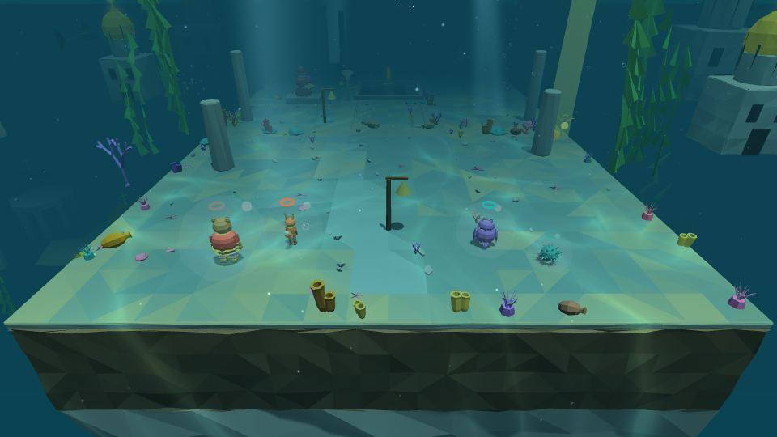
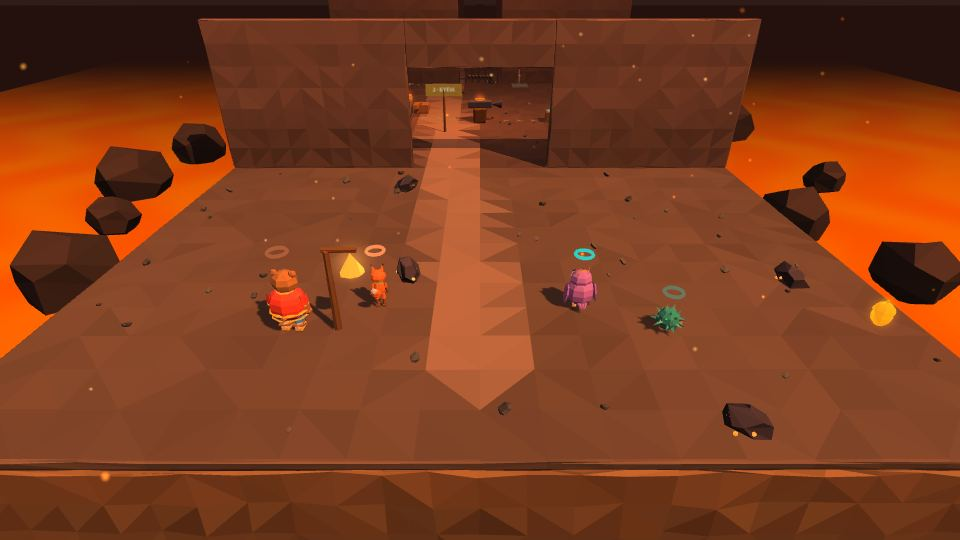

# Миры

Путь героев — пять сказочных миров между **[[Прологом|Пролог]]** и **[[Эпилогом|Эпилог]]**. Между уровнями герои возвращаются на **[[Лукоморье]]**. Каждый мир даёт новую [[чудо-вещь|Чудо-вещи]], пять уровней и босса.

```
Пролог «Звенышко» → Лукоморье ↔ Мир 1 → Мир 2 → Мир 3 → Мир 4 → Мир 5 → Эпилог
```

| | Мир | Уровни | Чудо-вещь | Босс | Звенья |
|---|---|---|---|---|---|
|  | **[[1 · Дремучий лес|Мир-1-Дремучий-лес]]** | 1-1 … 1-5, 1-Б | клубок-путеводитель | Леший-Путаник | 19 |
|  | **[[2 · Подводный Китеж|Мир-2-Подводный-Китеж]]** | 2-1 … 2-5, 2-Б | гусли Садко | Водяной | 20 |
|  | **[[3 · Небесное царство|Мир-3-Небесное-царство]]** | 3-1 … 3-5, 3-Б | перо Жар-птицы | Соловей-Разбойник | 20 |
|  | **[[4 · Огненная Смородина|Мир-4-Огненная-Смородина]]** | 4-1 … 4-5, 4-Б | кузнечные клещи | Змей Горыныч | 20 |
|  | **[[5 · Остров Буян|Мир-5-Остров-Буян]]** | 5-1 … 5-4, 5-Б1, 5-Б2 | вещь по знаку | Кощей Бессмертный | 15 |

## Типы уровней
| Значок | Тип | Примеры |
|---|---|---|
| 🧩 | **приключение** — загадки, платформы, бой | 1-1, 2-1, 3-1, 4-2, 5-1 |
| 🎵 | **гусельный** — ритм-уровень: прыжки и защита в такт | 1-3 «Колобок», 3-3 «Сирин и Алконост», 5-4 «Яйцо» |
| 👥 | **на четверых** — все четыре героя нужны одновременно | 2-3 «Невод», 4-3 «Эй, ухнем», 5-2 «Заяц» |
| 🐉 | **полёт** | 5-3 «Утка» |
| 👑 | **босс** | 1-Б, 2-Б, 3-Б, 4-Б, 5-Б1, 5-Б2 |

## Что есть на каждом уровне
- **Звенья** Златой цепи — главная цель (см. [[Экономика]]).
- **Золотые орешки** — для лавки Векши; за самоцвет уровня можно вышить карту тайников, и над орешками встанут столбы света.
- **Колокольчики** — точки возврата.
- **Задача внизу экрана** и подсказки Звенышка (в мире 4 — Пелагеи).

## Переход на уровень
После выбора уровня на карте-рушнике с двух сторон экрана съезжаются два вышитых льняных полотна; иголка вышивает в медальоне название мира и уровня, пока грузится уровень. Цвет вышивки свой у каждого мира: лес — зелёный, Китеж — синий, Небесное царство — сиреневый, Смородина — огненный, Буян — бирюзовый, Лукоморье — золотой.

## Особые места
- **[[Застава трёх богатырей|Застава-трёх-богатырей]]** — три испытания на время.
- **«Главы»** в главном меню — переиграть любой пройденный уровень.
