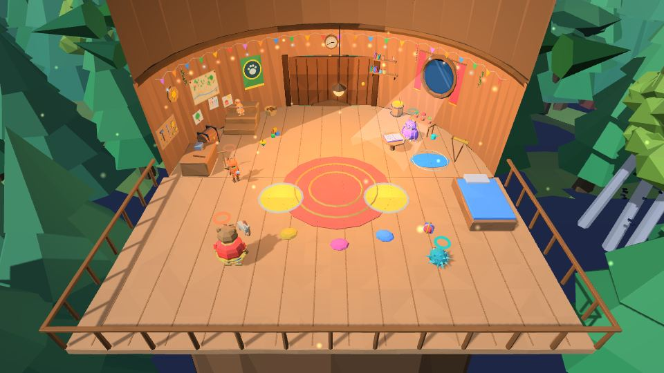

# Пролог «Звенышко»

| **Пролог** | |
|---|---|
| **Где** | штаб-сосна «Лесного патруля» |
| **Чему учит** | прыжок, смена героя, свой приём, «оставленный держит», первый бой |
| **Длительность** | ~10 минут |
| **Переиграть** | всегда открыт первым в списке «Дремучего леса» на карте |

## Сюжет
Вечер в штабе-сосне. Ролик **«Колыбельная»**: что-то звенит в темноте — это **Звенышко**, живое звено Златой цепи. Друзья бегут за ним.

## Прохождение
1. **Погоня по веткам.** Первая трещина — первый прыжок игры: камера поднимается над кроной и показывает её целиком, над трещиной светится дуга-стрелка, на том краю — кольцо. До первого прыжка герой у края не соскальзывает.
2. **Смена.** Уступ, овраг, корень — здесь учатся переключаться между своими героями. Лесенку для [[Потапа|Потап]] скидывает кнопка, на которую встаёт [[Прошка]].
3. **Старая калитка** — свой приём: рогатка Прошки и ковшик Йоши.
4. **Тропинки расходятся** — каждый игрок идёт своей.
5. **Жёлтые плиты** — главный урок игры: **«оставленный держит»**. Поставьте одного героя на плиту, переключитесь — он так и стоит.
6. **Первый морок** — колючий клубок: щит в такт и удар (см. [[Бой]]).
7. **Дупло** — и ролик **«Лукоморье»**.

## Лукоморье
Герои попадают на [[Лукоморье]]. У самого моря — **волшебный стан**: резная арка с жар-птицей, на золотом веретене намотан вышитый рушник. Подойдите и нажмите прыжок — из веретена раскатывается **карта-рушник**, и начинается ролик «Пять миров»: Звенышко ныряет в Дремучий лес и затягивает туда героев.

→ Дальше: **[[Мир 1 · Дремучий лес|Мир-1-Дремучий-лес]]**
