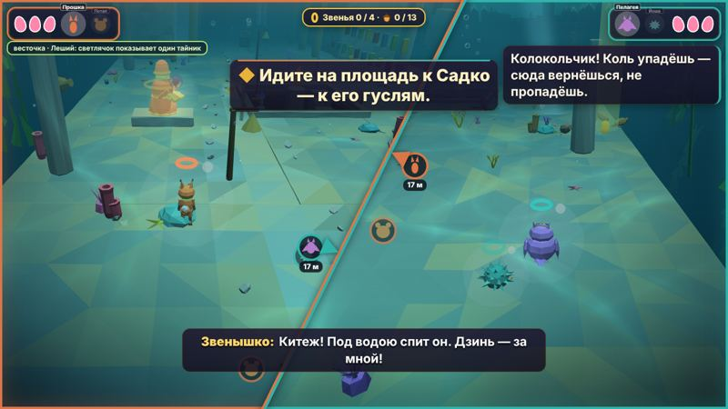
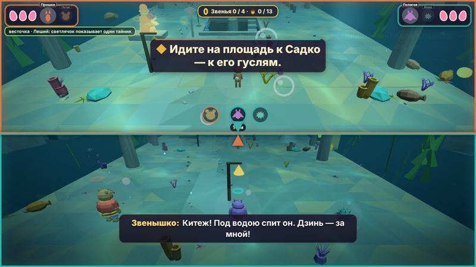

# Экран на двоих

Пока герои рядом, экран у вас общий. Разошлись — у каждого своя половина, и каждый видит своего героя. Снова сошлись — половины плавно сливаются в общий кадр.

## Когда экран делится
- Герои дальше 8 м друг от друга. Считается и высота: если один забрался на уступ над другим, это тоже «далеко».
- Или кто-то ушёл за край общего кадра.
- Сходится экран, когда вы ближе 6 м, оба в кадре и между вами нет стены.
- В драке экран общий, если вы ближе 16 м. Если дальше, у каждого своя половина: каждый видит свою драку.
- В роликах, на боевых аренах, на палубе и в гусельных уровнях экран всегда общий.

## Где чья половина
- **Кто левее на экране, у того левая половина**: камера не «перебрасывает» героя через весь экран. На узком экране (4 : 3, планшет) кто выше, у того верхняя.
- **Наклонная линия** (на высокой графике — сама, или выбрать в «Настройках»): линия идёт поперёк пути между вами, поэтому друг всегда за ней. Если повернуть свою камеру правым стиком, линия выпрямится: у вас теперь разный «вперёд».
- Цветная рамка панели и цвет линии показывают, чья половина.
- Панели героев и подсказки остаются в своих углах: Игрок 1 — слева, Игрок 2 — справа.

## Подсказки на линии
- Иконка друга стоит у края вашей половины, со стороны, где он сейчас. Под ней написано, сколько до него метров.
- Чем дальше вы друг от друга, тем толще линия.
- «Ко мне!» (**1** / **0** / крестовина **↑**) подсвечивает линию цветом позвавшего, и его иконка на половине друга пульсирует: «я здесь».
- Если сражается только один из вас, его половина становится шире (60 %). Когда бой закончится, доли вернутся к поровну.

## Настройки
**«Экран на двоих»:**
- **сам делится** — как описано выше;
- **всегда общий** — для самых маленьких. Экран не делится. Если вы разошлись больше чем на 18 м, того, кто стоит, Звенышко через секунду переносит к другу. Сквозь закрытые ворота не переносит;
- **у каждого свой** — экран разделён всегда (кроме роликов и арен).

**«Линия раздела»:**
- **сама** — на высокой графике наклонная, иначе слева и справа (на узком экране — сверху и снизу);
- **наклонная**, **слева и справа**, **сверху и снизу**.

На высокой графике у каждой половины ещё и свои чёткие тени вокруг своего героя.

См. также: [[Управление]].
