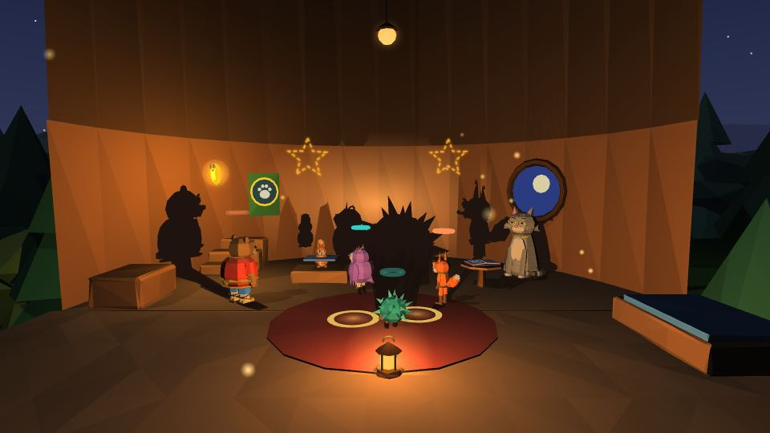

# Эпилог 🔒

| **Эпилог** | |
|---|---|
| **Где** | штаб-сосна, вечер — как в прологе |
| **Открывается** | после 5-Б2 «Кощей Бессмертный и Златая цепь» |
| **Переиграть** | последним в списке Острова Буян на карте-рушнике |

> ⚠️ Страница раскрывает финал игры.

Вечер в штабе-сосне. **Тишка** просит сказку, и Пелагея откладывает тетрадку — рассказывает, не заглядывая.

## Театр теней (final06)
Пелагея ставит фонарь на пол — у героев живые тени на стене: ближе к фонарю тень больше.
- вчетвером складывают **Змея о трёх головах** и дышат огнём;
- ловят **Жар-птицу** «в ладошки» двумя тенями;
- водят **хоровод** вокруг тени Кощея с прыжком на хлопок — и Кощей становится мальчишкой.

Проходится и в одиночку.

## Финал
Тишка допевает колыбельную до конца. Кот говорит без умолку — «А можно обратно… ненадолго… без голоса?» — «Руками…» — «…а держится словом». Открытка от Яги, хвост выбранной концовки лубком голосом Кота (обе — если спорили), титры.

## После титров
Можно гулять по [[Лукоморью|Лукоморье]]: Кощей там, где его оставила сказка, Тишка у дуба, в избе Кота — тетрадка: **пятый Сказ можно рассказать заново**.

← [[Мир 5 · Остров Буян|Мир-5-Остров-Буян]] · [[Миры]]
