# Златая цепь · релизная сборка final06

**Кооперативная low-poly сказка для всей семьи** (final06: вся игра озвучена — 671 реплика персонажей, 32 голоса (ElevenLabs v4), ролик ждёт, пока договорит голос, громкость «Голоса» в настройках; финальный бой с Кощеем заново — пять этапов, четыре новых помощника, обучение и подсказки; свой щит у каждого героя; голос заставки и звуки меню, см. `docs/09_final06.md`; final05: все жители сказки и мороки на уровне героев — скелетные модели, живые лица и мимика; враги больше не пропадают; палитра 256 цветов и бюджет отрисовок; эффектный удар героев; играть вторым героем, пока первый без сил; джойстики в меню; субтитры понятнее для 7-летних; трейлер, см. `docs/08_final05.md`; final04: интерактивное обучение боя с Горынычем и живые подсказки, герои видны за препятствиями — вырез «в горошек» и силуэты, камера правым стиком, см. `docs/07_visibility_camera.md`; final03: арт в духе Synty Studios — новые герои-скелеты, процедурный кит окружения, планы глубины и атмосфера миров, свет и производительность, см. `docs/06_art_synty.md`; final02: кинематографичная режиссура всех 113 роликов, `docs/05_cinematics.md`) по мотивам А. С. Пушкина и русских народных сказок: пролог «Звенышко», пять миров («Дремучий лес», «Подводный Китеж», «Небесное царство», «Огненная Смородина», «Остров Буян») с боссами, Лукоморье, эпилог и Застава трёх богатырей. Вдвоём на одной клавиатуре и/или с двумя джойстиками — или один игрок и все четверо героев.

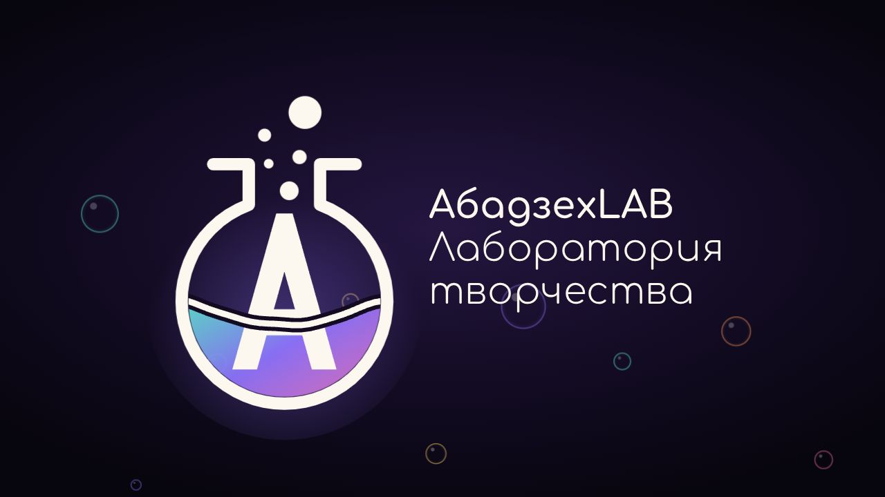

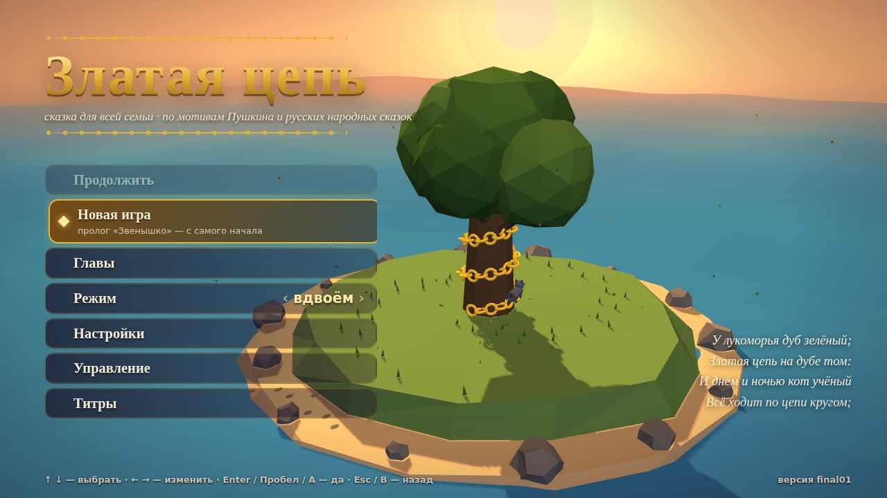

| | |
|---|---|
| 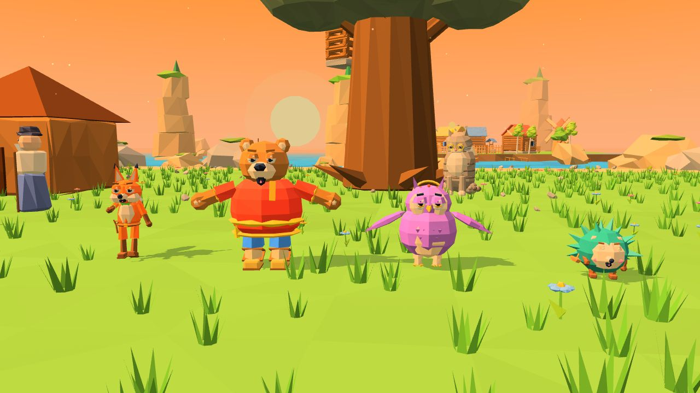 | 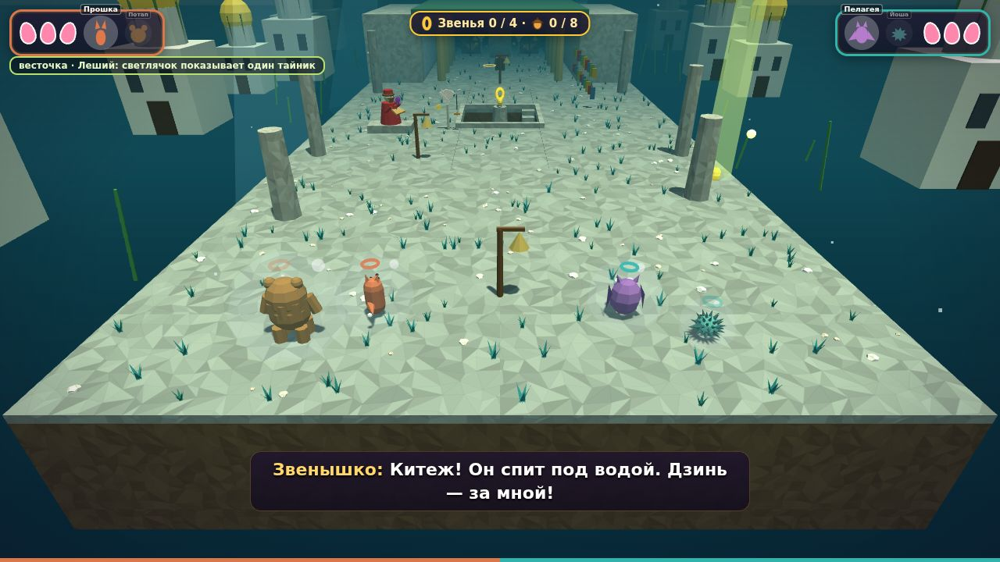 |
| 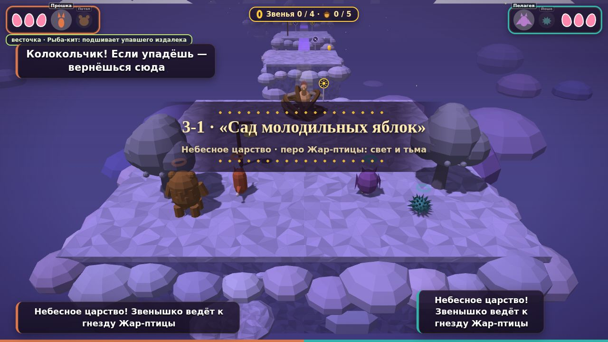 | 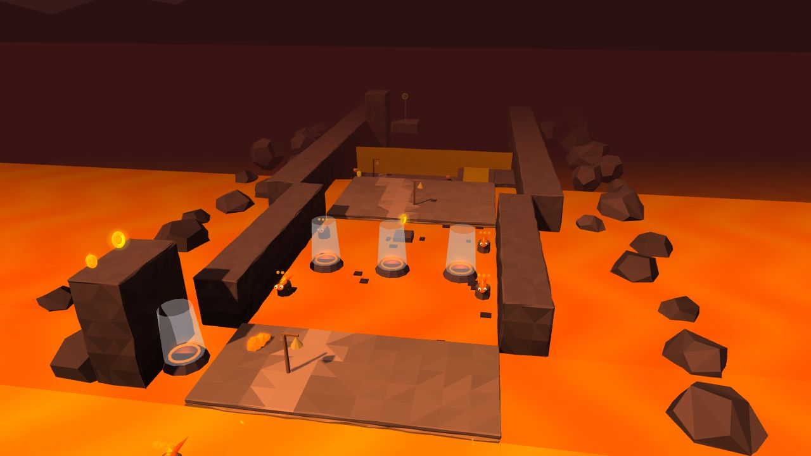 |
| 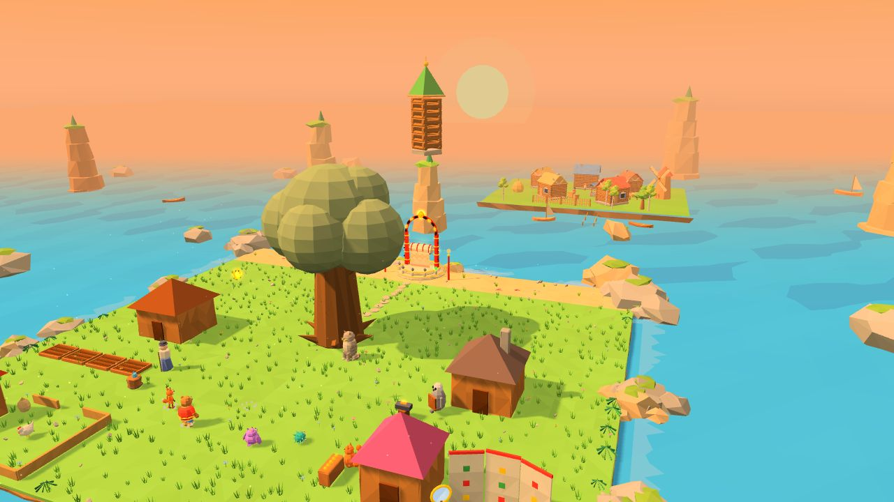 | 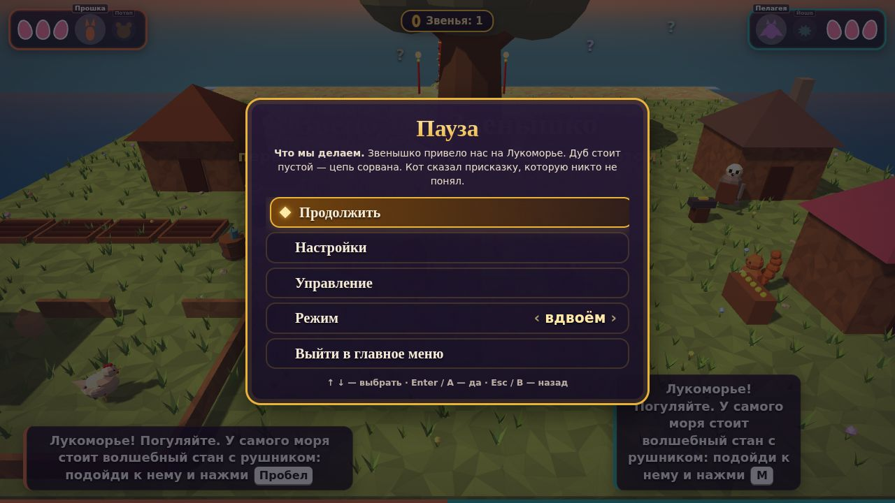 |
| 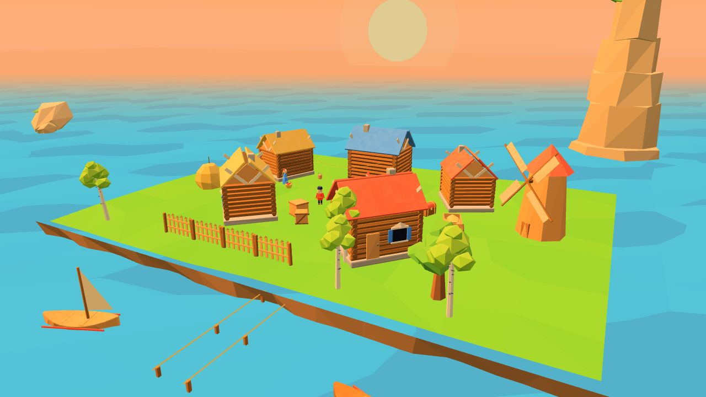 | 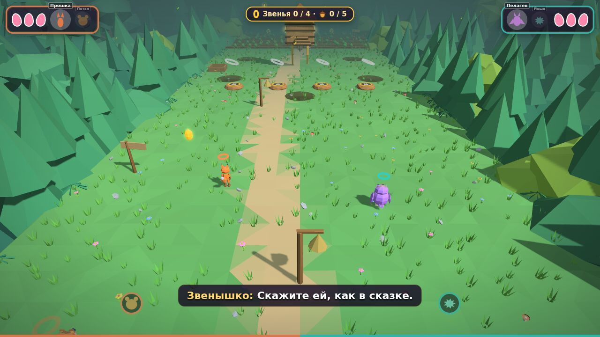 |
| 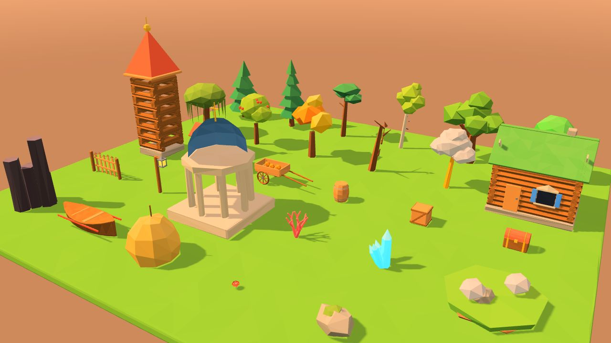 | 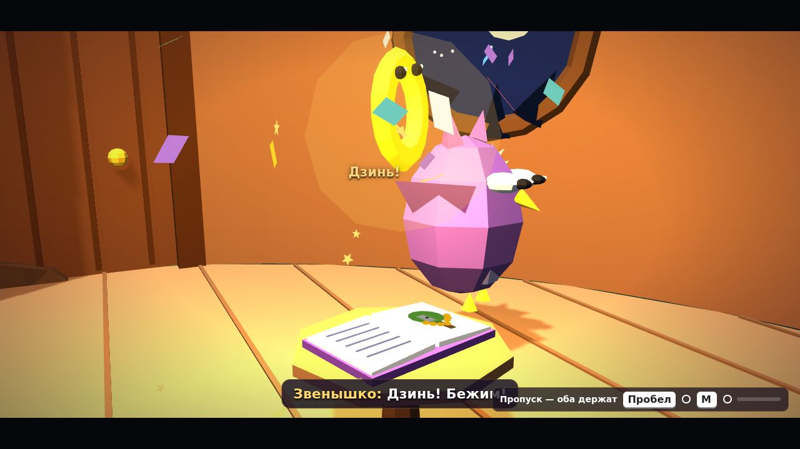 |

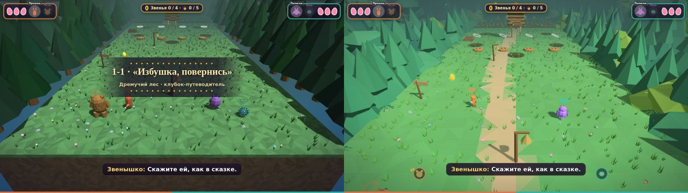

| | |
|---|---|
| 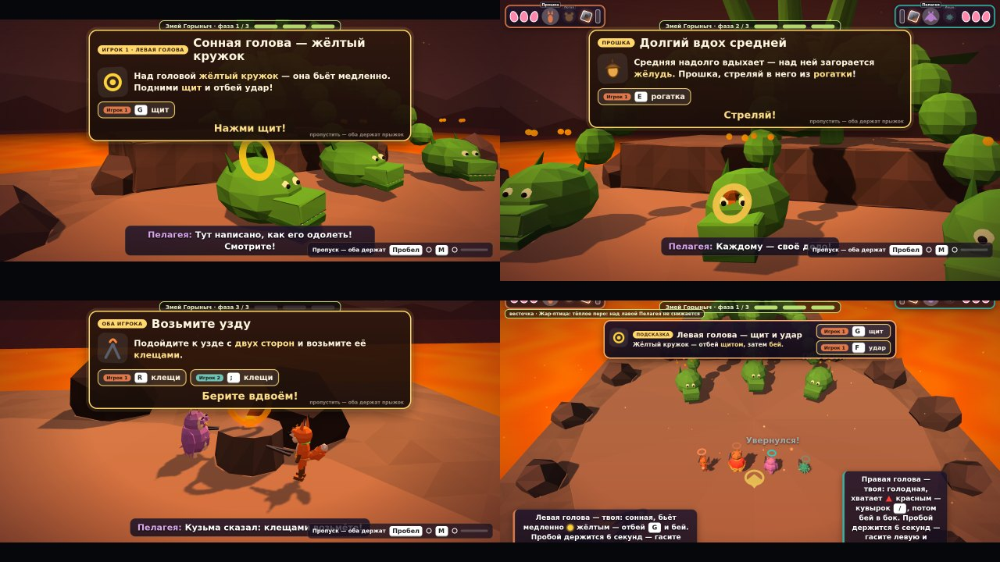 | 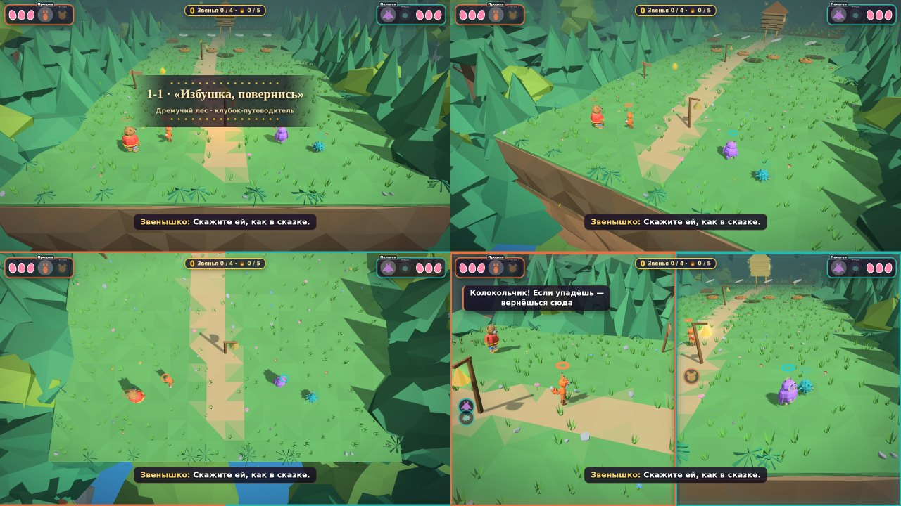 |

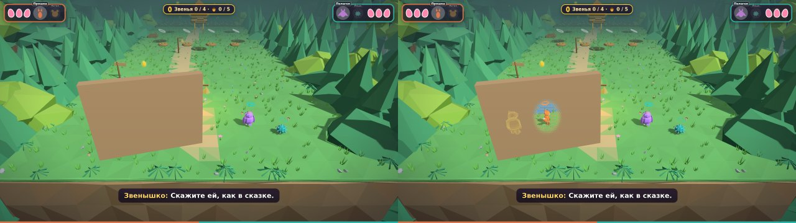

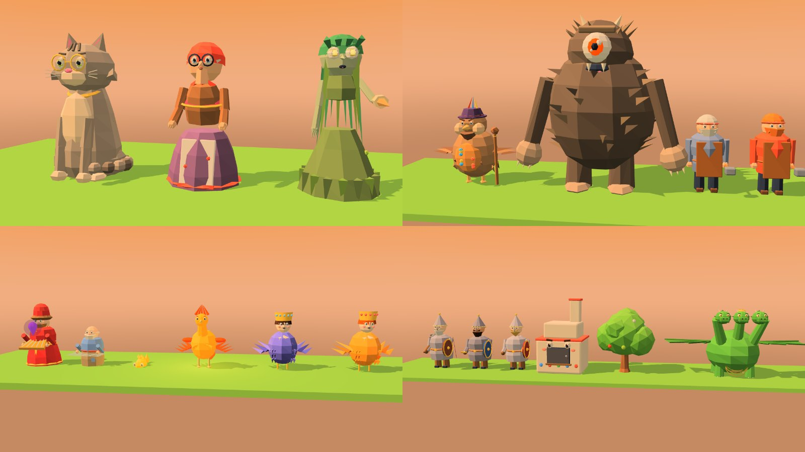

| | |
|---|---|
| 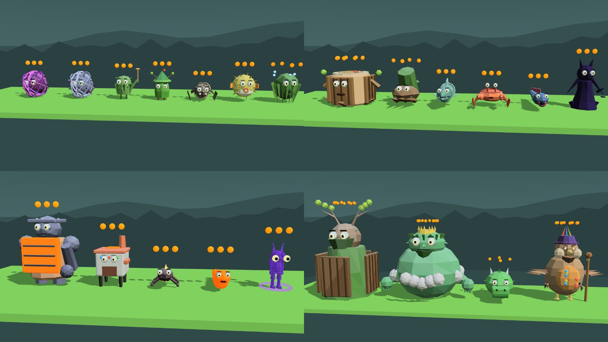 | 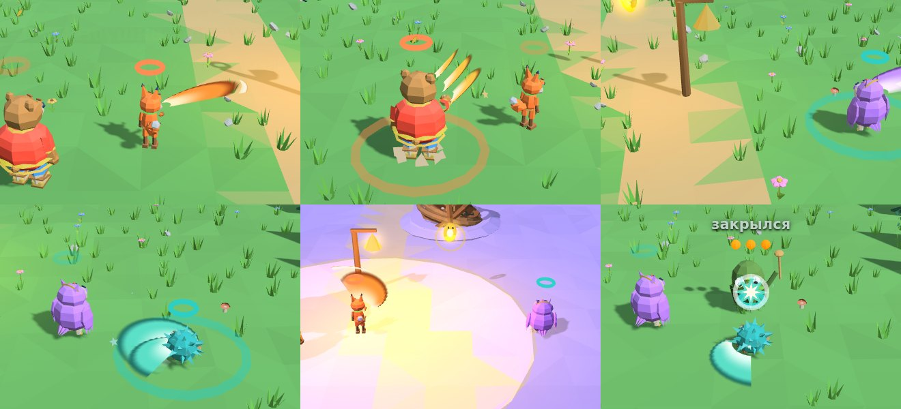 |

## Как играть
Откройте `zlataya_cep_final06.html` в Chrome, Edge или Firefox. Интернет не нужен: всё в одном файле.
- Меню: ↑ ↓ — выбрать, ← → — изменить, Enter / Пробел / A — выбрать, Esc / B — назад.
- В игре: Esc или Start — пауза (настройки, управление, выход в меню). P — фото-режим.
- Герой без сил не держит игрока: переключитесь на второго своего героя (в одиночном режиме — на любого живого), друзья поднимут упавшего или его вернёт таймер.
- Прогресс сохраняется сам: после каждого пройденного уровня и в Лукоморье. «Продолжить» возвращает на Лукоморье, «Главы» позволяют переиграть пройденное.
- Управление по умолчанию: Игрок 1 — WASD, Пробел, F, G, Q, E, R, Shift, 1; Игрок 2 — стрелки, M, «,», «.», K, L, «;», «/», 0; джойстик — A, B, X, Y, RT, RB, LT, крестовина ↑, **правый стик — камера** (вокруг героя и наклон; в сплите у каждого своя, сама возвращается, когда экран делится или сходится; скорость и инверсия — в «Настройках»). Полная таблица — в меню «Управление».

## Для разработки
- **Ctrl+Alt+]** — открыть все уровни. Прогресс становится как у полностью пройденной игры: все миры и боссы, карта в Лукоморье, товары лавки и испытания Заставы (без самоцветов). В «Главах» главного меню появляются все уровни по порядку, включая пролог, эпилог и Заставу, — так можно сразу перейти на нужный. «Новая игра» снимает это вместе со старым прогрессом, как только появится новое сохранение. Время игры, покупки, огород и свои пересказы сказок сохраняются. Нажатие посреди уровня не прерывает его.
- **Ctrl+Alt+[** — стереть всё, что игра хранит на этом компьютере: сохранение (вместе с открытыми уровнями), настройки, наряды и украшения из лавки. Игра сразу перезапускается и начинается как в первый раз. Если после нажатия закрыть файл, следующий запуск тоже будет чистым.
- Клавиши работают в любой раскладке (по коду клавиши: в русской это «ъ» и «х»), в меню и в игре. Все данные игры лежат в `localStorage` браузера под ключами `zlatayaCep.*`; другие сайты и файлы стирание не затрагивает. Сохранения общие для всех HTML-файлов, открытых с диска в этом браузере, поэтому стирание очищает и гардероб прототипа `index.html`.

## Что в папке
| Путь | Что это |
|---|---|
| `zlataya_cep_final06.html` | релизная сборка игры: озвученная игра (все реплики персонажей), финальный бой с Кощеем в пять этапов; персонажи и враги на уровне героев, видимые враги, палитра 256, удар героев, обучение Горыныча, видимость героев, камера правым стиком, арт в духе Synty, режиссура роликов (собирается скриптом, вручную не править) |
| `zlataya_cep_final05.html`, `zlataya_cep_final04.html`, `zlataya_cep_final03.html`, `zlataya_cep_final02.html`, `zlataya_cep_final01.html` | предыдущие релизы, оставлены как есть и больше не пересобираются |
| `build/build_final.py` | сборка: прототип `../index.html` + модули и записи голосов → `zlataya_cep_final06.html` |
| `build/fin_early.js` | low-poly геометрия и материалы: плоское затенение, тон по вершинам (`aShade`), хуки шейдеров, точка подключения выреза (подключается до создания мира) |
| `build/late_05_gallery.js` | витрина кита и героев для разработки, `FIN.stats()` — отрисовки за кадр |
| `build/late_10_render.js` | свет (солнце 45°, полусфера), филмик-тонмаппинг, цветокоррекция по миру, градиентное небо, силуэты горизонта, качество графики |
| `build/late_12_kit.js` | палитра 40×3 и 256 оттенков (семейства, кожа, волосы, акценты), шум, коробка с фаской, сборщик кит-геометрии, материалы (ветер, свечение) |
| `build/late_13_kit_nature.js`, `build/late_14_kit_build.js` | процедурный кит: деревья, кусты, камни, грибы…; постройки, реквизит, особое для миров |
| `build/late_15_heroes.js` | новые герои (скелетные меши, лицо, суставы, Потап на двух ногах), поза по состоянию, генератор жителей |
| `build/late_16_cast.js`, `build/late_17_cast2.js` | final05: жители сказки на уровне героев — скелетные модели, лица, моргание, речь, взгляд; прокси для старых углов век и рта |
| `build/late_18_foes.js` | final05: новые облики всех мороков, глаза с веками и бровями (радужка = знак удара), мимика на замахе и в оглушении |
| `build/late_19_gor.js` | final05: Змей Горыныч (три головы с характерами) и лицо Звенышка |
| `build/late_20_decor.js` | учёт плоскостей земли для декора |
| `build/late_22_synty.js` | Synty-проход по мешам уровня: фаски, шум, сетка граней, тона, слои обрывов, кромки |
| `build/late_24_world.js` | одевание мира: деревья кита, подножия, долина, средний план, деревня, ориентиры |
| `build/late_25_scatter.js` | scatter мелочи с зонами исключения, тропинка и «хлебные крошки» |
| `build/late_26_batch.js` | пачки статики (мировые и локальные) с автоматическим выходом изменившегося; final05: живое не склеивается в статику, движущиеся группы — в локальные пачки, «прозрачные стены» пачками с растворением по номеру стены |
| `build/late_27_atmo.js` | частицы по мирам, ореолы, волны и пена, лава, море |
| `build/late_30_hero.js` | блики в глазах, моргание, вес прыжка, пыль |
| `build/late_32_downswap.js` | final05: пока герой без сил — играть вторым (в одиночном — любым живым) |
| `build/late_34_slash.js` | final05: удар героев — лента-полумесяц, почерк героя, искры, «бах» при попадании |
| `build/late_35_guard.js` | final06: щит (B) — у каждого героя свой барьер (шестерёнки, соты, перья, иголки), волна при блоке, вспышка при отбиве |
| `build/late_40_music.js` | процедурная народная музыка |
| `build/late_50_save.js` | сохранения, главы, настройки |
| `build/late_60_title.js` | титульная 3D-сцена у лукоморья |
| `build/late_72_splash.js` | заставка студии «АбадзехLAB · Лаборатория творчества»: логотип кодом (SVG), моушн, выход «пузырём» в титул; final06 — голос Кота и «Нажмите любую кнопку», пока звук не разрешён |
| `build/fonts/` | шрифт Comfortaa для заставки (SIL OFL 1.1, `OFL.txt`), встраивается в страницу |
| `build/late_70_menu.js` | главное меню, пауза, настройки, управление, титры; final06 — звуки меню и паузы, наведение мыши не перехватывает джойстик |
| `build/late_71_pads.js` | final05: джойстики в меню — меню не сбрасывается при смене числа джойстиков, Start, нестандартные крестовины, частый опрос |
| `build/late_80_ui.js` | интерфейс: баннер события важнее ленты с названием уровня |
| `build/late_81_sfx.js` | аудиоинструменты (шум, фильтры, реверберация) и заново озвученные эффекты роликов |
| `build/late_82_cine_cam.js` | кино-камера: движение шотов, сплайны, handheld, trauma, FOV-punch, dolly-zoom, whip, iris, вход и выход, slow-mo |
| `build/late_83_cine_actors.js` | живые герои и персонажи: дыхание, эмоции (брови, веки, рот), пружины ушей и хвоста, взгляды головой, шаг в роликах, реакции на реплики |
| `build/late_84_cine_fx.js` | lowpoly-частицы, контровой свет, настроение, акценты наград и ударов |
| `build/late_85_cine_audio.js` | звук роликов по событиям режиссёра |
| `build/late_86_cine_direction.js` | авторская постановка ключевых роликов |
| `build/late_87_boss4b.js` | 4-Б «Змей Горыныч»: интерактивные обучающие ролики по этапам и живые подсказки в бою |
| `build/late_88_occ.js` | видимость героев: вырез «в горошек» в шейдере мира, детекция лучами, силуэты-«рентген», затухание у камеры, «прозрачные стены» узором |
| `build/late_89_camorbit.js` | камера правым стиком: орбита и наклон, отклик и инерция, свой стик в сплите, ходьба относительно камеры, столкновения, автовозврат |
| `build/late_90_boot.js` | запуск: заставка → титул |
| `build/late_95_dev.js` | клавиши разработчика: открыть все уровни, стереть все данные |
| `build/fin.css`, `build/fin_body.html`, `build/header.txt` | стили и разметка релиза, шапка файла |
| `build/late_91_voice.js` | final06: озвучка реплик — запись вместо «бормотания», субтитр до конца фразы, музыка тише, ролик ждёт голос, громкость «Голоса» |
| `build/late_92_koschei.js` | final06: 5-Б2 — основа финального боя: облики Кощея-бойца и четырёх помощников, меч, звуки магии, эффекты; ушедшие враги не действуют |
| `build/late_93_koschei_level.js` | final06: 5-Б2 — арена, пять этапов, правила спеси и ПРОБОЯ, одиночный режим, ролики между этапами |
| `build/late_94_koschei_tut.js` | final06: 5-Б2 — интерактивное обучение перед этапами и живые подсказки в бою |
| `build/voice/` | final06: каталог озвученных реплик `lines.json` (голоса, тон, обработка) и записи `<id>.mp3` |
| `../tools/voice/` | final06: инструменты озвучки — `extract.js` (все реплики из кода), `plan.js` (каталог и пачки запросов к Eleven v4), `fetch.js` (скачать и обработать записи) |
| `build/rep_10_cine.py`, `build/rep_20_subs.py`, `build/rep_30_gameplay.py` | точечные замены в прототипе при сборке: реплики роликов; final05 — субтитры, понятные 7-летнему; final06 — правки геймплея: Пробой Горыныча вдвое дольше, стан и берег Лукоморья дальше от дуба |
| `build/three.r128.min.js` | Three.js r128 (MIT), встраивается в страницу |
| `docs/01_audit.md` | аудит прототипа глазами лидов и решения для релиза |
| `docs/02_art_bible.md` | арт-библия low-poly стиля |
| `docs/03_audio.md` | музыка и звук |
| `docs/04_release_checklist.md` | чек-лист релиза: что готово, что осталось до магазина |
| `docs/05_cinematics.md` | аудит всех 113 роликов и описание новой режиссуры, камеры, анимации, эффектов и звука |
| `docs/06_art_synty.md` | аудит сцены, арт-направление в духе Synty, итоги final03: модули, герои, мир, производительность, проверки |
| `docs/07_visibility_camera.md` | final04: исследование подходов к видимости героев, аудит камеры и материалов, детекция, визуал и замеры; камера правым стиком |
| `docs/08_final05.md` | final05: персонажи и враги, причина пропадания врагов, палитра и бюджет отрисовок, удар, джойстики, субтитры, трейлер |
| `docs/09_final06.md` | final06: озвучка всей игры — голоса 32 персонажей, обработка, как озвучить новые реплики; финальный бой с Кощеем в пять этапов; другие правки |
| `docs/CHANGELOG.md` | изменения по версиям |
| `docs/screens/` | скриншоты релизной сборки |

## Сборка
```sh
python3 zlataya_cep/build/build_final.py
```
Скрипт не меняет прототип `index.html` и не трогает прежние релизы `zlataya_cep_final01.html`–`zlataya_cep_final04.html`. Он берёт прототип, встраивает Three.js, подключает модули и проверяет синтаксис через `node --check`. Правки уровней и механик делаются в прототипе `index.html`, правки релизного слоя (арт, меню, сохранения, музыка) — в модулях `build/`. После любой правки пересоберите файл.

## Тесты
Боты из `tools/tests/` работают и с релизной сборкой (отладочный объект включается параметром `?debug`, запускалка передаёт его сама):
```sh
LIST=tools/tests/regress_list_final.txt tools/tests/regress.sh zlataya_cep/zlataya_cep_final06.html
tools/tests/run_one.sh tfin_save zlataya_cep/zlataya_cep_final06.html   # сохранения, «Продолжить», главы, настройки
tools/tests/run_one.sh tfin_menu zlataya_cep/zlataya_cep_final06.html   # заставка, титул, меню, пауза
tools/tests/run_one.sh tfin_dev zlataya_cep/zlataya_cep_final06.html    # Ctrl+Alt+] и Ctrl+Alt+[
tools/tests/run_one.sh tfin_cine zlataya_cep/zlataya_cep_final06.html   # кино: камера, говорящие, выход, пропуск, пролог
tools/tests/run_one.sh tfin_splash zlataya_cep/zlataya_cep_final06.html # заставка студии: кадры, выход, пропуск
tools/tests/run_one.sh tfin_boss4b zlataya_cep/zlataya_cep_final06.html # 4-Б: обучающие ролики этапов, подсказки в бою
tools/tests/run_one.sh tfin_occ zlataya_cep/zlataya_cep_final06.html    # видимость героев за препятствиями (замер по пикселям)
tools/tests/run_one.sh tfin_cam zlataya_cep/zlataya_cep_final06.html    # камера правым стиком
tools/tests/run_one.sh tfin_foekinds zlataya_cep/zlataya_cep_final06.html # final05: виды врагов 1–10 видны в драке (11–20 — tfin_foekinds2, 21–28 — tfin_foekinds3)
tools/tests/run_one.sh tfin_downswap zlataya_cep/zlataya_cep_final06.html # final05: играть вторым героем, пока первый без сил
tools/tests/run_one.sh tfin_voice zlataya_cep/zlataya_cep_final06.html  # final06: озвучка — записи по порядку, без бормотания, ролик ждёт голос, громкость, пропуск
tools/tests/run_one.sh tfin_pads zlataya_cep/zlataya_cep_final06.html   # final05: два джойстика в меню
URLQ='&hq=1' tools/tests/run_one.sh tfin_budget zlataya_cep/zlataya_cep_final06.html # final05: бюджет отрисовок по всем уровням
URLQ='&hq=1' tools/tests/run_one.sh tfin_cast zlataya_cep/zlataya_cep_final06.html   # final05: витрина персонажей (кадры)
node tools/tests/layout_check.js                                        # меню на 13 размерах окна: без наездов и обрезаний
```

## Трейлер
Трёхминутный трейлер снимается ботами из релизной сборки кадр за кадром: `node tools/video/trailer.js`, звук — `node tools/video/audio.js`, склейка — `tools/video/encode.sh` (см. `tools/video/README.md`).

## Опросы тестеров
Четыре интерактивных опроса для тех, кто прошёл игру: 7–8, 9–10, 11–13 лет и 14+ со взрослыми. Лежат в `docs/feedback/` (`opros_*.html`, собираются из `docs/feedback/src/`); там же описание, ссылки на опубликованные страницы и формат ответов — `docs/feedback/README.md`.
