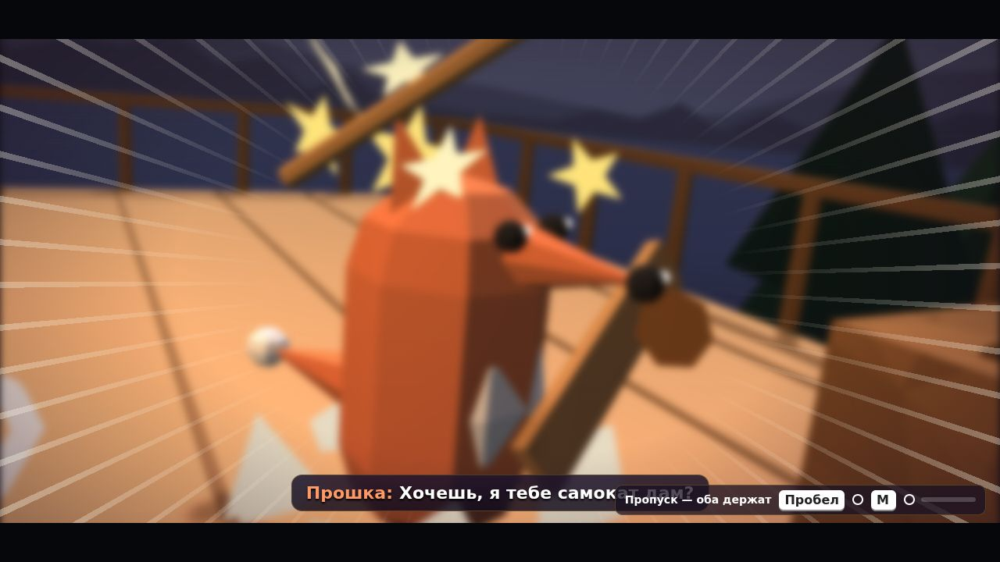
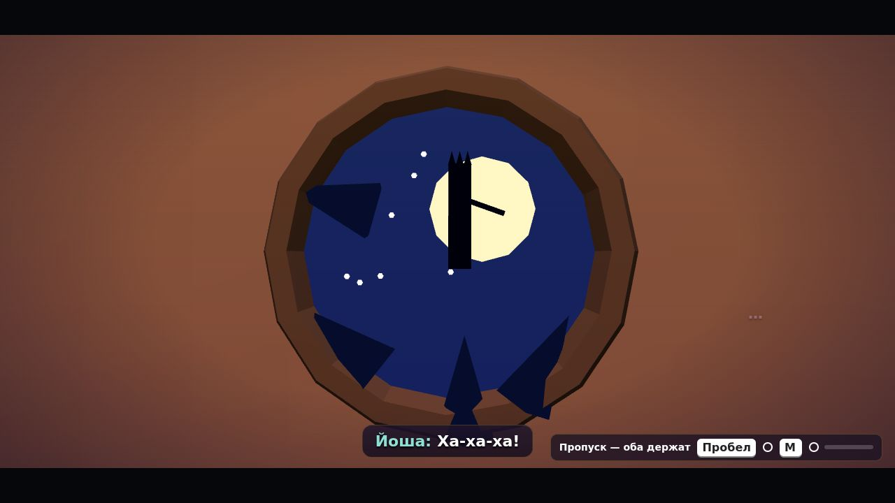
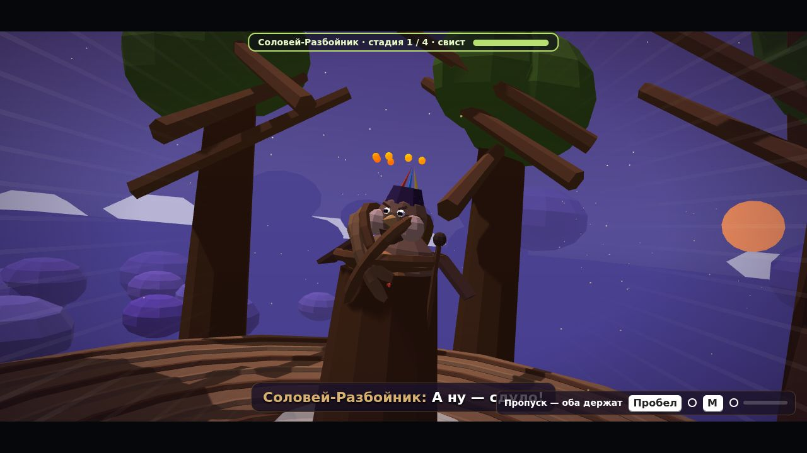

# Синематики: аудит и новая режиссура (final02)

Документ описывает, как устроены ролики в прототипе, что с ними было не так и что сделано в релизе `final02`. Прототип `index.html` не менялся: вся работа лежит в модулях `build/late_81…86` и собирается в `zlataya_cep_final02.html`.

| | |
|---|---|
|  |  |
|  |  |

## 1. Аудит

### Движок роликов
- **Где.** Все ролики построены на одной функции прототипа `play(def)`. Она описана в разделе «РОЛИКИ В ДВИЖКЕ» и вызывается 113 раз из построителей уровней (`build11`…`build5B2`, `buildLukomorye`, `buildEpi`, `buildZast`).
- **Описание ролика.** Ролик — объект со списком шотов `shot(t, камера, цель, [камера2, цель2, длительность])`, репликами `says` (время, длительность, кто, текст), событиями `events` (функции во времени), функцией `tick` и функцией `end`.
- **Запуск.** Ролики запускаются из логики уровней: на старте уровня (`W.onStart`), по достижению цели, по таймеру `later()`, из `end` другого ролика (цепочки).
- **Камера.** `setCam` берёт текущий шот. Позиция «прыгает» на новую точку (склейка), а если у шота есть вторая точка, камера едет к ней по прямой с `smooth`. Дальше `updateShared` экспоненциально подтягивает общий риг к цели (`camK`). Угол обзора постоянный (`def.fov`). Тряска — случайный скачок раз в 0,1 с.
- **Персонажи.**
  - Герои — группы примитивов (`HB.*` → `g` → `body` → детали; хвост, лапы, крылья, клюв, клубок ежа).
  - Персонажи — такие же группы `{g, body, head, …}` из конструкторов `makeKot`, `makeYaga`, `makeLeshy`, `makeKoschei`, `makeGorynych` и других.
  - Скелетов нет. В роликах героев расставляют через `placeOnGround` и `h.face`; разворот и перемещение мгновенные, либо это линейный `anim()` без шага.
- **Завершение.** Ролик кончается, когда `t ≥ dur`. Тогда вызывается `end()`, и игровая камера экспоненциально возвращается к игрокам. Пропуск — оба игрока держат прыжок: все события выполняются сразу.
- **Игровой цикл.** `frame → step(dt) → render()`. Ролик обновляется в начале `step`, камера — в `updateShared`, анимация героев — в `animHero`.

### Цифры

| | |
|---|---|
| Роликов | 113 |
| Общая длина | 1957 с (около 33 минут) |
| Шотов | 397 |
| Шотов с движением камеры | 30 (7,5 %) |
| Средняя длина шота | 4,9 с |

### Общие проблемы
1. **Камера.** Статична в 92 % шотов. Движение линейное (`smooth`), без дуг и сплайнов. Нет handheld-жизни, FOV-приёмов и переходов, кроме жёсткой склейки. Вход в ролик — жёсткий прыжок из игровой камеры.
2. **Герои.** Стоят статуями. Разворачиваются рывком. Скольжение по сцене без шага. Никто не реагирует на реплики, на награду или удар.
3. **Акценты.** Баннеры наград, удары и вспышки не выделены: нет замедления, пауз и частиц. Тряска — дрожание без затухания.
4. **Звук.** Эффекты — одиночные осцилляторы. Нет звуков камеры, переходов и акцентов. Нет пространства (реверберации).
5. **Крупности.** Много роликов из 1–2 шотов одной крупности. Говорящий часто вне кадра.

### Разбор по роликам
| # | Где | Длина · шоты | Драматургическая задача | Проблемы сейчас | Что предлагаю (сверх общей системы) |
|---|---|---|---|---|---|
| 1 | Пролог · `lullabyScene` | 39 с · 11 | Знакомство с героями и тёплый вечер; смешной крах самоката; чудо: книга рождает Звенышко | 8 из 11 шотов статичны; герои не реагируют на реплики; акцент без замедления и эффектов | установочный кран на штаб-сосну, крупные реакции на «Ха-ха-ха», slow-mo и конфетти-искры на рождении Звенышка, iris на выходе |
| 2 | 1-1 · `yagaTalk` | 13.5 с · 4 | Яга ставит задачу, Прошка хорохорится — комичное упрямство | все 4 шот(а) статичны; герои не реагируют на реплики | two-shot Прошка–Яга, push-in на «…» Яги, вставка удивления Прошки |
| 3 | 1-1 · `giveClews` | 12.5 с · 3 | Награда и секрет: клубки и шёпот «шапку наизнанку» | все 3 шот(а) статичны; средний шот 4.2 с; герои не реагируют на реплики; акцент без замедления и эффектов | шёпот на ухо — крупный план каждого героя, радость при вручении, конфетти на баннере |
| 4 | 1-3 · `stopScene` | 22 с · 6 | Смешная развязка: Колобок ждёт, что его съедят, а Прошка «инженер» | все 6 шот(а) статичны; герои не реагируют на реплики; акцент без замедления и эффектов | обмен взглядами, dolly-zoom на «А так можно было?», наклон головы Колобка |
| 5 | 1-3 · `giftScene` | 7.5 с · 1 | Благодарность Колобка, тепло | все 1 шот(а) статичны; средний шот 7.5 с; герои не реагируют на реплики; акцент без замедления и эффектов; меньше трёх крупностей | медленный orbit вокруг героев, прыжки радости |
| 6 | 1-3 · `giftScene` | 5.2 с · 2 | Старт погони: Колобок запел, Звенышко объясняет правило | все 2 шот(а) статичны; герои не реагируют на реплики; меньше трёх крупностей | быстрый push-in на Звенышко, speed lines на старте |
| 7 | 1-4 · `hatScene` | 12 с · 3 | Прошка не верит в чудеса, швыряет шапку | все 3 шот(а) статичны; средний шот 4.0 с; герои не реагируют на реплики; акцент без замедления и эффектов | anticipation перед броском, наклон и фырканье, лёгкий whip на шапку |
| 8 | 1-4 · `kidnap` | 25.5 с · 9 | Комичный испуг: Леший уносит Пелагею | 1 из 9 шотов статичны; герои не реагируют на реплики; акцент без замедления и эффектов; тряска случайным дрожанием | dolly-zoom на «Ой… Прошка?!», дрожь героев, удар-тряска, обвинение Йоши крупно |
| 9 | 1-5 · `finale` | 21 с · 4 | Кикимора побеждена, ворчит, но должна | все 4 шот(а) статичны; средний шот 5.3 с; герои не реагируют на реплики | крупный план ворчания, облёт, пружинящие реакции героев |
| 10 | 1-5 · `finale` | 13 с · 3 | Кикимора прядёт под чужим голосом; подсказка про паутинку | 2 из 3 шотов статичны; средний шот 4.3 с; герои не реагируют на реплики | крейн вверх по пряже, push-in на подсказку |
| 11 | 1-Б · `ringStrike` | 9 с · 2 | Леший дразнит: «где я?» — игра в прятки | 1 из 2 шотов статичны; средний шот 4.5 с; герои не реагируют на реплики; акцент без замедления и эффектов; меньше трёх крупностей | orbit по кругу из Леших, наклон головы героев |
| 12 | 1-Б · `headHit` | 6 с · 1 | Лешие множатся — комичная угроза | все 1 шот(а) статичны; средний шот 6.0 с; герои не реагируют на реплики; акцент без замедления и эффектов; меньше трёх крупностей | FOV-punch и тряска на «четыре Лешего», удивление всех героев |
| 13 | 1-Б · `ending` | 16 с · 3 | Примирение: Леший становится проводником; Прошка признаёт шапку | все 3 шот(а) статичны; средний шот 5.3 с; герои не реагируют на реплики; акцент без замедления и эффектов | мягкий dolly out, гордость Прошки, конфетти на баннере |
| 14 | 2-1 · `sadkoIntro` | 9.4 с · 2 | Садко без струны — грустно; надежда на Йошу | все 2 шот(а) статичны; средний шот 4.7 с; герои не реагируют на реплики; меньше трёх крупностей | крейн-раскрытие гуслей, push-in на Йошу |
| 15 | 2-1 · `giftScene` | 20.6 с · 4 | Гусли запели — радость, наставление «не молчите» | все 4 шот(а) статичны; средний шот 5.2 с; герои не реагируют на реплики; акцент без замедления и эффектов | слоу-мо на рост струны, прыжки радости, облёт Садко |
| 16 | 2-1 · `bookScene` | 28 с · 6 | Книга не про Прошку; зонт из лопуха; смех | 5 из 6 шотов статичны; средний шот 4.7 с; герои не реагируют на реплики | крупная реакция «Не… про… меня», вставка смеха Йоши |
| 17 | 2-2 · `bylina` | 12.4 с · 3 | Потап забыл былину — трогательная растерянность | все 3 шот(а) статичны; средний шот 4.1 с; герои не реагируют на реплики | медленный push-in на Потапа, опускание головы (droop) |
| 18 | 2-3 · `intro` | 12 с · 3 | Рыбка в беде, задача с камнями | все 3 шот(а) статичны; средний шот 4.0 с; герои не реагируют на реплики | whip на рыбку, push-in на подсказку |
| 19 | 2-3 · `fishEnd` | 13 с · 3 | Рыбка спасена, старик доволен | все 3 шот(а) статичны; средний шот 4.3 с; герои не реагируют на реплики | two-shot, радость, искры на звене |
| 20 | 2-4 · `intro` | 11 с · 3 | Кита не избежать: героев глотают — страшно-смешно | все 3 шот(а) статичны; герои не реагируют на реплики; тряска случайным дрожанием | тряска, испуг, fade через тёмный на «внутри кита» |
| 21 | 2-4 · `bubbleScene` | 6.5 с · 2 | Пелагею уносит пузырь — Йоша бросается на помощь | все 2 шот(а) статичны; герои не реагируют на реплики; акцент без замедления и эффектов; меньше трёх крупностей | быстрый whip, удивление, anticipation рывка Йоши |
| 22 | 2-4 · `sneeze` | 16 с · 3 | Кит чихает — освобождение и шутка Йоши | все 3 шот(а) статичны; средний шот 5.3 с; герои не реагируют на реплики; акцент без замедления и эффектов; тряска случайным дрожанием | hit-stop и slow-mo на чих, тряска, конфетти-брызги |
| 23 | 2-5 · `sinkScene` | 14.4 с · 3 | Китеж тонет в тишине; Прошка не понимает | 2 из 3 шотов статичны; средний шот 4.8 с; герои не реагируют на реплики | медленный крейн вниз, наклон головы Прошки |
| 24 | 2-5 · `giveScene` | 10 с · 1 | Вручение (без слов) | все 1 шот(а) статичны; средний шот 10.0 с; меньше трёх крупностей | orbit, радость героев, искры |
| 25 | 2-5 · `bomScene` | 21 с · 4 | Колокол будит Водяного — нарастание | 3 из 4 шотов статичны; средний шот 5.3 с; герои не реагируют на реплики; тряска случайным дрожанием | push-in по нарастающей, FOV-punch на удар колокола |
| 26 | 2-Б · `intro` | 15 с · 3 | Водяной проснулся — большой и смешной | 2 из 3 шотов статичны; средний шот 5.0 с; герои не реагируют на реплики; акцент без замедления и эффектов | крейн снизу-вверх на Водяного, испуг героев, пузырьки |
| 27 | 2-Б · `ending` | 20 с · 4 | Водяной уснул, «тише, пусть спит» — нежность | все 4 шот(а) статичны; средний шот 5.0 с; герои не реагируют на реплики; акцент без замедления и эффектов | мягкий dolly out, приглушённый звук, шёпот крупно |
| 28 | 3-1 · `intro` | 6.4 с · 2 | Прибытие в Небесное царство — восторг | 1 из 2 шотов статичны; герои не реагируют на реплики; меньше трёх крупностей | кран-раскрытие неба, прыжки радости |
| 29 | 3-1 · `giftScene` | 24.6 с · 5 | Сад в темноте; найден холодный ключ — тревога | все 5 шот(а) статичны; средний шот 4.9 с; герои не реагируют на реплики; акцент без замедления и эффектов | контраст тёплого и холодного света, push-in на ключ, «Ой» крупно |
| 30 | 3-1 · `endScene` | 12 с · 2 | Свет вернулся; ключ подброшен — загадка | все 2 шот(а) статичны; средний шот 6.0 с; герои не реагируют на реплики; акцент без замедления и эффектов; меньше трёх крупностей | слоу-мо на рост света, настроение тёплое, затем holding shot на ключ |
| 31 | 3-3 · `endScene` | 18 с · 4 | Финал 3-3 без слов — гармония песни | все 4 шот(а) статичны; средний шот 4.5 с; акцент без замедления и эффектов | медленные облёты, свет, искры |
| 32 | 3-3 · `endScene` | 9.6 с · 2 | Сирин и Алконост — две правды | все 2 шот(а) статичны; средний шот 4.8 с; герои не реагируют на реплики; меньше трёх крупностей | зеркальные two-shot, обмен взглядами |
| 33 | 3-4 · `launchScene` | 12.4 с · 3 | Корабль взлетает — восторг и юмор Потапа | все 3 шот(а) статичны; средний шот 4.1 с; герои не реагируют на реплики; акцент без замедления и эффектов | кран вверх, speed lines, «я тяжёлый» — наклон корабля |
| 34 | 3-4 · `wingScene` | 21 с · 4 | Авария в воздухе и изобретение Прошки | все 4 шот(а) статичны; средний шот 5.3 с; герои не реагируют на реплики; акцент без замедления и эффектов; тряска случайным дрожанием | тряска, anticipation удара молотком, гордость Прошки |
| 35 | 3-4 · `landScene` | 9 с · 2 | Посадка | все 2 шот(а) статичны; средний шот 4.5 с; акцент без замедления и эффектов; меньше трёх крупностей | dolly out, приземление с пылью |
| 36 | 3-5 · `tishScene` | 10 с · 2 | Тишка найден, начинается погоня | все 2 шот(а) статичны; средний шот 5.0 с; герои не реагируют на реплики; акцент без замедления и эффектов; меньше трёх крупностей | whip на гусей, speed lines |
| 37 | 3-5 · `yagaScene` | 14 с · 3 | Яга узнаёт помощников — сюрприз | все 3 шот(а) статичны; средний шот 4.7 с; герои не реагируют на реплики; акцент без замедления и эффектов | push-in на Ягу, удивление героев |
| 38 | 3-5 · `endScene` | 30 с · 4 | Яга разоблачает Кощея и отдаёт долг; Тишка спасён | все 4 шот(а) статичны; средний шот 7.5 с; герои не реагируют на реплики; акцент без замедления и эффектов | крупные планы Яги, радость Тишки, конфетти |
| 39 | 3-5 · `endScene` | 8.4 с · 2 | Правило ночного полёта | все 2 шот(а) статичны; средний шот 4.2 с; герои не реагируют на реплики; меньше трёх крупностей | мягкий push-in, тихий звук |
| 40 | 3-Б · `intro` | 13 с · 3 | Соловей-Разбойник: свист и «сдуло» | все 3 шот(а) статичны; средний шот 4.3 с; герои не реагируют на реплики; акцент без замедления и эффектов | FOV-punch и тряска на свист, герои держатся |
| 41 | 3-Б · `ending` | 13 с · 2 | Соловей признаётся, что разучился петь — грусть | все 2 шот(а) статичны; средний шот 6.5 с; герои не реагируют на реплики; меньше трёх крупностей | медленный push-in, droop |
| 42 | 3-Б · `finale` | 14 с · 2 | Пелагея поёт с Соловьём — дружба | все 2 шот(а) статичны; средний шот 7.0 с; герои не реагируют на реплики; акцент без замедления и эффектов; меньше трёх крупностей | orbit, тёплый свет, искры, третий виток — конфетти |
| 43 | 4-1 · `intro` | 27 с · 6 | Кузня; Пелагея впервые читает вслух — шаг смелости | 5 из 6 шотов статичны; средний шот 4.5 с; герои не реагируют на реплики | кран по кузне, push-in на Пелагею, гордость |
| 44 | 4-1 · `endScene` | 21 с · 5 | Кузнецы признают учеников | все 5 шот(а) статичны; средний шот 4.2 с; герои не реагируют на реплики; акцент без замедления и эффектов | крупные реакции, гордость Прошки |
| 45 | 4-2 · `intro` | 15 с · 3 | Огненная река; живая вода — план | 1 из 3 шотов статичны; средний шот 5.0 с; герои не реагируют на реплики | крейн над лавой, наклон головы Йоши |
| 46 | 4-2 · `fallScene` | 24 с · 5 | Потап оберегает Йошу, Йоша взрослеет — доверие | все 5 шот(а) статичны; средний шот 4.8 с; герои не реагируют на реплики | two-shot, обмен взглядами, пауза перед «…Ловлю» |
| 47 | 4-2 · `bottomScene` | 20 с · 4 | Потап отпускает контроль | все 4 шот(а) статичны; средний шот 5.0 с; герои не реагируют на реплики; акцент без замедления и эффектов | мягкий dolly, кивок |
| 48 | 4-3 · `intro` | 23 с · 5 | Бурлаки: Потап вспоминает песню | все 5 шот(а) статичны; средний шот 4.6 с; герои не реагируют на реплики | ритмичные push-in на «Эй, ухнем», удивление Прошки |
| 49 | 4-3 · `endScene` | 18 с · 4 | Песня вернула память Потапу | все 4 шот(а) статичны; средний шот 4.5 с; герои не реагируют на реплики; акцент без замедления и эффектов | медленный orbit, тёплый свет |
| 50 | 4-4 · `intro` | 22 с · 5 | Борозда для лавы — план | все 5 шот(а) статичны; средний шот 4.4 с; герои не реагируют на реплики | крейн вдоль борозды, push-in на Прошку |
| 51 | 4-4 · `endScene` | 17 с · 4 | Долг отдан | все 4 шот(а) статичны; средний шот 4.3 с; герои не реагируют на реплики; акцент без замедления и эффектов | кивок, радость, конфетти |
| 52 | 4-5 · `intro` | 22 с · 4 | Калинов мост — распределение ролей | все 4 шот(а) статичны; средний шот 5.5 с; герои не реагируют на реплики | truck вдоль моста, push-in на Пелагею |
| 53 | 4-5 · `winchDone` | 21 с · 4 | Кикимора отдаёт долг | все 4 шот(а) статичны; средний шот 5.3 с; герои не реагируют на реплики | крупно Кикимора, реакция героев |
| 54 | 4-5 · `holdScene` | 23 с · 5 | Потап держит мост — сила и спокойствие | все 5 шот(а) статичны; средний шот 4.6 с; герои не реагируют на реплики; тряска случайным дрожанием | низкий ракурс, slow-mo, тряска, пауза |
| 55 | 4-5 · `vineScene` | 24 с · 5 | «Ты держал — а ты чинил» — пара | все 5 шот(а) статичны; средний шот 4.8 с; герои не реагируют на реплики; акцент без замедления и эффектов | two-shot, обмен взглядами, искры |
| 56 | 4-Б · `intro` | 20 с · 5 | Три головы Горыныча спорят — смешно | все 5 шот(а) статичны; средний шот 4.0 с; герои не реагируют на реплики; акцент без замедления и эффектов | whip между головами, наклоны, испуг героев |
| 57 | 4-Б · `ending` | 16 с · 3 | Горыныч пойман, уговор | все 3 шот(а) статичны; средний шот 5.3 с; герои не реагируют на реплики; акцент без замедления и эффектов | push-in, фырканье дымом, облегчение |
| 58 | 5-1 · `intro` | 21 с · 4 | Буян: главное правило «не смотреть Лиху в глаз» | все 4 шот(а) статичны; средний шот 5.3 с; герои не реагируют на реплики; акцент без замедления и эффектов | крупно каждая голова, dolly-zoom на «Лихо», пауза |
| 59 | 5-1 · `hollowScene` | 17.5 с · 3 | Сказка Кощея без конца — загадка | все 3 шот(а) статичны; средний шот 5.8 с; герои не реагируют на реплики | медленный push-in на книгу, тревожное настроение |
| 60 | 5-1 · `trap` | 5.2 с · 2 | Ловушка Лиха — испуг | все 2 шот(а) статичны; герои не реагируют на реплики; меньше трёх крупностей | FOV-punch, тряска, испуг |
| 61 | 5-1 · `skinsScene` | 9.6 с · 2 | Прошка придумывает укрытие-овцу | все 2 шот(а) статичны; средний шот 4.8 с; герои не реагируют на реплики; акцент без замедления и эффектов; меньше трёх крупностей | наклон головы, гордость |
| 62 | 5-1 · `finale` | 16.5 с · 4 | Заяц убегает — погоня | все 4 шот(а) статичны; средний шот 4.1 с; герои не реагируют на реплики; акцент без замедления и эффектов; тряска случайным дрожанием | whip, speed lines, удивление |
| 63 | 5-2 · `intro` | 14 с · 3 | План поимки зайца | все 3 шот(а) статичны; средний шот 4.7 с; герои не реагируют на реплики; акцент без замедления и эффектов | two-shot, кивки |
| 64 | 5-2 · `finale` | 13 с · 3 | Утка улетела — досада | все 3 шот(а) статичны; средний шот 4.3 с; герои не реагируют на реплики; акцент без замедления и эффектов | whip за уткой, droop |
| 65 | 5-3 · `catchDuck` | 15 с · 3 | Утка поймана | все 3 шот(а) статичны; средний шот 5.0 с; герои не реагируют на реплики; акцент без замедления и эффектов | slow-mo на поимке, радость |
| 66 | 5-3 · `intro` | 13 с · 3 | Правила полёта на Горыныче | все 3 шот(а) статичны; средний шот 4.3 с; герои не реагируют на реплики; акцент без замедления и эффектов | крупно головы, быстрые склейки |
| 67 | 5-4 · `endSong` | 25 с · 5 | Кощей забирает яйцо — «Моё» | все 5 шот(а) статичны; средний шот 5.0 с; герои не реагируют на реплики; акцент без замедления и эффектов; тряска случайным дрожанием | dolly-zoom на «Моё», холодный свет, тряска |
| 68 | 5-4 · `intro` | 12 с · 2 | Зал с иглой | все 2 шот(а) статичны; средний шот 6.0 с; герои не реагируют на реплики; акцент без замедления и эффектов; меньше трёх крупностей | крейн по залу, push-in |
| 69 | 5-Б1 · `intro` | 20 с · 4 | Терем Кощея — нельзя победить, только выстоять | 3 из 4 шотов статичны; средний шот 5.0 с; герои не реагируют на реплики; акцент без замедления и эффектов | медленный кран, тревога, решимость |
| 70 | 5-Б1 · `takeBook` | 17 с · 3 | Кощей хочет прочитать книгу — неожиданная мягкость | все 3 шот(а) статичны; средний шот 5.7 с; герои не реагируют на реплики; акцент без замедления и эффектов | push-in на Кощея, удивление героев |
| 71 | 5-Б2 · `intro` | 35 с · 6 | Кощей дочитал — «конца нет»; решимость защищаться | все 6 шот(а) статичны; средний шот 5.8 с; герои не реагируют на реплики | медленный push-in на Кощея, холодный свет, затем тёплый на героях |
| 72 | 5-Б2 · `skaz1` | 14 с · 3 | Сказ: Потап держал | все 3 шот(а) статичны; средний шот 4.7 с; герои не реагируют на реплики; акцент без замедления и эффектов | orbit, гордость Потапа |
| 73 | 5-Б2 · `skaz2` | 15 с · 3 | Сказ: помощник | все 3 шот(а) статичны; средний шот 5.0 с; герои не реагируют на реплики | мягкий orbit, искры |
| 74 | 5-Б2 · `liftScene` | 9 с · 2 | Лифт работает — «я же говорил» | все 2 шот(а) статичны; средний шот 4.5 с; герои не реагируют на реплики; меньше трёх крупностей | гордость Прошки, пыль |
| 75 | 5-Б2 · `forgeEnd` | 13 с · 2 | Кощей помогает ковать — примирение | все 2 шот(а) статичны; средний шот 6.5 с; герои не реагируют на реплики; акцент без замедления и эффектов; меньше трёх крупностей | крупно руки, искры, тёплый свет |
| 76 | 5-Б2 · `chainScene` | 49 с · 10 | Финал: прощение, цепь скована | все 10 шот(а) статичны; средний шот 4.9 с; герои не реагируют на реплики; акцент без замедления и эффектов | кульминация: slow-mo на скрепление, конфетти, rim light, крупные слёзы-радость |
| 77 | Эпилог · `e1` | 24 с · 4 | Эпилог: Тишка просит сказку | все 4 шот(а) статичны; средний шот 6.0 с; герои не реагируют на реплики; акцент без замедления и эффектов | тёплый крейн по избе |
| 78 | Эпилог · `e2` | 21 с · 2 | Тишка вспомнил колыбельную | все 2 шот(а) статичны; средний шот 10.5 с; герои не реагируют на реплики; меньше трёх крупностей | медленный orbit, мягкий свет, засыпание |
| 79 | Эпилог · `e3` | 24 с · 3 | Кот сказывает; «руками — а держится словом» | все 3 шот(а) статичны; средний шот 8.0 с; герои не реагируют на реплики | two-shot Прошка–Пелагея, улыбка |
| 80 | Застава · `intro` | 7 с · 1 | Застава: вызов | все 1 шот(а) статичны; средний шот 7.0 с; акцент без замедления и эффектов; меньше трёх крупностей | кран на заставу, гордость |
| 81 | Лукоморье · `mapScene` | 12.5 с · 3 | Карта мира 1 | 2 из 3 шотов статичны; средний шот 4.2 с; герои не реагируют на реплики; акцент без замедления и эффектов | push-in на карту, искры |
| 82 | Лукоморье · `forgeScene` | 15 с · 3 | Первая ковка звена | все 3 шот(а) статичны; средний шот 5.0 с; герои не реагируют на реплики; акцент без замедления и эффектов | anticipation и удар «Хэк!», искры, hit-stop |
| 83 | Лукоморье · `w2Intro` | 17.4 с · 3 | Интро мира 2: подводный город; «Купаться!» | все 3 шот(а) статичны; средний шот 5.8 с; герои не реагируют на реплики | радость Йоши, брызги |
| 84 | Лукоморье · `mapScene2` | 11.4 с · 2 | Карта мира 2 | все 2 шот(а) статичны; средний шот 5.7 с; герои не реагируют на реплики; акцент без замедления и эффектов; меньше трёх крупностей | push-in, брызги |
| 85 | Лукоморье · `forgeScene2` | 18.6 с · 4 | Ковка звена мира 2 | все 4 шот(а) статичны; средний шот 4.7 с; герои не реагируют на реплики; акцент без замедления и эффектов | удары «Хэк!», искры, радость |
| 86 | Лукоморье · `festival2` | 7.6 с · 1 | Праздник: выбор сказа | все 1 шот(а) статичны; средний шот 7.6 с; герои не реагируют на реплики; меньше трёх крупностей | мягкий orbit |
| 87 | Лукоморье · `tell2` | 17.4 с · 3 | Пелагея шёпотом рассказывает сказ — первый голос | все 3 шот(а) статичны; средний шот 5.8 с; герои не реагируют на реплики; акцент без замедления и эффектов | push-in на Пелагею, тёплый свет |
| 88 | Лукоморье · `w3Intro` | 16.4 с · 3 | Интро мира 3: Жар-птица | все 3 шот(а) статичны; средний шот 5.5 с; герои не реагируют на реплики | наклон головы Потапа, восторг |
| 89 | Лукоморье · `mapScene3` | 11.4 с · 3 | Карта мира 3 | все 3 шот(а) статичны; герои не реагируют на реплики; акцент без замедления и эффектов | push-in, искры |
| 90 | Лукоморье · `forgeScene3` | 17 с · 3 | Ковка звена мира 3 | все 3 шот(а) статичны; средний шот 5.7 с; герои не реагируют на реплики; акцент без замедления и эффектов | удары, искры, hit-stop |
| 91 | Лукоморье · `festival3` | 7.6 с · 1 | Праздник: выбор сказа | все 1 шот(а) статичны; средний шот 7.6 с; герои не реагируют на реплики; меньше трёх крупностей | мягкий orbit |
| 92 | Лукоморье · `tell3` | 16.6 с · 3 | Пелагея рассказывает вполголоса | все 3 шот(а) статичны; средний шот 5.5 с; герои не реагируют на реплики | push-in, тёплый свет |
| 93 | Лукоморье · `feast3` | 26 с · 5 | Пир; Потап почти вспомнил былину | все 5 шот(а) статичны; средний шот 5.2 с; герои не реагируют на реплики | радость, «почти» — наклон головы |
| 94 | Лукоморье · `koscheiScene` | 58 с · 11 | Кощей крадёт сказки: «Сказок не будет» — кульминация хаба | 9 из 11 шотов статичны; средний шот 5.3 с; герои не реагируют на реплики; акцент без замедления и эффектов; тряска случайным дрожанием | холодный свет, dolly-zoom, тряска, решимость «Скуём заново» |
| 95 | Лукоморье · `w4Intro` | 25 с · 5 | Интро мира 4: кузня у огненной реки | все 5 шот(а) статичны; средний шот 5.0 с; герои не реагируют на реплики | крейн, кивки |
| 96 | Лукоморье · `mapScene4` | 11.4 с · 3 | Карта мира 4 | все 3 шот(а) статичны; герои не реагируют на реплики; акцент без замедления и эффектов | push-in, искры |
| 97 | Лукоморье · `coilEnd` | 11 с · 3 | Виток цепи (без слов) | все 3 шот(а) статичны; акцент без замедления и эффектов | кран вокруг дуба, искры |
| 98 | Лукоморье · `forgeScene4` | 22 с · 4 | Ковка мира 4: кто из чего | все 4 шот(а) статичны; средний шот 5.5 с; герои не реагируют на реплики; акцент без замедления и эффектов | быстрые крупные планы четырёх героев подряд |
| 99 | Лукоморье · `festival4` | 10 с · 1 | Горыныч в Лукоморье — уговор | 0 из 1 шотов статичны; средний шот 10.0 с; герои не реагируют на реплики; меньше трёх крупностей | крупно головы, смешное «не пинайтесь» |
| 100 | Лукоморье · `ride4` | 16 с · 2 | Полёт на Горыныче; головы спорят | 1 из 2 шотов статичны; средний шот 8.0 с; герои не реагируют на реплики; меньше трёх крупностей | speed lines, whip между головами |
| 101 | Лукоморье · `landing4` | 15 с · 3 | Посадка; Пелагея догадывается | все 3 шот(а) статичны; средний шот 5.0 с; герои не реагируют на реплики | push-in на Пелагею |
| 102 | Лукоморье · `tell4` | 15.6 с · 2 | Сказ мира 4 | все 2 шот(а) статичны; средний шот 7.8 с; герои не реагируют на реплики; меньше трёх крупностей | orbit, тёплый свет |
| 103 | Лукоморье · `finale4` | 12 с · 2 | Кот почти заговорил | все 2 шот(а) статичны; средний шот 6.0 с; герои не реагируют на реплики; акцент без замедления и эффектов; меньше трёх крупностей | push-in на Кота, радость |
| 104 | Лукоморье · `w5Intro` | 20 с · 3 | Интро мира 5: матрёшка из сказки | все 3 шот(а) статичны; средний шот 6.7 с; герои не реагируют на реплики | крупно головы, наклон головы Прошки |
| 105 | Лукоморье · `mapScene5` | 11.4 с · 3 | Карта мира 5 | все 3 шот(а) статичны; герои не реагируют на реплики; акцент без замедления и эффектов | push-in, искры |
| 106 | Лукоморье · `sandScene` | 19 с · 4 | Песочные часы: «В тереме — не победить» | все 4 шот(а) статичны; средний шот 4.8 с; герои не реагируют на реплики | медленный push-in, тревога |
| 107 | Лукоморье · `forgeScene5` | 14 с · 2 | Ковка мира 5 | все 2 шот(а) статичны; средний шот 7.0 с; герои не реагируют на реплики; акцент без замедления и эффектов; меньше трёх крупностей | удары, искры |
| 108 | Лукоморье · `bezImen` | 52 с · 9 | «Без имён»: Кощей хочет прощения — трогательно | все 9 шот(а) статичны; средний шот 5.8 с; герои не реагируют на реплики; акцент без замедления и эффектов | очень медленные push-in, паузы, тёплый свет на «я расскажу» |
| 109 | Лукоморье · `travelTo` | 3 с · 3 | Переход к уровню | все 3 шот(а) статичны | быстрый whip/iris |
| 110 | Лукоморье · `festival` | 7 с · 1 | Праздник: выбор сказа | все 1 шот(а) статичны; средний шот 7.0 с; герои не реагируют на реплики; меньше трёх крупностей | мягкий orbit |
| 111 | Лукоморье · `tell` | 15 с · 2 | Кот рассказывает сказ | все 2 шот(а) статичны; средний шот 7.5 с; герои не реагируют на реплики; акцент без замедления и эффектов; меньше трёх крупностей | push-in, тёплый свет |
| 112 | Лукоморье · `voiceScene` | 50 с · 9 | Кощей крадёт голос Кота — тишина | 7 из 9 шотов статичны; средний шот 5.6 с; герои не реагируют на реплики | холодный свет, медленный dolly, тихий звук |
| 113 | Лукоморье · `lukoScene` | 24.5 с · 6 | Кот и звено: «держится словом» | 5 из 6 шотов статичны; средний шот 4.1 с; герои не реагируют на реплики; акцент без замедления и эффектов; тряска случайным дрожанием | orbit, наклон головы Прошки |

## 2. Режиссура: как устроено

Общая система оживляет **все 113 роликов**. Авторские шоты остаются мастер-планом, поверх них работают модули:

| Модуль | Что делает |
|---|---|
| `late_81_sfx.js` | Аудиоинструменты: шумовые источники с фильтрами, реверберация, панорама. Заново озвучены эффекты роликов. |
| `late_82_cine_cam.js` | Режиссёр и камера: движение шотов, склейки, вход и выход, trauma, FOV, dolly-zoom, slow-mo и hit-stop, события. |
| `late_83_cine_actors.js` | Живые герои и персонажи: idle, эмоции, пружины, взгляды, шаг, реакции на реплики. |
| `late_84_cine_fx.js` | Lowpoly-частицы, контровой свет, настроение, акценты от баннеров, ударов, вспышек и звуков. |
| `late_85_cine_audio.js` | Звук, привязанный к событиям режиссёра. |
| `late_86_cine_direction.js` | Авторская постановка ключевых роликов. |
| `rep_10_cine.py` | Одна точечная замена: угол обзора в рендере берётся у режиссёра. |

### Камера (`late_82`)
- **Движение каждого шота** по крупности (расстояние камера–цель):
  - общий план (≥ 9 м) — кран с подъёмом или проезд;
  - средний (3,6–9 м) — облёт ±8° или наезд;
  - крупный — наезд на реакцию с сужением угла.
  - Первый шот ролика — кран-раскрытие (establishing). Последний — отъезд (разрешение).
  - Амплитуда растёт с длиной шота; кривая — `easeInOutSine`.
- **Сплайны.** Авторские движущиеся шоты идут по `CatmullRomCurve3` (центростремительный) через приподнятую и смещённую середину, с `easeInOutCubic`.
- **Handheld.** Градиентный шум (Перлин 1D, 3 октавы): позиция, цель и крен. В тихих сценах амплитуда вдвое меньше (`calm`).
- **Тряска.** Trauma-модель: `shake = trauma²`, шумовое смещение и крен, затухание 1,35/с. Учитывает настройку «Тряска камеры».
- **Оптика.**
  - FOV-punch — пружина: сужение на награде, «выдох» на ударе.
  - Dolly-zoom — наезд с расширением угла, фон «уезжает».
  - Плавная смена FOV между шотами: крупный −3°, общий +2°.
  - Голландский угол для комичных моментов.
- **Покрытие.** Если в ролике меньше трёх крупностей, в середине самых длинных статичных шотов камера врезает крупный или средний план ближайшего героя, персонажа или говорящего с той же стороны оси; если рядом никого нет — врезку по оси взгляда ближе к цели.
- **Говорящие.** Реплика героя или персонажа в кадре даёт мягкий наезд со смещением цели к голове говорящего. Если отвечает второй герой и оба в кадре, камера держит обоих (two-shot). Если говорящий вне кадра или далеко на общем плане, камера вставляет его крупный план 3/4 (с проверкой, что камеру ничего не заслоняет). Вставка не делается, если:
  - автор склеил кадр ровно на реплике;
  - в этот миг есть событие ролика;
  - шот движущийся;
  - с прошлой вставки прошло меньше 3 с.
  - Решение принимается после склейки, в том же кадре.
- **Склейки.**
  - жёсткая;
  - монтажный **whip pan**: поворот на месте старого кадра, склейка на пике смаза, доворот с новой точки; смаз и линии скорости;
  - **затемнение через цвет** для далёких перебросок (закрывается заранее, до склейки);
  - **iris** — круговая шторка;
  - мягкая склейка (`cut:false`) — сплайн-переход.
- **Вход и выход.**
  - Вход — дуга из игровой камеры за 0,6–1,1 с. Если места далеко друг от друга или экран разделён — iris. Во время перехода между уровнями — склейка под рушником.
  - Выход — дуга к игровой камере за 1,1 с с переходом угла обзора к 55°. Если игра окажется далеко, шторка закрывается ещё до конца ролика. Пропуск ролика — затемнение.
- **Время.** Slow-motion (0,4–0,5×) и hit-stop (2–3 кадра) берутся «в долг»: после акцента ролик идёт на 1,0–1,3× быстрее, пока не догонит. Длина ролика в тиках не меняется, это проверяет бот `tfin_cine`.
- **Полосы.** Letterbox въезжает с кривой `cubic-bezier(.22,1,.36,1)` за 0,8 с. В ролике усилены виньетка и насыщенность (кроме низкого качества графики).

### Персонажи (`late_83`)
- **Idle.** Дыхание со сохранением объёма, покачивание, взгляды по сторонам раз в 1,6–4 с. В ролике герои поворачиваются к говорящему (обмен взглядами).
- **Эмоции.** Каждая — anticipation → действие → follow-through.

  | Эмоция | Движение |
  |---|---|
  | `joy` | присед, прыжок по дуге с вращением, глаза щёлочкой, лапы вверх, приземление с приседом и дожимом |
  | `hop` | маленький прыжок |
  | `surprise` | вытянуться и отпрыгнуть назад, глаза ×1,45, затухающее покачивание |
  | `fear` | сжаться и дрожать |
  | `pride` | грудь вперёд |
  | `nod`, `tilt` | кивок, наклон головы |
  | `flinch` | вздрогнуть |
  | `laugh` | смех |
  | `effort` | «Хэк!» |
  | `droop` | поникнуть |
  | `cheer` | ликование |

  Для кооп-сцен реакции героев двух игроков зеркальные: вращение в разные стороны, небольшой разнос по времени.
- **Вторичное движение.** Пружины (spring-damper):
  - уши Прошки, кисточки Пелагеи и уши Потапа отстают от тела;
  - хвост Прошки качается от основания и отстаёт при развороте (кончик хвоста теперь прикреплён к хвосту);
  - крылья Пелагеи трепещут на эмоциях и в речи;
  - лапы Потапа поднимаются на радости, тянутся вперёд на усилии;
  - клюв Пелагеи открывается в речи.
- **Реплики.** Эмоция определяется по тексту: «Ха-ха» → смех, «Ура!» → радость, «?!» и «Ой» → удивление, «?» → наклон, «…» и «(тихо…)» → поникнуть, «Хэк» → усилие, «я же говорил» → гордость. Говорящий кивает в такт речи. Слушатели кивают на «спасибо» и вздрагивают от восклицаний персонажей.
- **В роликах.**
  - плавные развороты вместо рывков;
  - шаг и покачивание, когда сценарий двигает героя;
  - пыль при приземлении;
  - «!» над удивлённым, капли у испуганного, звёзды над радостным.
- **Персонажи.** Кот, Яга, Леший, Кощей, Горыныч и остальные дышат, кивают и подпрыгивают на своих репликах. Головы Горыныча в бою 4-Б находятся среди противников, чтобы камера и взгляды шли точно на них.
- **Игровая безопасность.** Все смещения добавочные: в начале шага они снимаются, в конце кладутся заново. Логика уровней и физика их не видят, абсолютные значения прототипа (клюв, масштаб тела в роликах про голос) сохраняются.

### Эффекты, свет, настроение (`late_84`)
- **Частицы** — тетраэдры, октаэдры, звёздочки, конфетти, без текстур. Число частиц зависит от качества графики.

  | Эффект | Когда |
  |---|---|
  | пыль | удары, приземления, ворота |
  | звёзды | удары, радость |
  | конфетти: хлопок у героя и «дождь» через кадр | награды |
  | искры | кузня (молот) |
  | брызги | вода |
  | листья и лепестки | рост, цветы |
  | блёстки | звено, Звенышко, узелок |
  | линии скорости | свист, whip |

- **Акценты.**

  | Что делает ролик | Что добавляется |
  |---|---|
  | баннер награды | конфетти, slow-mo 0,45× на 0,45 с, FOV-punch −5°, вспышка контрового света, тёплое настроение, радость героев |
  | баннер тревоги (красный) | холодное настроение и удивление |
  | тряска | trauma, пыль, звёзды, hit-stop, «выдох» FOV и испуг героев |
  | вспышка | блеск и удивление |

- **Свет.** Контровой (rim) направленный свет ставится за героем в кадре: крупный план 0,55, общий 0,2, пульс на акцентах. Настроение — тёплое, холодное или ночное тонирование (soft-light), плавные переходы.
- **Постобработка.** Bloom и глубина резкости не делались. Три.js r128 без EffectComposer потребовал бы отдельного прохода рендера; это заметно дороже на слабых ноутбуках и замедляет тесты в SwiftShader. Вместо этого сделаны цветокоррекция, виньетка, свет и частицы.

### Звук (`late_81`, `late_85`)

| Событие | Звук |
|---|---|
| начало ролика | «вздох» шумом вверх, аккорд ре–ля, колокольчик; тихая воздушная подложка на время ролика |
| конец ролика | нисходящий звон; при пропуске — короткий «зип» |
| whip | свист полосовым шумом с панорамой слева направо |
| iris | мультяшные «буп» вверх и вниз |
| затемнение, вход, выход | мягкие «вууш» |
| удар | суббас 140→38 Гц, шум, осколки |
| hit-stop | щелчок и суббас |
| slow-mo | «вуумм» вниз с реверберацией |
| награда | колокольная россыпь по пентатонике, аккорд, хлопки конфетти |
| вспышка | мерцание |
| FOV-punch | «вуф» |
| dolly-zoom | комичное «ууу» с тремоло |
| эмоции | свистулька вверх (радость, удивление), «боинг» (прыжок), дрожь (испуг), мини-фанфара (гордость), «бонк» (вздрогнуть), «ва-а» вниз (поникнуть), «хап» (усилие) |

Заново озвучены эффекты, которые звучат в роликах: свист, удар, глухой удар, скрип ворот, «Дзинь» Звенышка, ключи, треск, брызги, вода, рост, звено, «ок», колокол, узелок, цветок, волна, рожок, молот, защёлка, праща, подброс, взмах. Они стали многослойными, с реверберацией. Всё идёт через регулятор «Звуки».

### События для звука и музыки
`FIN.cine.on(имя, fn)`:
- `start`, `end` (`skipped`, `chained`);
- `shot`, `cut` (`type`: `cut`/`whip`/`dip`/`soft`), `whip`, `iris` (`dir`), `dip`;
- `blendIn`, `blendOut`, `insert` (`who`), `say` (`who`, `text`, `emo`);
- `emote` (`who`, `type`, `pos`), `accent` (`type`: `reward`/`flash`/`confetti`), `impact` (`amp`, `pos`);
- `punch`, `dollyzoom`, `slowmo`, `hitstop`, `sfx` (`name`).

Приёмы для постановки:
- камера: `FIN.cine.punch(град)`, `trauma(a)`, `dollyZoom(доля, длит, держать)`, `dutch(угол)`;
- время: `slowmo(масштаб, длит)`, `hitstop(кадры)`;
- свет и настроение: `mood(цвет, сила)`, `rimPulse(a)`;
- эмоции: `FIN.actors.emote(герой, тип)`, `FIN.actors.emoteAll(тип)`;
- частицы: `FIN.fx.confetti/confettiCam/dust/stars/sparks/sparkle/drops/leaves/speed`.

## 3. Авторская режиссура (`late_86`)
Ручная постановка добавлена для 36 ключевых роликов. Ролик узнаётся по уровню и длительности, при совпадении — по реплике.

| Где | Что добавлено |
|---|---|
| Пролог «Колыбельная» | тёплый вечер → крах самоката (slow-mo, голландский угол, удивление Прошки, смех Потапа и Пелагеи) → тень за окном (холодное настроение, испуг всех, dolly-zoom) → свечение книги (slow-mo, блёстки) → рождение Звенышка (конфетти, slow-mo, радость) → дверь (ликование) |
| 1-4 похищение Пелагеи | dolly-zoom на «Ой… Прошка?!», холод, испуг, голландский угол на смешке Лешего, Прошка поникает от «это из-за тебя» |
| 2-Б Водяной | dolly-zoom и trauma на «Буль-буль-буль!» |
| 3-Б Соловей | линии скорости, trauma и голландский угол на «А ну — сдуло!» |
| 4-Б Горыныч | наклоны и испуг на спорах голов |
| 5-4 «Моё» | dolly-zoom, холод |
| 5-Б2 «Дочитал…» | спокойная камера, dolly-zoom, переход к теплу на решимости |
| 5-Б2 финал | прощение, slow-mo и конфетти на «Мы все вспомнили!», золотое настроение |
| Лукоморье: «Сказок не будет» | dolly-zoom, холод, испуг → гордость «Скуём заново» |
| Лукоморье: «Без имён» и эпилог | спокойная камера, ночь → тепло |

Ещё добавлены реакции и настроение в 1-1, 1-3, 1-Б, 2-1, 2-4, 2-Б (сон), 3-1, 3-4, 3-5, 3-Б (финал), 4-2, 4-3, 4-5, 5-1, 5-Б1, в пир и в сцену голоса Кота в Лукоморье.

Как добавить постановку ролику — строка в `DIR`:
```js
{lv:'2-3',dur:12,mood:[WARM,0.12],cues:[[4.6,dAll('surprise')],[8.5,dDZ(0.25,0.9,1)]]}
```

## 4. Проверка по критериям

| Критерий | Как выполнено |
|---|---|
| Нет кадров, где камера и персонажи стоят без причины | каждый шот получает движение по крупности и handheld; герои дышат, смотрят и реагируют; в тихих сценах движение вдвое мягче, но не нулевое |
| Anticipation → действие → follow-through | заложено в каждую эмоцию; пружины ушей, хвоста и крыльев дают доводку |
| Минимум 3 крупности и 2 типа движения | 2+ типа движения в каждом ролике есть всегда: кран/отъезд на первом и последнем шоте, облёт/наезд/проезд в середине, наезды на говорящих. Если в ролике меньше трёх крупностей, режиссёр врезает крупный или средний план героя, персонажа или говорящего; если рядом никого нет — врезку по той же оси взгляда ближе к цели. Это выполняется везде, где есть статичный шот от 3,2 с без событий в момент врезки; исключения — совсем короткие ролики (3–5 с) |
| Плавные входы и выходы | дуга из игровой камеры и обратно, шторки для далёких мест; бот проверяет вход, выход и пропуск |
| Читаемость без текста | реакции героев на реплики и события, «!» над удивлёнными, крупные планы говорящих, акценты на наградах и ударах |
| Ярко и «сочно» | конфетти, звёзды, искры, линии скорости, FOV-punch, slow-mo, пружины, мультяшные звуки |

## 5. Тесты
- `tools/tests/bots/tfin_cine.js` (в `regress_list_final.txt`) проверяет:
  - вход в ролик 4-Б и наезды на три головы;
  - длину ролика в тиках при slow-mo;
  - выход в игру, пропуск ролика;
  - постановку пролога: dolly-zoom, удар, эмоции, конфетти;
  - что все герои стоят на земле.
- В сборке добавлена защита: модуль не может объявить функцию с именем функции прототипа. Такая ошибка однажды подменила физику земли.
