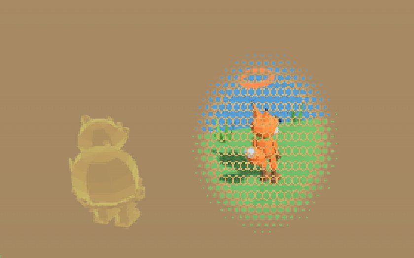
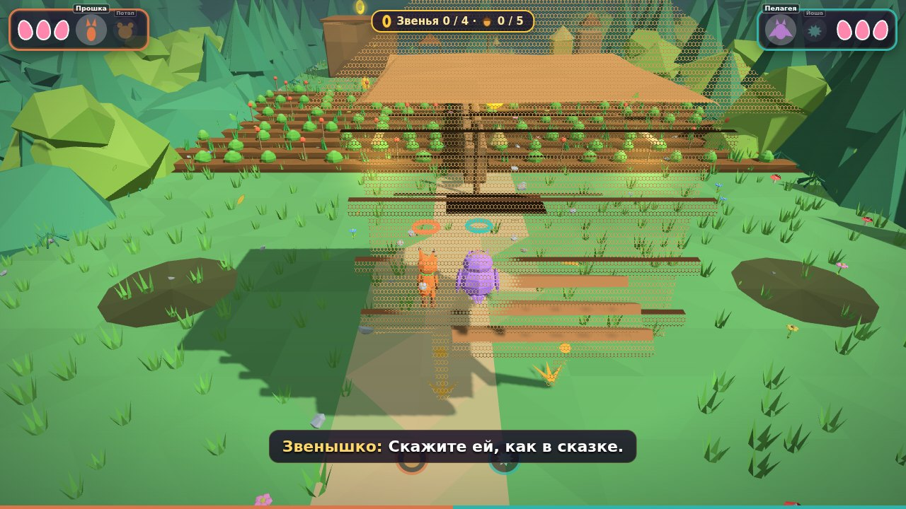

# final04 · Видимость героев и камера правым стиком

Роли: Lead Technical Artist, Gameplay Camera Engineer. Всё сделано модулями релизной сборки поверх прототипа, прототип `index.html` не меняется. Модули:
- `build/late_88_occ.js` — видимость героев;
- `build/late_89_camorbit.js` — камера правым стиком;
- точка подключения шейдера — `LowPolyMat` в `build/fin_early.js`.

Боты:
- `tfin_occ` — видимость, с замерами по пикселям;
- `tfin_cam` — камера.

Новых библиотек нет: всё построено на Three.js r128, который уже встроен в сборку.

## Шаг 1 · Исследование подходов

| Подход | Как работает | Плюсы | Минусы | Где встречается |
|---|---|---|---|---|
| **Полупрозрачность (alpha blend)** | препятствию между камерой и героем снижается `opacity` | просто; объект виден целиком | прозрачный проход: сортировка, «просвечивание» задних граней, мерцание при пересечениях, нет записи глубины. У нас хуже: изменение материала выбрасывает меш из пачки статики, а пачки — это сотни мешей в одной отрисовке | классика изометрии и ранних 3D-платформеров. Так работали «прозрачные стены» прототипа (`fadeable`, непрозрачность 0,22) |
| **Дизер / screen-door** | фрагменты выбиваются по пороговой матрице (Bayer 4×4/8×8, `discard`) | материал остаётся непрозрачным: нет сортировки, работает глубина и тени, дёшево | без TAA узор заметен; мелкий шум рябит при движении | повсеместно для объектов у самой камеры в современных action-adventure |
| **Экранный вырез вокруг героя** | в шейдере скрывается то, что ближе героя и попадает в круг вокруг него на экране | прячется только то, что закрывает героя; остальное здание, стена или лес видны, уровень читается | нужны правила «что не резать» (пол под ногами, интерактив) | изометрические RPG с «окном» в стене вокруг персонажа |
| **X-ray силуэт** | второй проход меша героя с `depthFunc = GreaterDepth`: рисуется только там, где героя закрыли | форма героя видна всегда, даже за тем, что резать нельзя (враги, ворота, платформы). Одна отрисовка на героя | силуэт не показывает окружение и подножие | платформеры и кооп-игры: цветной контур героя за стеной |
| **Наезд камеры (spring arm)** | камера подъезжает к герою, если между ними препятствие | ничего не прячется | в кооп-камере на двоих «дёргает» кадр и спорит с кадрированием пары; меняет дефолтную камеру | камеры от третьего лица с одним героем |

**Выбор: экранный вырез с крупным узором (дизер «в горошек»), x-ray силуэт, затухание у камеры.** Почему:
1. Вырез прячет ровно то, что закрывает героя, и уровень остаётся читаемым. Детская аудитория теряется, когда пропадает целый дом.
2. Дизер вместо alpha: материалы остаются непрозрачными — без сортировки и мерцания, с тенями. Главное для нашей сборки: статика собрана в пачки по 24 м, а шейдер работает с пачкой, не разбирая её. Покадровая прозрачность отдельных объектов в пачках невозможна без их выброса.
3. Узор сделан стилем, а не шумом: крупные круглые дырки с тёплой кромкой, «кружево» в духе игрушечного low-poly. Мелкий Bayer без TAA рябит.
4. X-ray закрывает то, что вырез не должен трогать: врагов, ворота, подвижные платформы. Ещё он показывает героя в первый миг, пока вырез проявляется.
5. Наезд камеры оставлен только как защита от стен при повороте камеры игроком (см. ниже). Дефолтная камера не меняется.

## Шаг 2 · Аудит кода

### Камера (прототип)
- **Риги:** `rigs[0]`, `rigs[1]` (свой у каждого игрока) и `shared` (общий).
  - `updateRig`: взгляд = герой + упреждение, камера = взгляд + `camBack()·7,2 м + 4 м`, x ограничен `W.camX`.
  - `updateShared`: кадр ролика, `W.camFn` (сценарные камеры раннера и полёта), боевые зоны `W.camZones`, середина пары.
- **Сплит:** `decideSplit` (`G.split`, `G.splitTarget`).
- **Отрисовка:** `composePose(src)` → `render()`. Общий экран рисуется камерой `camS`, сплит — `cams[0]` и `cams[1]` (со `setViewOffset` и переходом через `lerp`).
- **Направление камеры:** `camBack()` = (sin `W.camYaw`, 0, cos `W.camYaw`). От него же считается ходьба в `updatePlayer`.
- **Правый стик** прототип не читает (`PADS.gp[pi].axes[2..3]`).

### Герои
- В final03 у каждого героя один `SkinnedMesh` (`HMAT`: цвета вершин, скиннинг) в `h.body`.
- Вещи гардероба и снаряжение прикреплены к костям.

### Материалы
| Что | Материал | Примечание |
|---|---|---|
| Почти вся геометрия уровня | `LowPolyMat` (все `MeshLambertMaterial` → Phong с плоским затенением, `aShade`, хуки `fxHook`) | общий `onBeforeCompile` — одна точка подключения выреза для всего мира |
| Пачки статики (`late_26`) | `batMat`: `LowPolyMat` с цветом вершин (`bemis`) или `MeshBasicMaterial` для неосвещённого | ячейки 24 м; оригиналы остаются «заместителями» на слое 31 (для лучей) |
| Кит-декор, деревья с ветром | `KMAT` / `LowPolyMat` с `fx` | не в пачках (цвет вершин, ветер) |
| Лес-инстансы, scatter | `InstancedMesh` + `LowPolyMat` | матрица экземпляра учитывается в шейдере |
| FX, значки, кольца, небо, горизонт | `MeshBasicMaterial`, `ShaderMaterial` | выреза нет — их и не надо резать |

Старая прозрачность `fadeable`/`updateFade`:
- работает только для объектов, которые уровень пометил сам (в 2-2 это 180 мешей);
- луч идёт от рига к груди героя, при попадании `opacity` = 0,22 и `transparent`;
- из-за этого стена выпадает из пачки, начинаются сортировка и артефакты.

### Категории
- **Загораживают** (к ним применяется вырез):
  - статика уровня: земля и склоны выше ног, стены, дома, заборы;
  - мосты и настилы над героем, деревья (в том числе с ветром), камни, кит-декор, инстансы леса;
  - пачки статики.
- **Никогда не прячутся:**
  - сами герои (скиннинг) и их вещи;
  - враги (`enemies`, `likhos`, `trees`: ходячие ели);
  - предметы и награды (`items`, `baits`, `bells`);
  - интерактив (`gates`, `plates`, `grabs`);
  - платформы (`movers`, `lifts`, `tiles`, `clouds`, поплавки воды);
  - NPC (`FIN.actors`), Звенышко;
  - FX, значки и подсказки (`MeshBasicMaterial`, без выреза);
  - по правилам шейдера: пол и опора под героем, ступени у ног, всё, что дальше героя.

  Материалы этих объектов помечаются `userData.noOcc`: у своих материалов пометка ставится на месте, общие подменяются копией без выреза, локальные пачки живых групп получают копию `batMat`.

## Шаг 3 · Детекция
- **Кто и откуда.** Для каждого из двух активных героев от настоящей камеры своей панели (`camS` на общем экране, `cams[i]` в сплите) идут 3 луча: к голове (0,9 роста), груди (0,5) и ногам (+0,3 м).
- **Частота** — 15 раз в секунду, отдельно для каждой панели.
- **По чему проверяются лучи.** Список «загораживающих» собирается через 0,4, 1,8 и 3,5 с после загрузки, дальше раз в 5 с. В него попадают:
  - меши с вырезом выше 0,7 м с площадью основания меньше 600 м² (огромная земля не в счёт);
  - заместители пачек (настоящая геометрия, слой 31);
  - экземпляры инстансов — каждый своей коробкой.

  Проверка идёт в три ступени: отсев по коробке отрезка, пересечение луча с коробкой (slab), точная проверка меша (`Mesh.raycast`). Экземпляры и очень крупные меши (больше 6000 треугольников) принимаются по коробке.
- **Гистерезис 0,3 с:** «закрыт» включается сразу, выключается через 0,3 с без попаданий.
- **Цифры (1-1, `tfin_occ`):**
  - около 950 кандидатов;
  - 6 лучей за такт;
  - на кадр 0,03–0,09 мс JS (детекция вместе с расчётом формы выреза);
  - точных проверок — единицы.

## Шаг 4 · Визуал

- **Узор — «горошек».**
  - Круглые дырки на сетке со сдвигом рядов, шаг 8 px на 1080p (масштабируется с разрешением).
  - Радиус дырки ∝ √силы, поэтому доля выбитого равна силе. Потолок — 70 % площади: остаётся ≥ 30 % препятствия, его форма и тени читаются.
  - Вокруг каждой дырки тёплая кромка (#FFCC73, 60 %). Резких вспышек нет.
- **Маска.**
  - Эллипс вокруг центра героя на его глубине. Полуоси 0,55 + 0,35·рост × 0,5 + 0,55·рост м, дальше 10 м растут на 3 %/м (до +70 %), не меньше 62 px на экране 1080p.
  - Край мягкий (smoothstep от 0,55 до 1 радиуса): дырки к краю мельчают.
- **Правила фрагмента.** Режется только то, что ближе героя на 0,6 м и больше. Не режутся:
  - всё ниже ног + 0,3 м;
  - горизонтальные грани ниже ног + 1,2 м (ступени, уступы);
  - материалы без выреза.
- **Время.** Проявление 0,2 с, возврат 0,5 с, с плавной кривой (smoothstep). Без мерцания: гистерезис и узор, неподвижный на экране.
- **Силуэт-«рентген».**
  - Второй проход скелетного меша (тот же скелет): `depthFunc = GreaterDepth`, рисуется после мира (renderOrder 1) и до героев (renderOrder 2), поэтому своё тело силуэт не рисует.
  - Трафарет: каждый пиксель рисуется один раз, наложений частей тела нет.
  - Сдвиг на 0,28 м к камере: травинка у ног или земля силуэт не зажигают.
  - Цвета героев: Прошка #FF9A4A, Потап #FFD25A, Пелагея #D8A8FF, Йоша #72E6CC.
  - Пульс 0,6 ± 0,14, края ярче (френель). В роликах гаснет за 0,3 с.
- **У самой камеры.** Всё ближе 2,1 м растворяется тем же узором, к 0,75 м — полностью (до потолка 70 %). Пол и крыши под камерой не растворяются. Работает и в роликах.
- **Тени** не трогаются: теневой проход рисуется своими материалами глубины, поэтому растворённая стена отбрасывает тень как раньше.
- **«Прозрачные стены» уровней** (`fadeable`) остаются авторской разметкой:
  - вместо полупрозрачности стена растворяется узором целиком (до 65 % площади);
  - материал не меняется, сортировки нет;
  - такие стены не попадают в пачки;
  - тот же луч прототипа и те же сроки, что у выреза.

  
- **Настройка** «Герои за препятствиями»: вырез и силуэт / только силуэт / выкл.

### Замеры (`tfin_occ`, 1-1, стена между камерой и героем)
| Что | Без системы | С системой |
|---|---|---|
| видно героя (доля пикселей от героя без стены) | 0,00 | 0,75 вырез · 0,77 вырез + силуэт |
| пол под стеной и столб за героем изменились | — | 0,00 и 0,00 |
| стена у камеры (1,2 м) закрывает центр кадра | 1,00 | 0,26 |
| живые объекты уровня без выреза | — | 19/19 |
| отрисовок за кадр | 197 | 197 (+ по 1 на героя, только когда силуэт виден) |
| время кадра в боте (swiftshader, шум) | 1,6–2,7 мс | 1,8–2,4 мс |

Стоимость на GPU — несколько операций и `discard` во фрагментах мира. В цикле по двум героям проход пропускается, если сила равна нулю.

## Камера правым стиком

- **Дефолт не меняется.** Орбита — поправка к позе, которую считает прототип: поворот вокруг точки взгляда и наклон. Она применяется в `composePose` на время отрисовки, сами риги не трогаются. При нулевой орбите поза совпадает с прежней побитно (`tfin_cam`: «default same»).
- **Оси.**
  - Стик X — вращение вокруг героя (на общем экране — вокруг середины пары или центра боевой зоны).
  - Стик Y — наклон −10°…+50° от дефолта. Стик вверх — камера ниже (смотрит вверх), как принято в играх от третьего лица.
- **Отклик.**
  - Радиальная мёртвая зона 0,15, после неё квадратичная кривая: половина хода даёт 17 % скорости. Так точные доводки даются легко.
  - Максимум 146°/с по горизонтали и ~90°/с по вертикали при скорости 100 %.
  - Разгон ~0,1 с. После отпускания инерционное торможение: камера «доезжает» ~16° и останавливается за ~0,3 с.
- **Настройки:** скорость 50–200 %, инверсия по горизонтали и вертикали.
- **Сплит.** У каждого игрока своя камера и свой стик, полный круг.
- **Общий экран.** Камеру ведут оба игрока: стики складываются, поворот ограничен ±55°. Почему:
  - в играх с общим экраном камеру либо вообще не дают вращать, либо её двигают оба игрока;
  - полный круг на общем экране путает второго игрока: его «вперёд» меняется без его участия;
  - ±55° дают заглянуть за угол и оставляют направления узнаваемыми для обоих.
- **Одиночный режим:** полный круг, работает любой джойстик.
- **Без орбиты:** уровни со сценарной камерой (`W.camFn`: раннер, полёт) и ролики.
- **Ходьба относительно камеры.**
  - Левый стик и клавиши работают относительно «вперёд» своей камеры: в сплите — своей, на общем экране — общей, в переходе сплита — плавно между ними.
  - Сделано подменой `camBack()` на время `updatePlayer(pi)`; остальной код прототипа видит прежнее направление.
  - `tfin_cam`: отклонение шага от «вперёд» камеры — 0°.
- **Стены и земля.**
  - Если повёрнутая камера зашла за коробку уровня с видимым мешем, она подъезжает к взгляду: быстро внутрь, медленно обратно. Минимальная дистанция — 1,6 м.
  - Если опустилась к земле — поднимается на 0,45 м над ней.
  - Вес этих поправок растёт вместе с поворотом, поэтому у дефолтной позы поведение прежнее.
  - Вместе с системой видимости: что осталось между героем и камерой — растворяется.
- **Автовозврат к дефолту** — 0,65 с, easeInOutCubic, по кратчайшему углу. Срабатывает:
  - при разделении и слиянии экрана;
  - в начале и в конце ролика;
  - после падения, когда герой возвращается к колокольчику.

  Прерывается, если игрок тронул стик.
- **Подсказка** в меню «Управление»: «Камера — правый стик…».

### Проверки (`tfin_cam`)
| Что | Итог |
|---|---|
| мёртвая зона 0,1 | поворот 0° |
| отклик 0,5 / 1,0 | 0,17 |
| инерция | 72,6°/с через 0,1 с после отпускания, 0 — к концу |
| общий экран | предел −55°, стик второго игрока поворачивает назад |
| наклон | +50° / −10°; инверсии X и Y работают |
| ходьба | угол к «вперёд» камеры 0° |
| сплит | возврат за 0,65 с; у Игрока 1 — 107,6°, у Игрока 2 — 0° |
| прерывание возврата стиком | да; слияние — снова возврат, все по нулям |
| стена за камерой | 15,3 м → 7,7 м → 15,3 м |
| падение и начало ролика | −55° → 0° |
