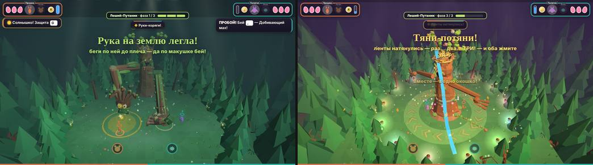
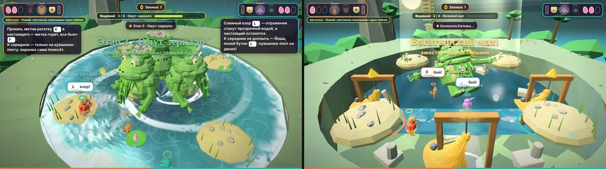
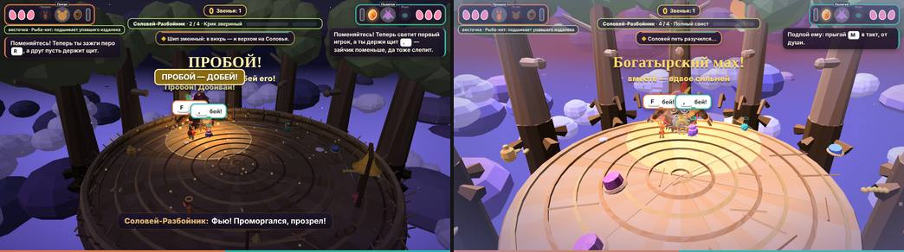
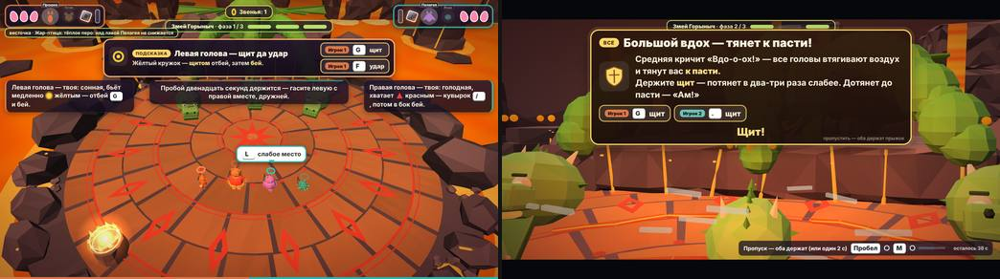
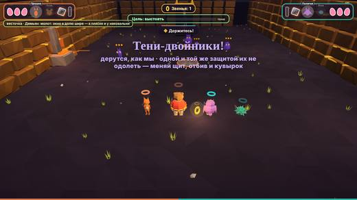
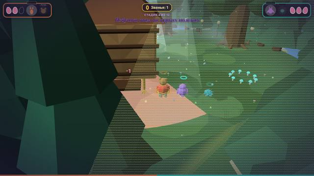
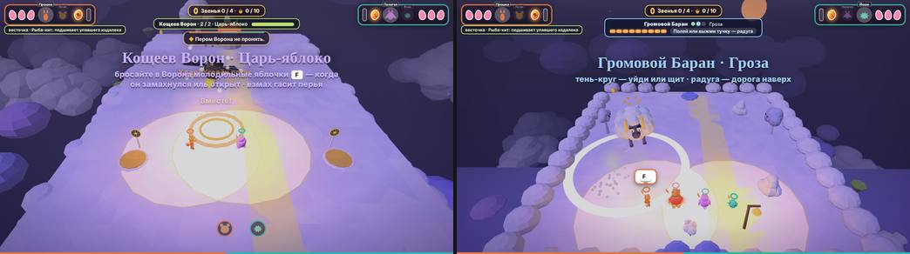

# 34. Аудит боссов «Златой цепи»: матрица, метрики, бэклог

Основа — стандарт `docs/33_boss_standard.md` («Боевая библия»). Здесь — что есть сейчас, насколько это отличается от стандарта и что делать (бэклог для сессий «по одной задаче»). Код игры в этой работе **не менялся**.

**Что проверено.** Пять главных боссов (1-Б Леший-Путаник, 2-Б Водяной, 3-Б Соловей-Разбойник, 4-Б Змей Горыныч, 5-Б1 и 5-Б2 Кощей) вместе с подходом («погоня с валом» ≈ 190 м в 2-Б, «Прямоезжая дорожка» ≈ 170 м в 3-Б) и пять мини-боссов (Яга 1-1, Рак-Отшельник 2-1, Кощеев Ворон 3-1, Громовой Баран 3-2, Лихо Одноглазое 5-1). Источники: `wiki/Боссы.md`, `Бой.md`, `Бестиарий.md`; доки `05, 16, 20, 22–31`; код `proto/levels/*`, `build/levels/*`, общие модули `late_75…late_91c`.

**Состояние кода:** `main` на `75490ed` (2026-10-08, включая PR «3-2 Громовой Баран: читаемость боя…»); релиз пересобран `build_final.py`. Все боссы, кроме Барана 3-2, измерены до этого слияния — оно трогало только 3-2 (`git diff --stat`).

**Метки источников.** `[КОД]` — прочитано в коде (`файл:строка`); `[БОТ]` — измерено существующим ботом на релизе, в который подмешан перехватчик (песочница аудита: `tip/banner/say/play/prompt/shake`, DOM-сэмплер HUD, переопределённая отрисовка); `[КАДР]` — снимок экрана; `[ГИПОТЕЗА]` — допущение (в т. ч. всё про детей: **данных живых детей нет**, `docs/30` — симуляция).

**Как мерили** (всё воспроизводимо; инструменты — `tools/boss_audit/` (README там же); постоянное ядро — F-0 в бэклоге):
- *Тексты:* экстрактор русских строк из JS (контекст вызова, число слов) + перехват `tip/banner/say/play` под ботами; время на экране — `dur × tipMul` мира (×2,5 мир 1, ×2,2 мир 2, ×1,8 мир 3, ×1 миры 4–5, `late_75_kids_w1.js`).
- *Читаемость:* порог слов/с — 0,5 (7 лет, 7 слов за 15 с — `docs/30`), 1,2 (9 лет), 1,7 (10 лет) `[ГИПОТЕЗА]`.
- *Размеры шрифтов:* вычисленные стили реальных элементов на окнах 1280×720, 1920×1080, 1024×576.
- *Перекрытия HUD:* прямоугольники видимых окон (баннер, субтитры, плашка пропуска, карточки, полоса босса).
- *Звук:* анализаторы на шинах `JM.mus/sfx/vox` (настройки по умолчанию, свободный процессор, Chromium без звуковой карты — измеряется выход до устройства).
- *Отрисовка:* `renderer.info` (вызовы, треугольники) после принудительной `render()` раз в 2 с игрового времени; частицы — `FIN.fx.list`. Время кадра в программном рендере (SwiftShader) — только относительное.
- *Боты играют идеально*, поэтому длительности — нижняя граница; ребёнок ×2–3 `[ГИПОТЕЗА]`.

**Шкала оценок области (0–3):** 0 — нет или мешает; 1 — работает, но выбивается из стандарта или непонятно ребёнку; 2 — хорошо, мелкие отличия; 3 — эталон. Доказательства каждой оценки — в таблицах раздела 3.

## 1. Сводная матрица: босс × область (0–3)

A — UI боя · B — подсказки · C — обучение и показ механик · D — VFX · E — катсцены · F — структура боя и кооператив · G — язык сигналов · H — звук, музыка, озвучка · I — техника и покрытие. Доказательства каждой оценки — в таблицах раздела 3 (с `файл:строка` и пометкой источника).

| Босс | A | B | C | D | E | F | G | H | I | Σ / 27 |
|---|---|---|---|---|---|---|---|---|---|---|
| 1-Б Леший-Путаник | 2 | 1 | 1 | **3** | 2 | 2 | 2 | 2 | 2 | 17 |
| 2-Б Водяной | 2 | 1 | 1 | **3** | 2 | 2 | 2 | 2 | **3** | 18 |
| 3-Б Соловей-Разбойник | 1 | 1 | 1 | **3** | 2 | 1 | 1 | 2 | 2 | 14 |
| 4-Б Змей Горыныч | 2 | 2 | 2 | **3** | **3** | 2 | **3** | 2 | **3** | **22** |
| 5-Б1 Кощей в тереме | 1 | 2 | 1 | 2 | 2 | 2 | 2 | 2 | 1 | 15 |
| 5-Б2 Кощей и Златая цепь | 1 | 1 | 2 | 2 | 2 | 1 | 2 | 2 | **3** | 16 |
| Яга 1-1 (ролик + 1-й бой) | — | **3** | 2 | — | 2 | — | **3** | 2 | 2 | — |
| Рак-Отшельник 2-1 | 1 | 1 | 2 | 2 | **3** | 2 | 2 | **3** | 2 | 18 |
| Кощеев Ворон 3-1 | 2 | 1 | 1 | 2 | 2 | 2 | 2 | 1 | 2 | 15 |
| Громовой Баран 3-2 | 2 | 1 | 1 | 2 | 2 | 1 | 1 | 1 | 2 | 13 |
| Лихо Одноглазое 5-1 | 2 | 1 | 1 | 2 | 2 | 2 | 2 | **3** | 1 | 16 |
| **Среднее по главным** | 1,5 | 1,3 | 1,3 | 2,7 | 2,2 | 1,7 | 2,0 | 2,0 | 2,3 | 17,0 |

**Читать так.** Сильное везде — **D (VFX)**: телеграфы-заливки, мимика, примирение. Слабое везде — **B и C (подсказки и показ)**: интерактивный показ есть только в 4-Б (5-Б2 показывает пассивно, остальные — баннером и текстом); тексты длиннее нормы у всех. Лучший — 4-Б (кандидат в эталон по **механике** обучения, не по длине); самые проблемные — 3-Б (сигналы и плотность) и 5-Б2 (длина, сохранение, озвучка уроков).

## 2. Метрики

### 2.1. Тексты и озвучка

Слов в тексте; «читаемы 10-леткой» — `слов/с ≤ 1,7`, время на экране уже умножено на `tipMul` мира; «озвучено» — реплики из `say/play`, найденные в `voice/lines.json`. Для 7 лет (≤ 0,5 слова/с) **не читаем ни один `TIP` ни одного босса** — даже две строки Яги по 4–5 слов (0,7–0,8 слова/с) `[ГИПОТЕЗА]`.

| Босс | `TIP`: шт. × слов (макс.) | `TIP` длиннее 7 слов | `TIP` на экране, с (с tipMul) | `TIP` читаемы 10-леткой (≤ 1,7 сл/с) | Подписи баннера: шт. × слов (макс.) | читаемы 10-леткой | Озвучено реплик |
|---|---|---|---|---|---|---|---|
| 1-Б | 16 × 9,2 (13) | 81 % | 7,7 | 16 из 16 | 12 × 7,2 (14) | 9 из 12 | 14 из 17 (82 %) |
| 2-Б | 28 × 17,8 (32) | 86 % | 9,3 | 9 из 28 | 18 × 5,1 (8) | 16 из 18 | 11 из 91 (12 %) |
| 3-Б | 39 × 15,6 (32) | 82 % | 7,3 | 13 из 39 | 12 × 8,4 (15) | 6 из 12 | 23 из 76 (30 %) |
| 4-Б | 4 × 12,2 (18) | 100 % | 2,9 | 0 из 4 | 8 × 16,2 (30) | 1 из 8 | 33 из 44 (75 %) |
| 5-Б1 | 11 × 9,4 (15) | 73 % | 2,8 | 2 из 11 | 6 × 8,7 (16) | 1 из 6 | 9 из 18 (50 %) |
| 5-Б2 | 8 × 8,2 (13) | 62 % | 2,6 | 2 из 8 | 4 × 2,2 (4) | 4 из 4 | 44 из 483 (9 %) |
| Яга 1-1 | 2 × 4,5 (5) | 0 % | 6,0 | 2 из 2 | 1 × 6,0 (6) | 1 из 1 | 7 из 12 (58 %) |
| Рак 2-1 | 7 × 16,9 (26) | 86 % | 8,2 | 3 из 7 | 4 × 8,5 (14) | 3 из 4 | 14 из 16 (88 %) |
| Ворон 3-1 | 4 × 12,5 (15) | 75 % | 6,1 | 1 из 4 | 6 × 7,8 (14) | 2 из 6 | 4 из 30 (13 %) |
| Баран 3-2 | 3 × 11,0 (15) | 67 % | 5,3 | 1 из 3 | 7 × 7,3 (14) | 2 из 7 | 2 из 26 (8 %) |
| Лихо 5-1 | 4 × 9,0 (14) | 50 % | 2,5 | 0 из 4 | 7 × 13,0 (20) | 0 из 7 | 40 из 57 (70 %) |

Примечания: у 5-Б2 вызовы `tip` есть, но карточки скрыты (`W.hintsOff`) — в DOM карточек подсказок 0 `[БОТ]`; у 3-Б и 2-Б в счёт входят подход и погоня; у мини-боссов — окно самого боя (Рак — с 231-й с, Лихо — с 240-й).

### 2.2. Ролики внутри боя и время этапов

| Босс | Ролики внутри боя, с (по порядку) | Сумма, с |
|---|---|---|
| 1-Б | 6, 6,6, 9, 16 | 37,6 |
| 2-Б | 7, 8,6, 9, 9,5, 12, 16, 24 | 86,1 |
| 3-Б | 7, 8, 9, 9, 13, 14, 16 | 76,0 |
| 4-Б | вход 20; рык 6,8; **обучение этапов 48,7 + 51,6 + 37,2 (интерактивное, предел)**; напоминание 4,8; финал 32,5 | 201,6 (из них обучение 137,5) |
| 5-Б1 | 17, 20 | 37,0 |
| 5-Б2 | 23 урока: 12 стадийных (39–69 с, сумма 611 с) + 11 прочих (дверь, «репка», поездки, пролог; 14–69 с, сумма 341 с); 14 роликов стадий в `tk5e_flow`: 9–58 с, сумма 238 с | **952 + ≈ 240 = ≈ 1190** |
| Яга 1-1 | 19,2 | 19,2 |
| Рак 2-1 | 6,4, 8,2, 16 | 30,6 |
| Ворон 3-1 | 6,4, 9,2, 12,6, 14,4, 22 | 64,6 |
| Баран 3-2 | 7,2, 9,4, 12,6, 20 | 49,2 |
| Лихо 5-1 | 12,6, 13,6, 15, 15,2, 15,6, 17,6, 24,4 | 114,0 |

Время этапов (`[БОТ]`, игровые секунды без роликов; бот знает ответы и не ошибается — нижняя граница, ребёнок ×2–3 `[ГИПОТЕЗА]`):

| Босс | Этап 1 | Этап 2 | Этап 3 | Этап 4 | Бой, всего | Соло (всего / самый долгий этап) |
|---|---|---|---|---|---|---|
| 1-Б | 32 | 90 | 50 | — | ≈ 172 | этап 3: 34 (`tfin_k1b3solo`); весь бой соло ботом не проходится |
| 2-Б | 31 | 38 | 5 (бот знает настоящего) | 27 (с общим ударом) | ≈ 101 | **≈ 229 (×2,3)**; этап 2 — **152** против 38 |
| 3-Б | 35 | 19 | 31 | 28 (+ песня 9) | ≈ 113 | 154 (×1,35); этап 3 — 61 против 31 |
| 4-Б | — | — | — | — | не измерено сквозным ботом (ролики-обучения до 137 с + бой) | `tfin_gorsolo` — отладочные победы |
| 5-Б1 | 75 (по таймеру) | 70 | 30 | — | **176** (по часам; не зависит от игры) | `noLose`: упасть нельзя |
| 5-Б2 | не измерено: бот выигрывает стадии 1, 2, 8, 9, 12 вызовами `E.oldWin` | | | | `[ГИПОТЕЗА]`: 12 × 3–3,5 мин по `docs/27` ≈ 40 мин + 16 мин уроков + ролики | `tk5e_solo` — по стадиям |
| Рак 2-1 | 2 этапа ≈ 45 с вместе с роликами (232→277 с) | | | | | |
| Лихо 5-1 | 3 фазы ≈ 115 с, из них ролики ≈ 114 с | | | | | |

Погоня 2-Б (≈ 190 м) и подход 3-Б (≈ 170 м) идут **до** боя; у идеального бота подход 3-Б — **183 с** (`tfin_k3b`: 9→192 с), то есть дорога сопоставима с самим боем.

### 2.3. Комфорт и нагрузка

Тряска — амплитуда `shake()` (`proto/engine/08_zven_tasks_camera.js:59`, после неё действует множитель «Тряска 0/50/100 %»); «пик в секунду» — наибольшее число событий за 1 с; hit-stop — приращения `G.hitstop`; вспышки — подъём `#flash` выше 0,3 (молнии 2-Б и вспышки 5-Б2 сюда не попадают: они не через `#flash` или не в боте). Перекрытия — доля площади меньшего окна, которая закрыта другим (HUD бот-сэмплирует каждые 0,1 с).

| Босс | Тряска: макс. / пик в секунду | hit-stop (шт.) | вспышки `#flash` | Перекрытия HUD (≥ 10 % меньшего окна) |
|---|---|---|---|---|
| 1-Б | 0,06 / 7 | 12 | 0 | skip×subs 48 %; banner×hintS 55 % |
| 2-Б | 0,09 / 10 | 4 | 0 | skip×subs 47 %; banner×hintS 64 % |
| 3-Б | 0,09 / 5 | 3 | 0 | skip×subs 48 % |
| 4-Б | 0,13 / 7 | 4 | 0 | bossbar×finTut 26 %; skip×subs 47 %; finTut×vest 45 %; finBossHint×hint1 20 %; finBossHint×hint0 24 %; finBossHint×hintS 100 %; banner×finBossHint 20 % |
| 5-Б1 | 0,30 / 5 | 2 | 0 | skip×subs 48 % |
| 5-Б2 | 0,16 / 6 | 2 | 0 | skip×subs 27 % |
| Яга 1-1 | 0,05 / 2 | 0 | 0 | skip×subs 48 % |
| Рак 2-1 | 0,06 / 3 | 0 | 0 | skip×subs 46 % |
| Ворон 3-1 | 0,05 / 4 | 1 | 0 | skip×subs 48 % |
| Баран 3-2 | 0,07 / 4 | 1 | 0 | skip×subs 47 %; banner×finBossHint 48 % |
| Лихо 5-1 | 0,10 / 1 | 0 | 0 | skip×subs 47 % |


**Нагрузка на отрисовку** (`[БОТ]`, 1280×720, качество «средняя», замер каждые 2 игровые секунды после принудительной `render()`; боссовые боты, в том числе соло). Для 1-Б, 2-Б, 3-Б (бой), 4-Б (бой), 5-Б1, Ворона, Барана и Яги использованы замеры с `gl.finish()`; для подхода 3-Б, Рака, Лихо, 5-Б2 — бот-логи с обновляющимися значениями. Замеры, где значения не менялись на протяжении десятков секунд (устаревшее состояние перехватчика), в таблицу не взяты. Время кадра **не приводится**: в программном рендере (SwiftShader) оно показывает только относительную нагрузку и сильно зависит от соседних процессов — вывод делаем по вызовам, треугольникам и частицам.

| Бой | замеров | вызовы: мед. / p95 / макс. | треугольники, тыс.: p95 / макс. | частицы: p95 / макс. | максимум вызовов — где |
|---|---|---|---|---|---|
| 1-Б | 143 | 244 / 277 / 326 | 104 / 109 | 17 / 23 | tfin_k1bhide.p2 |
| 2-Б | 107 | 201 / 416 / 458 | 156 / 161 | 31 / 47 | tfin_k2bboss.p2 |
| 3-Б | 426 | 161 / 203 / 415 | 457 / 545 | 16 / 31 | tfin_k3b |
| 4-Б | 279 | 208 / 242 / 299 | 89 / 91 | 14 / 117 | tfin_gorsolo |
| 5-Б1 | 84 | 92 / 129 / 220 | 229 / 244 | 10 / 24 | t5b1.p2 |
| 5-Б2 | 410 | 235 / 547 / 911 | 207 / 267 | 69 / 198 | tk5e_lesson |
| Ворон 3-1 | 25 | 151 / 174 / 181 | 281 / 283 | 24 / 31 | tfin_sky31boss.p2 |
| Баран 3-2 | 47 | 188 / 428 / 432 | 384 / 389 | 25 / 26 | tfin_sky32boss.p3 |
| Рак 2-1 | 28 | 289 / 409 / 420 | 740 / 745 | 11 / 15 | tfin_k21 |
| Лихо 5-1 | 58 | 152 / 189 / 249 | 202 / 402 | 9 / 31 | t51 |
| Яга 1-1 | 6 | 87 / 239 / 239 | 202 / 202 | 39 / 39 | tfin_yaga11.p2 |

Читать так: `вызовы` — `renderer.info.render.calls`; `частицы` — живые эффекты `FIN.fx.list`; Яга — всего 6 замеров (ролик + короткий бой), 3-Б включает подход (максимум 415 вызовов — там), 5-Б2 — уроки и стадии (максимум 911 вызовов — в уроке 3, t≈60 с; частиц до 198). **Исключены** кадры входа в уровень, где сцена ещё отрисовывается целиком (1277–1491 вызовов, статичная картинка 10–25 с) — это не бой, но на слабом устройстве именно они самые тяжёлые `[ГИПОТЕЗА]`; стоит проверить отдельно (F-0).

**Вывод.** Бюджет стандарта — **≤ 450 вызовов (p95), ≤ 600 тыс. треугольников (p95), ≤ 120 живых частиц (пик)**. Выше нормы только: 5-Б2 (p95 вызовов 547, пик 911; частиц 198) — задача B6-c; Рак-Отшельник (≈ 740 тыс. треугольников при 400 вызовах; причина не выяснена) — М-1 (найти, что рисуется); остальные боссы укладываются с запасом (1-Б, 4-Б — вдвое-втрое ниже нормы).

### 2.4. Громкость: боссовые звуки относительно музыки (`[БОТ]`, анализаторы на шинах, dBFS до звуковой карты)

Условия: настройки по умолчанию (музыка 0,7, звуки 0,8, голос 1), свободный процессор, Chromium без звуковой карты; пик и RMS за окно звука; **лимитер** на выходе — порог −6 дБ, отношение 20:1 (`late_91c_juice_world.js:17`).

| Что звучит | Пик, dBFS | RMS, dBFS | Относительно музыки боя (`boss`: пик −40,2 / RMS −64,7) |
|---|---|---|---|
| Музыка мира (`w1…w5`, `hub`, `epi`; `title` — −53,7) | −39…−46 | −54…−69 | −6…+1 дБ к музыке боя |
| Музыка боя: общая `boss` / `jxBoss2` / `jxBoss3` | −40,2 / −38,8 / −39,1 | −64,7 / −63,7 / −62,9 | 0 |
| Музыка 1-Б: этап 1 `k1b1` / этап 2 `k1b2` / этап 3 `k1b3` / финал `k1b4` | −52,9 / **−64,2** / −41,2 / −43,7 | −78,8 / **−91,8** / −56,9 / −56,4 | этап 2 тише этапа 3 на **23 дБ RMS** |
| Музыка 2-Б: этапы 1–4 `vod1…vod4` | −54,7 / −40,8 / −36,8 / −37,2 | −81,5 / −70,1 / −63,4 / −66,4 | этап 1 тише этапа 3 на **18 дБ RMS** (на 7 дБ, если не считать первую тему пробы: возможно нарастание при старте); этапы 2–4 ровные |
| Музыка 3-Б: этапы 1–4 `sol1…sol4` | −37,6 / −36,5 / −34,5 / −38,0 | −65,9 / −63,7 / −64,2 / −66,6 | **ровно: разброс 3 дБ**, на уровне общей `boss` |
| Звуки удара: `finisher` / `crash` / `hammer` / `mah` / `brk` / `parry` | −23,5 / −20,4 / −21,1 / −24,2 / −25,0 / −25,4 | −43…−48 | **+15…+20 дБ** к пику музыки |
| Сигналы мороков: `yellow` / `red` / `blue` | −34,9 / −38,2 / −36,8 | −52…−55 | +2…+5 дБ (тише ударов на 10–15 дБ) |
| **Рык Горыныча** (`G4S.roar`) / «гул» | **−24,8** / −25,6 | −41,6 / −44,7 | **+15 дБ** (как обычный удар, не громче) |
| Рык Водяного (`K2FX.roar`) | −29,1 | −41,0 | +11 дБ |
| **Свист Соловья** (синус 1,5 → 2,2 кГц) / другие волны | **−32,5** / −31…−33 | −49,6 | **+8 дБ**, тише рыка на 8 дБ |
| «Бормотание» — реплика без записи (`koschei`, `leshy`, `vod`, `solovei`…) | −27,8…−29,1 | **−40,3…−40,6** | +11 дБ пик, **+24 дБ RMS** |
| **Записанные голоса** (19 строк боссов и героев) | **−1,6…−4,6** (у лимитера) | **−17…−23,6** | **+36…+39 дБ пик, +41…+47 дБ RMS** |

Выводы (`[БОТ]`, на слух не проверено — нужен контрольный прослушивание, F-7):
- **Свист Соловья и рык Горыныча не громче остальных звуков игры**: рык — на уровне обычных ударов (−25 против −20…−25), свист — на 8 дБ тише; их «страшность» не в громкости. «Внезапных» боссовых SFX выше −20 dBFS нет.
- **Главная неровность — голос против всего остального:** записанная реплика на 36–39 дБ по пику (41–47 дБ по RMS) громче музыки боя и на 20–25 дБ громче самых резких ударов; пик реплики упирается в лимитер (−1,6…−4,6). Для ребёнка это «скачок громкости» при каждой записанной фразе, а настройки «Музыка» и «Голоса» не сближают их по умолчанию. Тон не влияет: реплики Кощея с тегами `[shouting]`/`[menacing]`/`[angrily]` — те же −3,6…−4,6 пик, RMS −17…−20,6, то есть не громче «тихих» (`[gently]` −17,1; `[quietly]` −18,0); выразительность записей выровнена нормализацией.
- Музыка очень тиха в абсолюте (пик −40, RMS −55…−69) и неровна между этапами одного босса (1-Б: этап 2 на 23 дБ тише этапа 3; 2-Б: этап 1 на 18 дБ тише этапа 3; 3-Б ровно — разброс 3 дБ, это образец для стандарта «± 6 дБ»). Приглушение музыки под записанной репликой ×0,45 (≈ −7 дБ), в ролике ещё ×0,55 (`late_91_voice.js:33`, `late_40_music.js:89`) почти не слышно на фоне разрыва в 40 дБ.

### 2.5. Размеры текста в реальном окне (`[БОТ]`, вычисленные стили, `uisize.js`)

В README написано «шрифт подсказок и задач — 22 и 19 px» — это старые `.tip` и `.obj`, которые в релизе **скрыты** (`fin.css:114–115` — размеры; `fin.css:188` — `.tip,.obj{display:none!important}`). Реальные окна:

| Элемент (кто пользуется) | px (1280×720 / 1920×1080 / 1024×576) | % высоты окна (720p / 1080p) |
|---|---|---|
| Карточка подсказки/задачи `.hn-card` — все уровни и боссы 1-Б, 2-Б, 3-Б, 5-Б1 | 16 / 16 / 16 | **2,2 % / 1,5 %** |
| Её малая строка `.hn-head` (задача при подсказке) | 12,5 | 1,7 % / 1,2 % |
| Её крупная строка `.hn-short` (краткая задача) | 17,5 | 2,4 % |
| Субтитры `#subs` — реплики всех роликов | 22 | 3,1 % / 2,0 % |
| Баннер `#banner` / подпись `small` | 44 / 22 | 6,1 % / 3,1 % |
| Полоса босса `#bossbar`, плашка пропуска `#skip` | 14 | 1,9 % / 1,3 % |
| Табличка Соловья `#solsign` (3-Б) | 22 (фикс., ПРОПИСНЫЕ) | 3,1 % / 2,0 % |
| Подсказка в бою 4-Б `#finBossHint`: заголовок / текст / кнопка | 20 / 15 / 15,4 | 2,8 % / 2,1 % |
| Урок 4-Б `#finTut`: заголовок / текст / кнопка / «Нажми» | 30 / 21,8 / 19,2 / 25,6 | 4,2 % / 3,0 % / 2,7 % / 3,6 % |
| HUD 5-Б2: подпись «стадия N из 12» / стих | 11 / 15–24 | 1,5 % / 2,1–3,3 % |
| Имя босса при появлении (`late_91c_juice_world.js:138`) | 40 (прописные) | 5,6 % |

Вывод: две системы — крупная для роликов, баннеров и урока 4-Б (3–6 %) и **мелкая для боевых подсказок** (1,5–2,8 %); при 1080p всё, что задано в px, уменьшается вдвое относительно экрана (1,3–3,1 %). Рекомендуемая нижняя граница стандарта — **3 % высоты окна**.

### 2.6. Телеграфы: время от замаха до удара, с (`[КОД]`, Лёгкий / Средний / Богатырь)

Базовые окна `TIMING` (`01_utils_input_sound.js:18`): замах 0,7 / 0,5 / 0,35, отбив 0,35 / 0,25 / 0,15; «большой» враг ×1,25; детские ступени `KIDS_W` (`late_75_kids_w1.js:16–19`): мир 1 — 0,9 (красный ×1,5), мир 2 — 0,82 (×1,35), мир 3 — 0,76 (×1,2), миры 4–5 — как база.

| Босс | Атака | Лёгкий | Средний | Богатырь | Откуда |
|---|---|---|---|---|---|
| 1-Б | «Хлоп» (жёлтая рука) | 0,9 | 0,5 | 0,35 | `FOE.hand` (не «большой») |
| 1-Б | «Сгреб» (красная рука) | 1,35 | 0,6 | 0,35 | красный ×1,5 / ×1,2 |
| 2-Б | шар, бросок сома, кони | 0,9–1,5 | то же | то же | `docs/23_vodyanoy_boss.md` |
| 3-Б | трель / посох / вдох / змей | 1,05 / 1,15 / 1,3 / 1,2 | 0,75 / 0,85 / 1,0 / 0,9 | как Средний | `late_99v_k3b.js:99` (`tell()` — только Лёгкий и соло) |
| 4-Б | левая (сонная, жёлтая) | 1,4 | 1,0 | 0,7 | 0,7 × 1,25 × 1,6 (`proto/levels/4-B.js:24`) |
| 4-Б | правая (красная), средняя (синяя) | **0,88** | 0,63 | 0,44 | `FOE.golova` `big:true` |
| 5-Б | тени-двойники, обычные мороки | 0,7 | 0,5 | 0,35 | база |

Окно кувырка на красный: мир 1 — 0,8 с, мир 2 — 0,73, мир 3 — 0,66, **миры 4–5 — 0,45** (`late_75_kids_w1.js:30`). У 3-Б «Богатырь» не отличается от «Среднего» (`tell()` не смотрит путь, кроме Лёгкого).

### 2.7. Число различных сигналов босса (форма + цвет + звук) — оценка `[КОД]`/`[ДОК]`

| 1-Б | 2-Б | 3-Б | 4-Б | 5-Б1 | 5-Б2 |
|---|---|---|---|---|---|
| 7 | 8 | **12** | 8 | 6 | > 20 (по стадиям) |

3-Б — максимум среди первых четырёх: четыре цвета волн + посох, змей, перья, пике, крен, колокол, жёлудь, прицел. Для 7 лет разумно ≤ 6 на этап и ≤ 8 на босса (`docs/33`).

## 3. Аудит по боссам

### 3.1. 1-Б «Леший-Путаник» (мир 1)

**Что это.** Три этапа на круглой поляне, без подхода: бой начинается сразу после ролика входа (9 с). Этап 1 «Руки-коряги» (жёлтая «Хлоп» — щит, красная «Сгреб» — кувырок; рука в Пробое ложится мостом на плечо, три удара по макушке сбивают трофеи), этап 2 «Ищи-свищи» (двойники прячутся, настоящий падает на струне клубка; Совиный взор Пелагеи надевает золотой обруч), этап 3 «Хоровод» (бег по кругу, прыжок через скакалку, «Тяни-потяни» на «ТРИ!», Богатырский мах вдвоём; два круга). Код: `proto/levels/1-B.js` + `build/levels/1-B/*` (замены — `rep_30_leshy1b.py`). Боты: `tfin_k1b`, `tfin_k1bhands`, `tfin_k1bhide`, `tfin_k1b3`, `tfin_k1b3solo`, `tfin_k1bcine` — **отдельные боты босса есть** (гипотеза из задания «в 1-Б нет бота» не подтвердилась).

**Измерено** (боты под перехватчиком, `[БОТ]`; время — игровое, бот играет идеально):
этап 1 ≈ 32 с (`tfin_k1b`: 5→38 с), этап 2 ≈ 90 с (2 круга, `tfin_k1bhide`: 7→97 с), этап 3 ≈ 50 с (2 круга, `tfin_k1b3`: 17→67 с); ролики 9 + 6 + 6,6 + 16 с = 37,6 с; бой без роликов у идеального бота ≈ 3 мин, у ребёнка — ×2–3 `[ГИПОТЕЗА]`, то есть 6–9 мин.
Тексты (все показанные за прогоны, tipMul мира 1 = ×2,5): `TIP` 16 шт., в среднем 9,2 слова (13 из 16 длиннее 7); подписи баннеров 12 шт., 7,2 слова (макс. 14); задача этапа 3 в карточке — 20 слов; реплик и подписей роликов 17, найдено в `lines.json` 14 (82 %; собственных записей `1-B_001…010` — 10 строк, 31 с).
Тряска: амплитуда ≤ 0,06 (до 7 событий в секунду, но `shake` берёт максимум, а не сумму); вспышек (`#flash`) 0; hit-stop 0,16 с на макушке.

**Кадр** `[КАДР]` (1280×720, уменьшен): слева — этап 1: баннер «Рука на землю легла!» в две строки и карточка игрока 2 с названием приёма «Добивающий мах»; справа — этап 3: баннер «Тяни-потяни!» поверх Лешего и скакалки (боты `tfin_k1bhands`, `tfin_k1b3`).



| Обл. | Оценка | Доказательство |
|---|---|---|
| A UI | **2** | Полоса босса «Леший-Путаник · фаза N / 3» + сегменты (удары по макушке / круги / запал) — `proto/levels/1-B.js:21–23` `[КАДР]`; но карточки подсказок 16 px (`fin.css:190`), плашка «Пропуск…» 14 px перекрывает субтитры на 48 % площади (`[БОТ]` skip×subs, t=0,9 с), баннер «Вторая скакалка!» закрывает 55 % карточки этапа 3 (`[БОТ]` t=59,8 с). |
| B Подсказки | **1** | Длинные: `late_99zb_k1b_hoorovod.js:39` — 13 слов, баннер-подпись `:38` — 12 слов за 6 с (2 слова/с); два имени одного приёма «Богатырский мах» (`late_99zb…:94`) и «Добивающий мах» (`proto/engine/09_hud_cine.js:65`) — в карточке на 70,7 с `[БОТ]`; одна и та же инструкция дважды подряд («Леший закружился! Бегом к нему…» и «Большой морок оглушён!…»). Эскалации нет. Хорошо: «Красный зубец — кувырок» (3 слова) вспыхивает на красном замахе, пока не удался первый кувырок (`late_75`/`late_76`). |
| C Обучение | **1** | Показа нет: новая механика этапа 3 (скакалка, «Тяни-потяни») вводится баннером в 12 слов и подсказкой (`late_99zb_k1b_hoorovod.js:38–40,78–79`), без демонстрации и без ожидания нажатия. Смягчает: задела скакалка — минус лепесток, витки не пропадают, а «не вместе» на «ТРИ!» — счёт заново без штрафа (`docs/29`, шаг 5). Этап 1 опирается на сигналы, выученные в 1-1…1-4. |
| D VFX | **3** | Эталон телеграфа: круг и веер **заливаются вместе с замахом** (`late_99y_k1b_fx.js` «телеграфы-заливки», `late_99z_k1b_hands.js:2–4`), цель — в цвет сигнала; три трофея слетают по одному с мимикой (удивлён → обижен → смущён); арена меняет свет по этапам; финал — рассвет, цветущий рог, лешачата хлопают. Фильтр «Меньше надписей» (`late_99z_k1b_hands.js:6`) оставляет только ключевые подписи. |
| E Катсцены | **2** | Полный набор: вход 9 с, переход 6 с, выход на хоровод 6,6 с, финал 16 с (+ Сказ), все пропускаемы (`S.skip()`, «осталось N с»); «Спор проигран» — босс становится другом. Минусы: стихи рассказчика не озвучены, субтитр 15 слов за 3,2 с `[БОТ]`; плашка пропуска перекрывает субтитры `[КАДР]`. |
| F Структура | **2** | 3 этапа, на каждом одна новая механика, роли двоих героев; соло: оставленный держит ленту, «Тяни-потяни» — одно нажатие (`late_99zb_k1b_hoorovod.js:8`, `tfin_k1b3solo`). Один герой в этапе 2 нужен Пелагее (взор) — но он необязателен (есть и другие приметы). «Этап сначала» из `docs/29` в коде нет — падение вдвоём обрабатывает общее правило (10 с, колокольчик). |
| G Сигналы | **2** | Этап 1 — по общему словарю (жёлтое/красное). Конфликт: сектор скакалки залит `0xffc83a` (`late_99y_k1b_fx.js:97`) — цвет жёлтого «щит», а надо **прыгнуть**; золотой обруч = «настоящий» (в 3-Б золотой жёлудь = «настоящий» — это согласуется). |
| H Звук | **2** | Своя музыка на каждый этап (`k1b1…k1b4`, `late_99zc_k1b_cine.js:10–29`), озвучены 10 строк; новые реплики — «бормотание» с субтитрами; громкость не измерена. Тон мягкий. |
| I Техника | **2** | Шесть ботов на этапы, соло только для этапа 3; сквозного прохода всех трёх этапов настоящими нажатиями нет (переходы — `W.bossNext()`); кадров/FPS в бою нет. |

**Находки 1-Б** (приоритеты — по критериям задания; номера используются в бэклоге):
- **1Б-1 [P1, B]** Подсказки/баннеры не по правилу ≤ 7–10 слов; этап 3 вводится 12–13-словными строками.
- **1Б-2 [P1, B]** Единое имя приёма: «Богатырский мах» vs «Добивающий мах» — привести к одному.
- **1Б-3 [P1, C]** Показ для «Хоровода»: демо-виток (скакалка пролетает мимо — герой прыгает; «раз-два-три» с эхом-метроном) до первой проверки.
- **1Б-4 [P1, G]** Сектор скакалки перекрасить из жёлтого/золотого в цвет «прыжка» словаря (см. 4.1) и дублировать формой (полоса поперёк дорожки, а не веер).
- **1Б-5 [P2, E]** Озвучить/упростить вступительные стихи (15 слов за 3 с).
- **1Б-6 [P2, I]** Бот «1-Б от входа до победы» настоящими нажатиями (этапы 1→2→3 без `bossNext`) + снимки FPS.

### 3.2. 2-Б «Водяной» (мир 2)

**Что это.** Сначала **погоня с валом** ≈ 190 м (десять участков: сваи и котёнок, дуб, мельница, кувшинки, ручей, развилка и шлюз, камыш, лодка Садко, плетень — `late_99s_k2b_chase.js`), потом бой в **четыре этапа**: 1 «Сом-перевозчик» (отбить шар в последний миг; рогатка Прошки в ус, Потап тянет «раз-два-три»), 2 «Водяные кони» (сыграть у раковины — конь замер — прыжок на коня — удар по короне острова), 3 «Омут-зеркало» (Совиный взор + метка рогаткой + кувшинка-плот Йоши), 4 «Великий вал» (колокола на «БОМ!», общий удар). Код: `build/levels/2-B/late_99j_k2b.js` (бой, 71 КБ), `late_99q` (облик), `late_99r` (эффекты воды), `late_99s` (погоня). Боты: `tfin_k2b` (погоня), `tfin_k2bsolo`, `tfin_k2bmill`, **`tfin_k2bboss` (бой вдвоём настоящими нажатиями) и `tfin_k2bbosssolo`** — лучшее покрытие среди боссов.

**Измерено** (`[БОТ]`, идеальная игра): этап 1 ≈ 31 с, этап 2 ≈ 38 с, этап 3 ≈ 5 с (занижено: бот знает настоящего — `D.posSlot(S.real)` в `tfin_k2bboss`), этап 4 ≈ 27 с (с общим ударом); одним игроком этап 2 ≈ **152 с** (в 4 раза дольше, чем вдвоём: смена героя и «оставленный держит напев 15 с»). Ролики: вход 8,6 + 16 с, переходы 9 + 9,5 + 12 + 7 с, финал 24 с = 86 с в бою, затем ещё три коротких ролика (7,6 + 8,6 + 9,5 с: Кощей на скале, котёнок, Сказ).
Тексты (tipMul мира 2 = ×2,2): `TIP` 28 шт., в среднем **17,8 слова (макс. 32)**, 24 из 28 длиннее 7 слов, на экране в среднем 9,3 с (≈ 1,9 слова/с); подписи баннеров 5,1 слова; задачи этапов в карточке — 11–29 слов. Реплик и подписей роликов 91, озвучено 11 (12 %); одностроки Звенышка в переходах (3–7 слов) **не озвучены**.
Тряска: ≤ 0,09 (до 10 событий/с в погоне); вспышек `#flash` нет, но есть молнии (см. ниже).

**Кадр** `[КАДР]` (1280×720, уменьшен): слева — этап 3 «Омут-зеркало»: баннер плюс две карточки по 30+ слов в углах (шрифт 16 px); справа — этап 4: баннер «Богатырский мах!» и метки героев (бот `tfin_k2bboss`).



| Обл. | Оценка | Доказательство |
|---|---|---|
| A UI | **2** | Полоса «Водяной · N / 4 · название этапа» + шкала запала (`late_99j_k2b.js`, `docs/23_vodyanoy_boss.md` «Шкала запала»); карточка этапа = баннер 3 с + подсказка 5,5 с (`late_99j_k2b.js:329`). Минусы общие: карточка 16 px, пересечения «баннер × карточка» 63 % в погоне («Вал по пятам!», t=14 с) и «пропуск × субтитры» 47 % в финале (`[БОТ]`). |
| B Подсказки | **1** | Стартовые подсказки этапов 21–32 слова (t=9,0 с: «Вал гонится! Не стой — … Дуб — Потап E, колесо мельницы — Потап держит, ручей и кувшинки — гусли…», 22 слова); этап 2 — 32 слова; подсказка-условие, её вызывают заново, пока условие верно (103 вызова за прогон бота). Эскалации нет: повтор **той же** подсказки через 28 с без прогресса (`late_99j_k2b.js:325–326`) и одна подсказка при падении (`:322`). Хорошо: Звенышко в переходе говорит одну короткую строку («В лад! На «бом» — бейте!», 6 слов) — но без озвучки. |
| C Обучение | **1** | Показа действия нет: переход-ролик показывает ситуацию (табун, колокола), а ответ — только строкой Звенышка и 21–32-словной подсказкой. Этап 1 вводит **два** новых совместных приёма сразу (рогатка в ус и тяга Потапа «раз-два-три»); на этапе 3 нужны **три роли** (Йоша — бутон, Пелагея — взор, Прошка — метка). Безопасность: до проверки герои ничем не рискуют (потеря лепестка не отнимает этап), но «вдвоём разом» = этап сначала (см. F). |
| D VFX | **3** | Телеграфы-заливки, язык цвета «синий круг — шар, красная дорожка — бросок сома, красный круг+купол — гейзер» (`docs/23_vodyanoy_boss.md`, «Вода и эффекты»); омут-шейдер, кольца, брызги, вал-«труба»; финал: вода светлеет, купола Китежа, колыбельная колоколов. «Меньше надписей» — в бою всплывают только ключевые. |
| E Катсцены | **2** | Вход, 4 перехода, финал, Кощей — полный набор, пропуск есть; в переходах — одна реплика Звенышка. Минусы: стихи рассказчика не озвучены, «пропуск» перекрывает субтитры. |
| F Структура | **2** | 4 этапа, у каждого своя пара умений; окна уязвимости ограничены («не больше 3–4 ударов — «Очухался!»»); соло — «оставленный держит» на каждом этапе. **Провал:** вдвоём рассыпались разом → «Этап сначала!» — сила Водяного возвращается (`late_99j_k2b.js:323–324`) — это потеря прогресса этапа. Соло этап 2 в 4 раза длиннее. |
| G Сигналы | **2** | Синий/красный по словарю (щит в последний миг / кувырок), но «красное кольцо на воде» = «кони меняют ряд» (не удар) и метка настоящего Водяного — свои значения. |
| H Звук | **2** | Музыка на каждый этап (на 4-м барабаны, перед общим ударом — тишина), 11 строк озвучки (31 с), реплики Водяного — бормотание; тон шутливый («Ах вы, головастики!»). **Молнии** (`K2FX.lightning`, `late_99r_k2b_fx.js:119–123`) — импульс света 2,2 + второй через 0,12 с не учитывают настройку «Вспышки 50 %» (`FIN.flashK` не читается). |
| I Техника | **3** | Бот на каждый этап настоящими нажатиями, вдвоём и соло, плюс боты погони; `W.warp2b`, `W.dbg2b` для проверки. FPS в бою — см. 2.3. |

**Находки 2-Б:**
- **2Б-1 [P0, B/C]** Этап 1 и стартовая подсказка погони — 21–32 слова; два новых приёма на этапе 1 (ус, тяга) — вводить по одному и с показом.
- **2Б-2 [P1, F]** «Этап сначала» при падении обоих → чекпоинт без потери прогресса (как в 4-Б и общем правиле «закон доброго дивана»).
- **2Б-3 [P1, C]** Показ «играет — держит коня» (этап 2) и «три роли» (этап 3) до проверки; интерактивное обучение по образцу 4-Б.
- **2Б-4 [P1, B/H]** Озвучить одностроки Звенышка в переходах (`zven` есть в `cast`): 6 строк × ≈ 3 с.
- **2Б-5 [P1, H]** Молнии подчинить `FIN.flashK` (≤ 3 вспышек/с уже соблюдено — пара через 0,12 с раз в 8–15 с).
- **2Б-6 [P2, F]** Соло, этап 2: 152 с против 38 с — сократить ожидание (напев 15 с).

### 3.3. 3-Б «Соловей-Разбойник» (мир 3)

**Что это.** Подход «Прямоезжая дорожка» ≈ 170 м (восемь участков, на каждом одно правило: колода, травы-муравы, лепестки, поклонившиеся деревья, застава дочек, рвущиеся облака, подъём по дубу, плетёный обод — `late_99w_k3b_road.js`; свист Соловья слышен издалека, волна сдувает стоящих на открытом) и бой по былине в четыре этапа: 1 «Свист соловьиный» (белая волна — прыжок, синяя — за широкий щит Потапа, Йоша плещет в клюв, второе дыхание — «дубы кланяются»), 2 «Крик звериный» (ночь, «солнечный зайчик» от пера и щита), 3 «Шип змеиный» (вихрь, родео, мёртвая петля на «БОМ»), 4 «Полный свист» (выдох/вдох, золотой жёлудь, три голоса, Богатырский мах), финал — песня с Пелагеей. Код: `late_99v_k3b.js` (88 КБ), `late_99t` (облик), `late_99u` (эффекты), `late_99w` (подход). Боты: `tfin_k3b`, `tfin_k3bsolo` (подход), **`tfin_k3bboss`, `tfin_k3bbosssolo`** (бой настоящими нажатиями).

**Измерено** (`[БОТ]`): этап 1 ≈ 35 с, этап 2 ≈ 19 с, этап 3 ≈ 31 с, этап 4 ≈ 28 с, песня ≈ 9 с (идеальная игра, бот знает настоящий жёлудь); ролики: переходы 8 + 7 + 9 с, этап 4 → песня 13 с, финал 16 с, затем Сказ 7,6 с — **всего 60 с**. Телеграфы: трель 0,75 с, посох 0,85 с, вдох 1,0 с (+0,3 с на Лёгком пути и в одиночку — `late_99v_k3b.js:99`), змей 0,9 с — самые короткие среди боссов (базовое «Лёгкое» окно мороков — 0,7 с, в мире 3 для Ёжика — 0,76 с, `late_75_kids_w1.js`).
Тексты (tipMul мира 3 = ×1,8): `TIP` 39 шт. (бой и подход), в среднем **15,6 слова (макс. 32)**, 32 из 39 длиннее 7, на экране 7,3 с (≈ 2 слова/с); подписи баннеров 12 шт., в среднем 8,4 слова, а у баннеров этапов — **12–15 слов за 5,4 с**; табличка над Соловьём — 21 строка по 1–6 слов (в среднем 3,2) — **самая короткая и точная подсказка среди боссов**, но ПРОПИСНЫЕ, 22 px, не масштабируются настройкой «Размер текста» и не читаются вслух. Реплик и подписей роликов (бой и подход) 76, озвучено 23 (30 %; в `lines.json` для 3-Б — 16 строк, 48 с).
Тряска ≤ 0,09, до 5/с; вспышек нет; перья-стрелы, ветер, пух — частицы (`FIN.k3fx`), бюджет не ограничен (замер — 2.3).

**Кадр** `[КАДР]` (1280×720, уменьшен): слева — этап 2: баннер «ПРОБОЙ!», табличка «ПРОБОЙ — ДОБЕЙ!» и две карточки подсказок в углах (четыре слоя текста); справа — этап 4: «Богатырский мах!» и карточка «Подлой ему: прыгай [M] в такт, от души» (бот `tfin_k3bboss`).



| Обл. | Оценка | Доказательство |
|---|---|---|
| A UI | **1** | **Пять** источников подсказок в бою: полоса босса с запалом (`late_99v_k3b.js:118–119`), табличка (`:92,120–137`), баннер этапа (3 с, `:452`), две подсказки на игрока (5,5 с, `:452`) и карточки задач; табличка живёт вне системы подсказок `late_79` (свой `z-index`, фикс. 22 px, ПРОПИСНЫЕ), а баннер этапа глушит её на 3,9 с (`BS.signT`, `:452`). Пересечения общие: «пропуск × субтитры» 47 % (`[БОТ]`, t=166 с). |
| B Подсказки | **1** | Стартовые подсказки 22–31 слово (t=44,3 с: «Пусть друг зажжёт перо… Добежит — Соловей ослепнет и упадёт: в свете пе…» — 31 слово); подписи этапов 12–15 слов (`[БОТ]`). Эскалации нет: одна подсказка на падение (`:441–443`) и повтор через 28 с (`:444`). Лучшее — табличка (3,8 слова, глагол, имя героя: «ЙОША — ПОЛЕЙ КОРНИ!», `:130–137`). |
| C Обучение | **1** | Показа нет: переход-ролик (7–9 с) = реплика Соловья + строка Звенышка; ответ даёт подсказка в 22–31 слово. Этапы вводят **по 2–3 новых механики**: этап 2 — зайчик (свет+щит), тени, Совиный взор для «перескока»; этап 3 — вихрь, родео, петля с колоколом; этап 4 — выдох, вдох, жёлудь, три голоса. Понять их без чтения вслух 7-летний не может `[ГИПОТЕЗА]`. |
| D VFX | **3** | Волна свиста — «звуковая рябь» кольцом, цвет = ответ (`FX.wave('white'/'blue'/'purple'/'gold')`, `late_99v_k3b.js:147–148`); телеграфы-заливки на земле; дубы кланяются, гнездо разматывается (арена 12 → 10 → 8,6 м); «Сдулся» и песня-пейофф. Отдельное: цвета волн добавляют **новые** значения (см. G). |
| E Катсцены | **2** | Вход, 3 перехода, финал + песня с Пелагеей — единая структура, пропуск есть; «Соловей садится и горло трёт» — босс становится другом (Сказ). Минусы: общие (пропуск×субтитры), стихи рассказчика не озвучены. |
| F Структура | **1** | 4 этапа × «второе дыхание» = 8 боёв в одном; на каждом этапе 2–3 роли, **смена героя «по ритму выдох—вдох»** (этап 4); соло описано как «оставленный держит» для каждого этапа (`docs/26`), но само описание — абзац из 5 пунктов в доке, в игре — строка подсказки. Провал: «Этап сначала» при падении обоих (`:442`, `stageRestart` `:449`) — потеря прогресса. |
| G Сигналы | **1** | **Новые значения цветов, которых нет в словаре боёв:** белая низкая волна — «прыжок», фиолетовая — «прыжок, гасит перо», золотая большая — «щит вдвоём», синяя высокая — **не отбивать, а стоять в тени за Потапом** (в словаре синий = «отбей»); красная дорожка змея — «прыгай» (подсказка `[БОТ]`, t=70,6 с; в словаре красный = «кувырок/уйти, щит не держит»). |
| H Звук | **2** | Музыка на каждый этап; «свист» — синтез: восходящий синус 1,5 → 2,2 кГц, пик 0,13 (`late_99v_k3b.js:149`) × мастер 0,22 ≈ −31 dBFS — тише голосов; фиолетовый «рык» 520 → 260 Гц; громкость в сравнении с музыкой — см. 2.4. Подписи к особым звукам (свист слева) не сделаны (`docs/23_vfx_sfx.md`, п. 13). |
| I Техника | **2** | 4 бота (бой/подход, вдвоём/соло) — хорошо; **бот знает настоящий жёлудь** (`tfin_k3bboss`), поэтому «ищи настоящий» ботом не проверяется как задача. |

**Находки 3-Б:**
- **3Б-1 [P0, G]** Привести волны к словарю сигналов: синяя «в тень Потапа» — отдельная форма (купол/тень на земле) вместо синей волны; белая/фиолетовая — «прыжок» одной формой; красный змей — только кувырок/шаг.
- **3Б-2 [P0, B/C]** Стартовые подсказки 22–31 слово и подписи 12–15 слов → таблички по образцу `solsign` (≤ 6 слов) + показ в переходе.
- **3Б-3 [P1, A]** Включить табличку в общую систему подсказок: масштаб `--fts`, не ПРОПИСНЫЕ, значок героя/кнопки, чтение вслух/«Повтори» (H/LB). Сейчас голос Звенышка отсылает **к чтению**: «На табличку над ним глядите — там написано, что делать» (`3-B_011`) — 7-летний прочитать табличку не может `[ГИПОТЕЗА]`.
- **3Б-4 [P1, F]** «Этап сначала» → чекпоинт без потери прогресса; сократить этап 2–4 по числу механик (одна новая за раз).
- **3Б-5 [P1, F]** Телеграфы: минимум 1,0 с для всех путей, 1,2 с на Лёгком (сейчас 0,75 с на Среднем и Богатырском, 1,05 с на Лёгком).
- **3Б-6 [P2, H]** Подписи к звукам (свист, рык) в настройке «подписи к звукам» (по умолчанию выкл. — включить для Ёжика).

### 3.4. 4-Б «Змей Горыныч» (мир 4) — кандидат в эталон

**Что это.** Три фазы без подхода: 1 — две боковые головы (левая сонная, жёлтая, замах ×1,6; правая голодная, красная) надо оглушить **разом** (Пробой 12 с); 2 — «вдох»: жёлудь Прошки в среднюю, широкий щит Потапа от огня, вода Йоши для сытой головы, Совиный взор Пелагеи показывает слабое место, «большой вдох» тянет к пасти; 3 — узда: клещами вдвоём к золотому ореолу и «раз-два-три» (50 с). Финал — Горыныч становится другом (ролик ≈ 32 с). Код: `proto/levels/4-B.js` + `build/levels/4-B/` (`late_87_boss4b.js` — обучение и живые подсказки, `late_98_gor_lava.js` — арена, рык, вдох, слабое место, `late_37` — узда, `late_38` — финал). Боты: `tfin_boss4b` (обучающие ролики), `tfin_gor4` (бой), `tfin_uzda`, `tfin_gorend`, `tfin_gorsolo`, `t4b`, `tfin_cam`, `tfin_cine`.

**Измерено** (`[БОТ]`/`[КОД]`): ролик входа 20 с (озвучено 5 из 6 реплик), «рык» перед фазой 2 6,8 с; **обучающие ролики этапов** — до 48,7 + 51,7 + 37,3 с = **137,6 с** (длительность — предел, шаг продолжается быстрее, когда нажата нужная кнопка; не нажали за 8 с — герои показывают сами); при повторе — «Напоминание» 4,75 с (`t4Short`, `late_87_boss4b.js:146`). Озвучки подсказок нет, но у босса **30 озвученных строк (85 с)** — больше, чем у остальных боссов, кроме 5-Б2.
Тексты: карточка обучения — в среднем 11,7 слова основного текста (макс. 23; с заголовком и подписями кнопок — 29 слов, макс. 41), 21 из 39 — длиннее 10; живая подсказка в бою — 9–24 слова, 3,5–6 с, шрифт текста **13–15 px**, заголовка 16–20 px (`fin.css:162–170`); tipMul мира 4 = ×1 (детские настройки на миры 4–5 не распространяются, `late_75_kids_w1.js`). Тряска ≤ 0,13 (до 7 событий/с), вспышек нет.

**Кадр** `[КАДР]` (1280×720, уменьшен): слева — живая подсказка боя `finBossHint` («Левая голова — щит до удара») и карточки игроков; справа — урок «Большой вдох»: карточка с кнопками, крупный шрифт (боты `tfin_boss4b`, `tfin_gor4`).



| Обл. | Оценка | Доказательство |
|---|---|---|
| A UI | **2** | Полоса босса «Змей Горыныч · фаза N / 3 · без сил ещё 50 с» + своё окно подсказки (`#finBossHint`), карточка обучения (`#finTut`, текст 22 px) с **значками действий и кнопками каждого игрока**, цветной ярлык роли («ПРОШКА», «ПОТАП»…). Минусы: подсказка в бою 13–15 px; `finBossHint` перекрывает карточку `hintS` (100 %, `[БОТ]` t=121,7 с) — система `late_79` прячет только подсказки игроков, не задачи; карточка обучения задевает полосу босса (26 %) и «весточку» (45 %). |
| B Подсказки | **2** | Лучшая система: подсказки **по событию** (жёлудь, сытая голова, огонь, вдох, проснулась голова, узда), с кулдауном и счётчиком показов; при простое > 12 с — циклический показ ещё не показанных (`t4Cycle`, `:183,195,203`); над целью — **стрелка**, у кнопки — **мигание**, на верное нажатие — «✓ Молодец!» и звук (`:158`). Но: тексты 9–24 слова, 13–15 px, не читаются вслух, эскалации «крупнее/демонстрация» нет, только смена темы. |
| C Обучение | **2** | **Образец механики**: интерактивный ролик на этап — героя показывают («Подними щит» → герой поднимает, «Отбил!»), шаг **ждёт нужной кнопки**, через 8 с показывает сам («Смотри — вот так!»), есть пропуск, запоминается `G.flags.tut4b`, при повторе — короткое напоминание (`late_87_boss4b.js:51–77,121–146`). Но этап 2 учит **пять** приёмов подряд (жёлудь, большой вдох, огонь/щит, сытая/вода, взор/слабое место) за 51,7 с — по правилу «одна новая механика за раз» это три урока; ролики не озвучены (`says=0` в `[БОТ]`); текст — 12 слов. |
| D VFX | **3** | Эталон: сигнал над головой (жёлтое кольцо, красный зубец, синяя капля — формы и цвета словаря), золотая чешуйка слабого места с лучом, стрелкой и звоном, золотой ореол узды растёт по мере приближения, лавовые трещины и гейзеры после рыка, огненный салют в финале; Пробой — золото и звяк. |
| E Катсцены | **3** | Вход 20 с (голоса голов), рык, три обучающих, финал ≈ 32 с в шесть сцен («Уговор есть уговор», кольцо дыма на голове Прошки, салют, кадр «на память»), пропуск — оба держат прыжок. Единственный босс, чей финал озвучен почти целиком (14 из 19 строк). |
| F Структура | **2** | Три фазы, каждая — набор ролей четырёх героев (`ролями` управляет переключение героя — «смени Q»); на фазе 1 «разом за 12 с» — давление по времени; **красная голова на Лёгком пути — замах 0,88 с (0,7 × 1,25 «большой», `proto/engine/05_foes_moroki.js:211`) и кувырок засчитывается за ≤ 0,45 с до удара (`:218`)**; Ёжику в мире 1 тот же знак даётся 1,69 с и 0,8 с (`late_75_kids_w1.js`) — в 4-Б окно вдвое жёстче при том же ребёнке. Одиночный режим есть (`tfin_gorsolo`, «Взор отдыхает 9 с» — `late_98_gor_lava.js:12`). |
| G Сигналы | **3** | Полностью по словарю боя: жёлтое — щит, красное — кувырок, синее — отбить; дополнительные значения (золото = слабое место/узда, жёлудь = рогатка) согласованы с 3-Б. Единственный босс без конфликтов. |
| H Звук | **2** | 30 озвученных строк (85 с), «Р-Р-Р-РА-А-А-АХ!» (`4-B_023`, `[roars angrily]`, 2,4 с) и синтез-рык: три пилы 66–101 Гц, `lp 600 Гц`, пик 0,085 (`late_98_gor_lava.js:25`) — низкий и без резкой атаки (атака 0,1 с); громкость относительно музыки — 2.4. «Вдо-о-ох!» теперь в 4 раза реже. |
| I Техника | **3** | Восемь ботов, соло, камера (`tfin_cam`), ролики (`tfin_cine`); FPS — см. 2.3. |

**Что тиражировать из 4-Б:** (1) движок `t4Run` — шаг с картой «значок + 1 фраза + кнопки + ожидание нажатия + показ через 8 с»; (2) событийные подсказки со стрелкой и «Молодец!»; (3) запись «видел — покажем коротко»; (4) ярлык роли с цветом игрока. **Что не тиражировать как есть:** длину и плотность (5 приёмов в одном ролике), мелкий шрифт живой подсказки, отсутствие голоса, привязку к DOM `finTut/finBossHint` вне общей системы `late_79`.

**Находки 4-Б:**
- **4Б-1 [P0, F]** Красный замах головы на Лёгком — удлинить до ≥ 1,2 с и дать окно кувырка 0,8 с (как в мире 1); распространить детские настройки на миры 4–5 хотя бы для боссов.
- **4Б-2 [P1, C]** Разрезать обучение этапа 2 на два-три коротких ролика по 15–25 с (по одной новой механике), озвучить («Звенышко» читает карточку).
- **4Б-3 [P1, A/B]** Подсказку в бою ≥ 20 px при 720p (сейчас 13–15), единый слой с `late_79`, чтение вслух/«Повтори».
- **4Б-4 [P1, B]** Эскалация вместо цикла тем: 1-й промах — мигает кнопка; 2-й — карточка и стрелка; 3-й — герой показывает.
- **4Б-5 [P2, A]** Не перекрывать `hintS`/полосу босса/«весточку» (`finTut` и `finBossHint` — в общую раскладку).

### 3.5. 5-Б1 «Кощей в тереме» (мир 5, бой «выстоять»)

**Что это.** Бой, который **нельзя проиграть и нельзя выиграть** — по сюжету Кощей забирает тетрадку Пелагеи. Вместо полоски босса — полоса «Цель: выстоять» с заполнением по времени (75 + 70 + 30 = **175 с**, `proto/levels/5-B1.js:6,28–30`) и подписью фазы («тени» → «золото» → «тетрадка»). Фаза 1 — тени-двойники, перенимающие любимую защиту (меняй щит, отбив, кувырок); фаза 2 — несобранные искры стали золотом: клещами в горн, длинный мах с меткой-жёлудем (рогатка); фаза 3 — Кощей поднимает иглу, 30 с закрываем Пелагею. `W.noLose=true`: лепестков не меньше одного (`proto/engine/06_damage_clew.js:5`) — упасть нельзя. Код — только прототип (`proto/levels/5-B1.js`, 17 КБ), модулей релиза нет. Бот: `t5b1`.

**Измерено** (`[БОТ]`, `t5b1`): 176 с боя (по таймеру) и 2 ролика босса (вход 20 с, «Выстояли» 17 с; ещё 52 с — уже Лукоморье после боя); `TIP` 11 шт. × 9,4 слова, подписи баннеров 6 шт. × 8,7 слова (макс. 16) на **2,2–3,0 с** (tipMul мира 5 = ×1: 3,5–6 слов/с — прочитать нельзя никому); «ПРОБОЙ! Бей скорей — добей его!» — 17 раз за 70 с (на каждом Пробое); «Длинный мах!» с подписью повторяется каждые 12 с. Тряска: 0,05 на ударах (до 5 событий/с) и один сильный толчок **0,30 × 0,5 с** при подъёме иглы (в других боях потолок 0,09–0,13), вспышек нет.

**Кадр** `[КАДР]` (1280×720, уменьшен): этап «Тени-двойники!»: баннер на фоне терема (бот `t5b1`).



| Обл. | Оценка | Доказательство |
|---|---|---|
| A UI | **1** | Полоса «Цель: выстоять» — **намеренно** другая (зелёная, без числа ударов; `:28–30`): «Кощея здесь не победить. Продержитесь только…» — Звенышко **озвучивает это во вступлении** (`5-B1_001`, 5,8 с, `[БОТ]` t=4,4 с), а Кот пишет на песке «В тереме — не победить» (`wiki/Боссы.md`). Но в самой полосе — только слова «Цель: выстоять» и шкала, без значка; из-за формата полоса не получает имя/гул/стингер (`late_91c_juice_world.js:136`). Пересечения: полоса × «весточка» 3 %, пропуск × субтитры 48 % (`[БОТ]`). |
| B Подсказки | **2** | Хорошо: **озвученные** одностроки Звенышка на старте каждой фазы — «Несите слиток в горн — искрами он снова рассыплется!» (5-B1_002), «Закройте Пелагею! Хоть немножко, хоть чуть!» (5-B1_003), Потап подбадривает («Держу, держу!»). Плохо: баннеры 15–16 слов на 2,6 с (`:54–55`, `[БОТ]`); периодический «Длинный мах!» (`:38`) — по таймеру, не по состоянию; «ПРОБОЙ!» ×17 за 70 с — шум. |
| C Обучение | **1** | Показа нет; приёмы фазы 2 (клещи в горн, рогатка в жёлудь) взяты из мира 4 и 2 — знакомые; «меняй защиту» (фаза 1) — новая мета-механика, объясняется одним баннером. Смягчает: потерять нечего (`noLose`). |
| D VFX | **2** | Тени-двойники — сигналы жёлтый/синий/красный по словарю; игла Кощея над головой вместо угольков (`:28`); рогатка по метке; без отдельных телеграфных заливок. Толчок 0,30 при подъёме иглы — самый сильный в боях. |
| E Катсцены | **2** | Вход 20 с, финал 17 с + 52 с (Кощей и тетрадка — «Не бойся. Я её не порву», `5-B1_004`, 4,8 с) — эмоционально точно, 9 озвученных строк (30 с); пропуск общий. Тон Кощея мягкий. |
| F Структура | **2** | 3 фазы с таймером вместо запала, всё безопасно; соло не проверяется отдельным ботом. Требуется сменить приём (щит → отбив → кувырок) — для 7 лет это скорее «знание 2-го уровня». |
| G Сигналы | **2** | Двойники — по словарю; «золото» = «слитки в горн» (новое значение золотого, как «настоящий» в 1-Б и 3-Б). |
| H Звук | **2** | Озвучены 9 строк; музыка общая тема босса (`boss`), без поэтапных тем. |
| I Техника | **1** | Один бот `t5b1` (фазы 1 и 2 — настоящими нажатиями, фаза 3 — `debug`); соло и камера не проверяются отдельно. |

**Находки 5-Б1:**
- **5Б1-1 [P1, A]** Дать полосе «Цель: выстоять» значок песочных часов и формат «<b>Имя</b> · этап N / M», чтобы она получала имя/гул/стингер; фразу Звенышка 5-B1_001 (16 слов) укоротить до ≤ 8.
- **5Б1-2 [P1, B]** Баннеры этапов — ≤ 7 слов и на ≥ 5 с (сейчас 15–16 слов на 2,6 с); «ПРОБОЙ!» без подписи после первого раза; «Длинный мах!» — по состоянию, а не по таймеру.
- **5Б1-3 [P1, I/F]** Распространить `W.tipMul`/детские окна на миры 4–5 (см. 4Б-1) и добавить боты «соло» и «камера».
- **5Б1-4 [P2, D]** Толчок 0,30 при подъёме иглы → в пределах 0,13 (общий потолок, см. стандарт).

### 3.6. 5-Б2 «Кощей Бессмертный и Златая цепь» (мир 5, финал)

**Что это.** Пролог «Через леса, через моря» (погоня на Горыныче, ≈ 150 с — `docs/28`) и **12 стадий в трёх актах** (`late_93_koschei_level_*.js`, 25 файлов ≈ 700 КБ): 1 свечи, 2 Леший, 3 видения, 4–7 страницы-порталы миров 1–4 (с полётами домой), 8 буря, 9 витязи, 10 груды злата, 11 «Без имён», 12 «Златая цепь на дубе том». По `docs/28` «по 3–6 новых приёмов на стадию». **Подсказок в бою нет совсем** — `E.noHint()` истинно на любой стадии (`late_93_koschei_level_p6_epic.js:19–20`), `W.hintsOff()` гасит карточки `late_79`; вместо них — **обучающие катсцены** (`E.LES[n]`, `late_93…p6b_lesson.js`). Боты: 21 (`tk5e_prolog/runner/s1…s12/p1…p4/fly/lesson/lesson2/flow/solo/smoke/leshy/shots`) — самое широкое покрытие.

**Измерено** (`[БОТ]`, `tk5e_lesson`, `tk5e_lesson2`): уроков — **23**: 12 стадий по **39–69 с** (сумма 611 с), плюс дверь 14,5, «репка» 32,9, ступа 48,8, поездка 38,3, Горыныч 69,1, пролог 41,3 + 20,3 + 30,3 + 16,3 + 15,3 + 14,3 (сумма 341 с) — **≈ 16 минут пассивных сцен** при первом прохождении; каждая — 11–20 реплик-субтитров; **308 различных реплик (288 — Звенышка), в среднем 6,4 слова, озвучено 8 (2,6 %)**; повтор — на первом входе, на третьем (после двух неудач), и далее каждый третий (`late_93…p6b_lesson.js:111`). Тайминги боя вдвоём без отладочных побед не измерены (бот выигрывает стадии 1, 2, 8, 9, 12 вызовами `E.oldWin`). Озвучено 74 строки (346 с), в т. ч. 30 строк Кощея; из них с тегами тона: `[shouting]` ×2, `[menacing]` ×2, `[angrily]`, `[coldly]` ×2, `[bitterly]` ×2 — «жутких» образов нет, но громкость не измерена (см. 2.4).

**Кадр** `[КАДР]` (1280×720, уменьшен): стадия 4 из 12: подпись «стадия N из 12» и стих — 11 px и 15–24 px, светлый шрифт на светлом фоне (бот `tk5e_shots`).



| Обл. | Оценка | Доказательство |
|---|---|---|
| A UI | **1** | Полосы босса нет (`bb.style.display='none'`, `…p6_epic.js:27`), вместо неё «строка пролога»: подпись «стадия N из 12» **11 px** прописными и **стих** 15–24 px, где ещё не добытая часть — тёмно-фиолетовая (`#3a1c58`) с тонкой обводкой (`late_92b_k5e_lib.js:172–178`) — ребёнок 7 лет стих не читает; имени/гула/стингера нет (`late_91c_juice_world.js:141`); знаки и стрелки отключены. Для ребёнка «где я и сколько осталось» — только золотые строки над дубом `[ГИПОТЕЗА: не считывается]`. |
| B Подсказки | **1** | Осознанно **нет** (отзыв «ребёнок 7 лет не читает», `docs/28`). Чем заменено: уроки, но в них 11–20 неозвученных реплик за 40–69 с (≈ 2 слова/с) — то есть **компенсация читается, а не слышится**; эскалация одна — урок повторяется после двух неудач (BP-6). Что компенсируют уроки: каждую механику стадия показывает до боя; но у стадии 3–6 приёмов (док. 28) и после урока нет ни значка, ни напоминания. |
| C Обучение | **2** | Есть **показ на самом поле** (герои и Кощей разыгрывают приём, `L.guard/L.hit/L.roll/L.tele`), кадры проверяются (`E.lessonWarn`), пропуск общий. Но: 40–69 с на урок, 23 урока, пассивно (не ждёт нажатия), 3–6 механик в одном; первую половину времени ребёнок только смотрит. Эталонный по глубине показа, не по длине. |
| D VFX | **2** | Общий набор `K5X`/`K2FX` на всех стадиях (дожди, молнии, чернила, ключи-буквы, шары), «оркестр собирается» — каждая освобождённая стадия добавляет голос музыки. Но: `#flash` и молнии не по `flashK` (X-9); провал стадии — бежевая вспышка на весь экран (`…p6_epic.js:63`); толчок 0,30 при подъёме иглы в 5-Б1. |
| E Катсцены | **2** | Пролог, интро, переходы, поездки домой, финал со сценой «Цепь» и Сказом; эмоциональная арка сильная (подробности сюжета в аудите не раскрываются). Минусы: доля роликов и уроков — **≈ 16 мин уроков** из бой ≈ 1 ч (`[ГИПОТЕЗА]`: 12 стадий × 3–3,5 мин по `docs/27` + уроки + ролики), озвучено 2,6 % реплик уроков, плашка пропуска перекрывает субтитры. |
| F Структура | **1** | 12 стадий × 3–6 новых приёмов (≈ 40–70 механик за бой) — главный риск для 7 лет (`docs/27` §11 сам обещал «одна новая идея на стадию», «≤ 3,5 мин на стадию», «сохранение на привалах», «Короткий путь»; **в коде этого нет**: `grep` пуст); **сохранения нет — каждый вход начинается с пролога** (`…p6_epic.js:80`, `E.start`); «числа выставлены на глаз» (`docs/28`, «Чего пока нет»). Провал: все четверо упали → «Сбился сказ…» + стадия заново (`:62–64`, `:72`); в полётах проиграть нельзя (15–20 с — справятся сами). Соло: правила облегчены, бот `tk5e_solo`. |
| G Сигналы | **2** | Опирается на словарь (красные круги, щит в последний миг, золотая нить) и на сигналы всех боссов (стадия 11: приёмы четырёх боссов); отдельной таблицы нет, при 70 механиках конфликтов не проверить `[ГИПОТЕЗА]`. |
| H Звук | **2** | 74 озвученных строки (346 с), музыка — «оркестр» от числа друзей (`K5L.music`), реплики Кощея — от тихих (`[quietly]`, `[gently]`, `[bitterly]`) до пяти «громких» (`[shouting]` ×2, `[menacing]` ×2, `[angrily]`); для неозвученных реплик Кощея — бормотание `koschei:{f:95,w:'sine',sp:0.2}` (низкий синус 95 Гц, `01_utils_input_sound.js:119`). Озвучка уроков — 2,6 % (8 из 308 реплик). |
| I Техника | **3** | 21 бот; **вызовов отрисовки до 911 (p95 547)** против бюджета «≤ 300 как в 3-Б» (`docs/27` §11), треугольников до 267 тыс., живых частиц до 198 `[БОТ]`; FPS в SwiftShader — см. 2.3. |

**Находки 5-Б2:**
- **5Б2-1 [P0, F]** Сохранение стадии/акта: выход из уровня не должен возвращать в пролог (привал на Лукоморье = точка сохранения), «Продолжить с Акта II».
- **5Б2-2 [P0, B/C]** Уроки: ≤ 25 с, одна механика, озвучены Звенышком (≤ 3 реплики по ≤ 7 слов), «Показать ещё раз» на паузе; 12 стадийных уроков (611 с) → ≈ 5 мин; убрать парные дубли (дверь, поездки) в общий шаблон.
- **5Б2-3 [P1, F]** Разрезать стадии с > 3 новыми приёмами (3, 6, 7, 10) на две или убрать часть; настроить числа ботом-телеметрией («время стадии», «падения») вместо «на глаз».
- **5Б2-4 [P1, A]** Рамка: `#bossbar` формата «<b>Кощей</b> · стадия N / 12 · название» (получит имя/гул/стингер); стих — только как украшение над дубом, подпись ≥ 22 px.
- **5Б2-5 [P1, D/X-9]** `#flash` и молнии — через общую функцию с `flashK`; провал стадии без белого экрана.
- **5Б2-6 [P1, I]** Бюджет отрисовки: ≤ 450 вызовов (сейчас p95 547, max 911) — страницы-порталы скрывать целиком.
- **5Б2-7 [P1, H]** Проверить на слух и замерить пик реплик Кощея с тегами `[shouting]/[menacing]` относительно музыки (см. 2.4).

### 3.7. Мини-боссы

**Список.** По `wiki/Бестиарий.md`, `MAP.md` и коду: **Яга (1-1)** — не бой, а ролик «Яга ставит задачу» (`late_99n_yaga11.js`) + первый бой с кикиморками; **Рак-Отшельник (2-1)** — 2 этапа (`late_99m_k21_hermit.js`); **Кощеев Ворон (3-1)** — 2 этапа (`late_99p_sky31.js`, §М); **Громовой Баран (3-2)** — 3 этапа (`late_99o_sky32.js`, §Л); **Лихо Одноглазое (5-1)** — «бой без ударов» в 3 фазы + сундук (`proto/levels/5-1.js`). Не мини-боссы: особые рядовые мороки ⭐ (Паутинник, Тягун, Мотылёк, Печник, Хамелей), препятствия («Голова в ущелье», «Чудо болотное») и Застава трёх богатырей (испытания). У Лихо нет отдельного бота: `t51` проходит весь 5-1 (метрики берутся с 240-й секунды).

**Метрики** (`[БОТ]`, окно мини-босса; tipMul мира: 2-1 ×2,2; 3-1/3-2 ×1,8; 5-1 ×1). **Баран 3-2 измерен дважды:** PR «3-2 Громовой Баран: читаемость боя, эффекты, камера» (`main`, `3308260`) влился в середине аудита, поэтому колонка Барана — **после** него (релиз пересобран, бот `tfin_sky32boss` перегнан); остальные колонки — до. Что изменилось у Барана: подписи баннеров 11,3 → 7,3 слова (макс. 21 → 14), красная дорожка разбега исправлена, добавлены телеграф молнии, камера боя и полоса с угольками; **не изменилось**: 3 этапа с 4–5 механиками, `TIP` 11 слов, озвучено 8 %, `finBossHint` 17 слов, плашка пропуска × субтитры 47 %, и **появилось** пересечение «баннер × подсказка босса» 48 % `[БОТ]`.

| | Яга 1-1 | Рак 2-1 | Ворон 3-1 | Баран 3-2 | Лихо 5-1 |
|---|---|---|---|---|---|
| Этапы / полоса босса | — / нет | 2 / **нет** (баннеры) | 2 / есть | 3 / есть | 3 + сундук / есть |
| Ролики внутри, с | 19,2 | 6,4 + 8,2 + 16 = 30,6 | 6,4 + 14,4 + 9,2 + 12,6 + 22 = 64,6 | 12,6 + 7,2 + 9,4 + 20 = 49,2 | 114 (7 роликов, ≈ 50 % времени) |
| `TIP`: шт. × слов (макс.) | 2 × 4,5 (5) | 7 × 16,9 (26) | 4 × 12,5 (15) | 3 × 11 (15) + `finBossHint` 11 × 16,9 (28) | 4 × 9 (14) |
| Подписи баннера: слов (макс.) | 6 | 8,5 (14) | 7,8 (14) | **7,3 (14)** (было 11,3 (21)) | 13 (20) |
| Озвучено реплик | 7 из 12 (58 %) | 14 из 16 (88 %) | 4 из 30 (13 %) | 2 из 26 (8 %) | 40 из 57 (70 %) |
| Пересечение «пропуск × субтитры» | 48 % | 46 % | 48 % | 47 % (+ баннер × подсказка босса 48 %) | 47 % |
| Оценки A / B / C / D / E / F / G / H / I | — / **3** / 2 / — / 2 / — / 3 / 2 / 2 | 1 / 1 / 2 / 2 / **3** / 2 / 2 / **3** / 2 | 2 / 1 / 1 / 2 / 2 / 2 / 2 / 1 / 2 | 2 / 1 / 1 / 2 / 2 / 1 / 1 / 1 / 2 | 2 / 1 / 1 / 2 / 2 / 2 / 2 / **3** / 1 |

**Кадр** `[КАДР]`: слева — Кощеев Ворон: баннер «Царь-яблоко» с подписью в две строки (до 14 слов); справа — Громовой Баран (после #72): баннер «Гроза — тень-круг: уйди или щит» и белый круг-телеграф на земле (боты `tfin_sky31boss`, `tfin_sky32fx`).



**Что видно.**
- **Яга** — образец формата подсказки: «Солнышко вспыхнуло — защиту G жми!» (5 слов, что видно + действие + кнопка, `[БОТ]` t=22,4 с); ролик (19 с, 3 из 5 реплик озвучены) ведёт прямо в бой.
- **Рак-Отшельник** — лучший пример «радостного, проходимого в одиночку» мини-босса: примирение (новый домик-купол), озвучено 88 %; но нет полосы босса (`late_99m_k21_hermit.js`: `bossbar` не используется) и подсказки по 17–26 слов («Раковину не пробить. Сыграй на гуслях… Один играет — другой …», `:162`).
- **Ворон / Баран** — озвучено 13 % / 8 % (остальные реплики — бормотание: `voron` — пила 105 Гц, `baran` — квадрат 85 Гц, `late_99p_sky31.js:28`, `late_99o_sky32.js:28`); Баран: 3 этапа с 4–5 механиками каждый (стожок, свет пера, радуга, тучки, Пушок), подсказка босса 17 слов, сигнал «тень-круг — уйди или щит» не в словаре (X-6; PR #72 доработал сам телеграф — заполняющийся круг и сходящееся кольцо, — но цвет и смысл остались вне словаря) `[КОД]` `late_99zd_sky32_fx.js`.
- **Лихо** — не бьют, а усыпляют (честный «мирный» бой), озвучено 70 %; но баннеры этапов — 20–22 слова на 3,4 с (`[БОТ]`: «Фаза 3 · не разбуди! гусли у головы R — колыбельная · перо у лапы — щекочи…»), роликов 114 с на ≈ 115 с игры.

**Находки.** **М-1 [P1]** Рак: подсказки ≤ 7 слов + полоса босса. **М-2 [P1]** Ворон и Баран: озвучить реплики роликов (≈ 50 строк), сократить Барана до 2 этапов или разнести механики. **М-3 [P1]** Лихо: баннеры ≤ 7 слов, часть роликов — только озвучкой; отдельный бот на Лихо. **М-4 [P2]** Яга: формат «что видно + действие + кнопка» записать в стандарт (сделано, п. 6).

## 4. Межбоссовые несоответствия и лучшие практики

### 4.1. Несоответствия (код `X-n` — на них ссылается бэклог)

| № | Что расходится | Где именно | Пометка |
|---|---|---|---|
| **X-1** | **Четыре политики провала.** 1-Б и 4-Б — общее правило (рассыпались → 10 с → у колокольчика, друг подшивает); 2-Б и 3-Б — «**Этап сначала!**», сила босса возвращается; 5-Б1 — упасть нельзя (`W.noLose`); 5-Б2 — «Сбился сказ», стадия заново + **бежевая вспышка на весь экран** (opacity 1, 1,4 с) | `late_99j_k2b.js:323`, `late_99v_k3b.js:442–449`, `proto/engine/06_damage_clew.js:5`, `late_93_koschei_level_p6_epic.js:63–64` | `[КОД]` |
| **X-2** | **Пять типографик подсказки:** карточка `.hn-card` 16 px (2,2 % высоты окна при 720p), табличка Соловья 22 px (прописные, не масштабируется), подсказка Горыныча 13–15 px, карточка обучения 22 px, HUD 5-Б2 11–24 px; «Размер текста» в настройках действует не на все; читаются вслух только `.hn-card` | `fin.css:188–203`, `late_99v_k3b.js:92`, `fin.css:141–170`, `late_92b_k5e_lib.js:173`, `late_79b_readaloud.js:38–43` | `[КОД]`+`[БОТ]` (`uisize.js`) |
| **X-3** | **Рамка босса** — общая полоса `#bossbar` у 1-Б, 2-Б, 3-Б (две полоски), 4-Б, 5-Б1 («Цель: выстоять», другой формат — поэтому без гула и стингера), у 5-Б2 её нет (свой «стих» 11–24 px). | `head.html:235`, `late_91c_juice_world.js:136`, `late_92b_k5e_lib.js:172` | `[КОД]` |
| **X-4** | **Детские настройки обрываются на боссах 4–5:** `tipMul` ×2,5 → ×2,2 → ×1,8 → **×1 → ×1**; окно замаха Ёжика 0,9 → 0,82 → 0,76 → **0,7 → 0,7**; красный знак ×1,5 → 1,35 → 1,2 → **×1**; кувырок засчитывается за 0,8 → 0,73 → 0,66 → **0,45 с** | `late_75_kids_w1.js:16–25` | `[КОД]`; `[ДАННЫЕ ДОК. 30]` обрыв 1→2 уже поправлен, 3→4 — нет |
| **X-5** | **Два имени одного приёма:** «Богатырский мах» (босс, баннер) и «Добивающий мах» (общая подсказка «ПРОБОЙ! Бей … — Добивающий мах!») | `proto/engine/09_hud_cine.js:65`, `late_99zb_k1b_hoorovod.js:94` | `[КОД]`+`[БОТ]` |
| **X-6** | **Цвета с разным смыслом:** жёлтое = щит (общее) ↔ золотой сектор скакалки = «прыжок» (1-Б); синее = отбей (2-Б, 4-Б) ↔ синяя волна = «встань в тень Потапа» (3-Б); красное = кувырок (1-Б, 2-Б, 4-Б) ↔ красная дорожка змея = «прыгай» (3-Б); белая и фиолетовая волны — только в 3-Б; золото = «настоящий/слабое место/цель» (1-Б обруч, 3-Б жёлудь, 4-Б чешуйка) ↔ золото = «слитки в горн» (5-Б1) | `late_99y_k1b_fx.js:97`, `late_99v_k3b.js:147–148`, `docs/26` | `[КОД]` |
| **X-7** | **Три способа учить и «нет»:** интерактивный ролик с ожиданием кнопки (4-Б), пассивные катсцены по 40–69 с (5-Б2, 12 уроков), баннер + текст (1-Б, 2-Б, 3-Б, 5-Б1), ролики-явления без показа ответа (мини-боссы) | см. разделы 3.x | `[КОД]`+`[БОТ]` |
| **X-8** | **Озвучка выборочная:** строки роликов босса озвучены в 4-Б (30) и 5-Б2 (74), у остальных 9–16; строки Звенышка озвучены выборочно: 2-Б — 1 (`2-B_011`), 3-Б — 3 (`3-B_008/011/015`), 5-Б1 — 3, 5-Б2 — 12; одностроки переходов 2-Б и 3-Б («В лад! На «бом» — бейте!») — бормотание; подсказки читает только голос браузера и только карточки | `lines.json`, `late_79b_readaloud.js` | `[КОД]`+`[БОТ]` |
| **X-9** | **Вспышки без общей настройки:** молнии 2-Б (`K2FX.flash`, свет 2,2 + повтор через 0,12 с) и `#flash` в 5-Б2 (штормовые вспышки и «страница» при провале) не читают `FIN.flashK` — «Вспышки 50 %» на них не действует | `late_99r_k2b_fx.js:119–123`, `late_93_koschei_level_p2_storm.js:59`, `p6_epic.js:63` | `[КОД]` |
| **X-10** | **Плашка пропуска** («Пропуск — оба держат…», 14 px) перекрывает субтитры на 47–48 % во всех роликах всех боссов | `proto/head.html:273` (`#skip`: `right:18px; bottom:7vh+10px`), `fin.css:126` | `[БОТ]`+`[КАДР]` |
| **X-11** | **Тексты в одиночном режиме парные:** 1-Б «и оба жмите удар», 2-Б и 3-Б «ударьте F и F разом — Богатырский мах» | `late_99zb_k1b_hoorovod.js:78`, баннеры общего удара в `late_99j_k2b.js`, `late_99v_k3b.js` | `[БОТ]` (`tfin_k1b3solo`, `tfin_k2bbosssolo`, `tfin_k3bbosssolo`) |
| **X-12** | **Время и сохранение:** бой от 3 мин (1-Б, у идеального бота) до **≈ 1 ч** (5-Б2: 12 стадий + пролог + 12 уроков по 40–69 с); сохранения внутри уровня нет, `E.start` всегда начинает с пролога | `late_93_koschei_level_p6_epic.js:80` | `[КОД]`+`[БОТ]` |
| **X-13** | **Первые телеграфы:** замах для Ёжика: 1-Б — 0,9 с (жёлтая рука) / 1,35 с (красная); 3-Б — 1,05 с (трель 0,75 + 0,3); 4-Б — 0,88 с (красная голова); мир 5 — 0,7 с; окно кувырка 0,8 → 0,45 с | `05_foes_moroki.js:211`, `late_99v_k3b.js:99`, `late_75` | `[КОД]` |

### 4.2. Лучшие практики (что растиражировать)

| № | Приём | Источник | Куда тиражировать |
|---|---|---|---|
| **BP-1** | Телеграф **«поза → заливка → удар → окно»**: круг/веер на земле растёт вместе с замахом, цвет и форма = ответ | 1-Б `late_99y/99z`, 2-Б `late_99r` | 3-Б (волны), 4-Б (головы), 5-Б1 |
| **BP-2** | **Табличка «что делать сейчас»** над боссом: 1–6 слов, глагол, имя героя («ЙОША — ПОЛЕЙ КОРНИ!») | 3-Б `late_99v_k3b.js:126–137` | все бои — но в общем слое, не ПРОПИСНЫМИ, с иконкой |
| **BP-3** | **Интерактивный урок:** шаг ждёт нужную кнопку, не нажали за 8 с — герои показывают сами, при повторе — «Напоминание» 4,75 с | 4-Б `t4Run`, `t4Short` | общий шаблон `FIN.lesson` (бэклог F-8) |
| **BP-4** | **Подсказка по событию** со стрелкой на цель, пульсом кнопки и «✓ Молодец!» + звук | 4-Б `t4HintShow` | 1-Б, 2-Б, 3-Б, 5-Б1, мини-боссы |
| **BP-5** | **Одна строка Звенышка в переходе** (3–7 слов) = ответ этапа («В лад! На «бом» — бейте!») | 2-Б, 3-Б | озвучить и тиражировать на все переходы |
| **BP-6** | **Эскалация «урок после двух неудач»** (`c===1||c%3===0`) | 5-Б2 `late_93…p6b_lesson.js:111` | общая лестница F-3 |
| **BP-7** | **Мягкие точки возврата:** «Колокольчик! Коль упадёшь — сюда вернёшься», «Вал догнал! назад, к последней отметке», `noLose` | 1-Б, 2-Б погоня, 5-Б1 | единый чекпоинт этапа (F-5) |
| **BP-8** | **«Меньше надписей»:** в бою всплывают только ключевые; остальное — звуком и вспышкой | 1-Б (`late_99z…:6`), 2-Б | 5-Б1 (баннер «ПРОБОЙ!» ×17), мини-боссы |
| **BP-9** | **Примирение вместо победы:** «Спор проигран», колыбельная колоколов, песня с Пелагеей, салют и кольца дыма, «Не бойся. Я её не порву» | все боссы | закрепить как обязательный пейофф |
| **BP-10** | **Музыка на каждый этап** (1-Б: 5 тем, 2-Б: 4, 3-Б: 4) и тишина перед общим ударом | 1-Б, 2-Б, 3-Б | 4-Б (сейчас общая `boss` + копии), 5-Б1 |
| **BP-11** | **«Оставленный держит»** в каждом этапе и бот «соло» на босса | 2-Б, 3-Б, 4-Б | 1-Б (только этап 3), 5-Б1 |
| **BP-12** | **Подход как отдельная игра с одним правилом на участок** (3-Б: 8 участков по ≈ 20 м) | 3-Б `late_99w` | для 1-Б (нет подхода), 4-Б |

## 5. Что из прежних предложений внедрено (по коду)

Проверено по коду и ботам, а не по тексту документов. «Не внедрено» — то, что документ обещал или предлагал, а в коде нет.

| Документ | Предложение | Статус по коду |
|---|---|---|
| `22`/`23_vodyanoy_*` | 4 этапа, шкала запала, телеграфы-заливки, погоня 190 м, бот на этап | **внедрено** целиком (`late_99j/q/r/s`, `tfin_k2bboss`); «плотина» не понадобилась (док. «Отличия») |
| `25`/`26_solovei_*` | 4 этапа + «второе дыхание», подход 170 м, табличка над боссом, соло | **внедрено**; «росная чаша» заменена ковшиком (док. «Отличия»); **подписи к особым звукам (свист) — нет** (`23_vfx_sfx.md` п. 13) |
| `29_leshy_proposals` | три этапа, телеграфы-заливки, хоровод, музыка по этапам, ролики | **внедрено**, шаги 1–6 (`late_99x…99zc`, 6 ботов); **«этап сначала» (проигрыш этапа) в коде нет**; «Звенышко, кружащее в финале» и наезд камеры в окне руки — сознательно не делались |
| `24`/`27`/`28_koschei_*` | 12 стадий, пролог-погоня, Кот-часы, друзья, **подсказок нет**, уроки-катсцены | **внедрено** (`late_93_*`, 21 бот `tk5e_*`); озвучены 74 строки; **числа «выставлены на глаз»** (док. 28 «Чего пока нет»); сохранения внутри битвы нет |
| `23_vfx_sfx.md` §5 | единая рамка босса: имя с узором, гул, тема этапов, стингер, «слабое место» у всех боссов | **внедрено частично** (`late_91c_juice_world.js:136–160`, привязано к формату полосы «<b>Имя</b> · этап N / M»): 1-Б…4-Б получают имя/гул/стингер, **5-Б1 («Цель: выстоять») и 5-Б2 (полоса скрыта) — нет** |
| `23_vfx_sfx.md` §9 | настройки «Тряска» и «Вспышки» 0/50/100 %, подписи к звукам, режим без вспышек | **внедрено** (`late_70_menu.js:75–76`); но молнии 2-Б и `#flash` в 5-Б2 не масштабируются по `flashK` (см. 4, X-9); подписи к звукам выкл. по умолчанию |
| `23_vfx_sfx.md` §8 | приглушение музыки под репликой 4–6 дБ | **не изменено**: под записью реплики ×0,45 (≈ −7 дБ), в ролике ещё ×0,55 (`late_91_voice.js:33`, `late_40_music.js:89`) |
| `16_hints.md` | одна карточка на игрока, без пересказа, баннер/подсказка босса главнее | **внедрено** (`late_79_hints.js`), но **охват неполный**: табличка 3-Б, `finBossHint`/`finTut` 4-Б, HUD 5-Б2 живут вне системы; подсказка босса 4-Б не гасит общую карточку (`finBossHint × hintS` 100 %) |
| `README.md` «Подсказки для детей» | «шрифт подсказок и задач 22 и 19 px» | **устарело:** `.tip`/`.obj` скрыты (`fin.css:188`), реальные карточки — **16 px** (`fin.css:190`), см. 2.5 |
| `27_koschei_epic_proposals.md` §11 | «сохранение на привалах, пропуск роликов при повторе, ≤ 3,5 мин на стадию, «Короткий путь», бюджет ≤ 300 вызовов отрисовки» | **не внедрено:** сохранения нет (`p6_epic.js:80`), «Короткого пути» и привала в коде нет (`grep` пуст), вызовов отрисовки до 911 (2.3) |
| `20_yaga_vodyanoy.md` | ролик «Яга ставит задачу» | **внедрено** (`late_99n_yaga11.js`, `tfin_yaga11`, 19,2 с) |
| `30`/`31` этап 1–2 | детские настройки на миры 2–3, 6 встреч в замедлении, «жалость», капля | **внедрено** (`late_75`, `late_76`); **на миры 4–5 и на боссов мира 4–5 не распространено** |
| `31` этап 3 | краткие строки задач + голос | краткие строки — **12 уровней, боссовых нет** (`late_79c_taskshort.js`); голос задач — не записан, читает браузер (`late_79b`), только карточки |
| `31` этап 5, 6, 7.2 | сохранение внутри уровня, «держу/жду», 5-Б2: разбить 36 сцен | **не сделано** |
| `30`/`31` этап 8 | повторный замер | **не сделано** (этот аудит — первый замер именно боссов) |

## 6. Бэклог

**Как читать.** Размер: S — до полусессии, M — одна сессия, L — разбито на несколько (в таблице L не осталось). Приоритет: **P0** — мешает понять или небезопасно/неприятно для ребёнка 7–10 лет; P1 — выбивается из стандарта; P2 — отделка. «Старт» — готовый промт для новой сессии (читать `CLAUDE.md`, `MAP.md`, `docs/33_boss_standard.md`, `docs/34_boss_audit.md`). Каждый пункт — одна ветка от свежей `main`, PR с автослиянием, бот — в `tools/tests/bots/` и в коммит.

**Правило параллельности** (один модуль — одна сессия): группы общих файлов —
- **UI-слой:** `late_79_hints.js`, `late_79b_readaloud.js`, `late_79c_taskshort.js`, `fin.css`, `late_76b_cine_skip.js`, `late_91c_juice_world.js` (раздел боссов) — задачи F-2a, F-2b, F-2c, F-3 идут **строго друг за другом**;
- **Детские настройки:** `late_75_kids_w1.js`, `late_76_kids_fight.js` — F-6;
- **FX / звук / музыка:** `late_84_cine_fx.js`, `late_82_cine_cam.js`, `late_81_sfx.js`, `late_91_voice.js`, `late_40_music.js`, `late_91b_juice.js` — F-4, F-7 по очереди;
- **Уровень = своя папка** (`proto/levels/<уровень>.js` + `build/levels/<уровень>/`) — задачи B* и M* разных уровней идут **параллельно**, но каждая — после тех F, которые она использует (колонка «Зависит»).

### 6.1. Порядок и параллельность
```
Волна 0 (параллельно, общих файлов нет):  F-0 · F-9 · F-10
Волна 1 (параллельно между группами):     F-1 · F-6 · F-2a → F-2b → F-2c   (UI-слой — по очереди)
Волна 2:                                  F-3 (после F-2c) · F-4 · F-7 · F-8 (после F-2c)
Волна 3 (по уровням — параллельно):       B1-a/b (1-Б) · B2-a/b (2-Б) · B3-a/b/c (3-Б) · B4 (4-Б) · B5 (5-Б1) ·
                                          B6-a → B6-b1/b2/b3 → B6-c (5-Б2, строго по очереди) · M-1…M-4
Волна 4:                                  F-11 (живой тест) по готовым боссам, повторный замер (F-0)
```

### 6.2. Общие основания

| ID | Задача | Размер / Пр. | Зависит |
|---|---|---|---|
| **F-0** | Журнал интерфейса и бот-аудитор боссов | M / P0 | — |
| **F-1** | Словарь сигналов и линтер цветов | M / P0 | F-0 |
| **F-2a** | Плашка пропуска, размер шрифта подсказок, перекрытия | S / P0 | F-0 |
| **F-2b** | Единая рамка босса (5-Б1, 5-Б2) + имя/гул/стингер | M / P1 | F-2a |
| **F-2c** | Табличка 3-Б, подсказка и урок 4-Б — в общий слой, чтение вслух | M / P1 | F-2b |
| **F-3** | Лестница эскалации подсказок, длина и время | M / P0 | F-2c |
| **F-4** | Единый FX-API: вспышки, тряска, hit-stop, телеграф | M / P1 | F-0 |
| **F-5** | Единый мягкий провал (политика + общий помощник) | S / P1 | F-4 |
| **F-6** | Детские настройки на миры 4–5 и на боссов | M / P0 | F-0 |
| **F-7** | Громкость: замер, нормы, подписи к звукам | M / P1 | F-0 |
| **F-8** | Общий шаблон урока `FIN.lesson` | M / P1 | F-2c |
| **F-9** | Протокол живого наблюдения за ребёнком | S / P1 | — |
| **F-10** | Список строк к записи голоса (по боссам) | S / P1 | — |
| **F-11** | Живой тест боссов и повторный замер | M / P1 | F-9, волна 3 |

**F-0. Журнал интерфейса и бот-аудитор боссов.** *Где:* новый `build/late_NN_uilog.js` (кольцевой журнал показанных `tip/banner/say/play/prompt`, замеры HUD — **только при `?debug`**), новый бот `tools/tests/bots/tfin_bossaudit.js`, строка в `tools/tests/affected_map.txt`. *Что и зачем:* сейчас метрики этого аудита снимались подменой релиза (песочница); бот в CI делает их регрессией стандарта. *Приёмка:* бот печатает по каждому боссу (1-Б…5-Б2, мини-боссы): слова подсказок (средн./макс.), минимальный размер шрифта подсказки в % высоты окна, перекрытия HUD (%), длительности роликов, вспышки/с, тряска (макс./с), hit-stop; пороги по умолчанию = текущие значения («храповик»: хуже нельзя), ужесточаются задачами ниже; не падает на пустом уровне. *Боты:* новый `tfin_bossaudit`; прогнать `smoke`, `tallobj`. *Старт:* «Прочитай `docs/34` «Как мерили» и §2: замеры снимались подменой релиза с перехватчиком `tip/banner/say/play/prompt/shake` (вставка перед `})();` после `if(window.ZC)window.ZC.FIN=FIN;`) — повтори это постоянным модулем под `?debug`. Сделай модуль-журнал под `?debug` и бота `tfin_bossaudit`, который гоняет существующие боссовые боты и пишет таблицу метрик; пороги — текущие значения. Не менять поведение игры.»

**F-1. Словарь сигналов.** *Где:* новый `build/late_NN_signals.js` (`FIN.signals`: ответ → цвет, форма, звук), документ `docs/33` п. 4; потом применяют B1-b, B3-a. *Что:* таблица из стандарта в коде + линтер: все телеграфные помощники (`K1F.tele/sector`, `K2FX.tele`, `FX.wave`, `FX2.tele`) берут цвет из словаря. *Приёмка:* бот `tfin_signals` падает, если телеграф «прыжок» не белая полоса, «щит» не жёлтый, «кувырок» не красный, «отбей» не синий, а «золотой» используется для опасности; 0 нарушений на 1-Б…4-Б после B1-b/B3-a. *Старт:* «Прочитай `docs/33` п. 4 и `docs/34` X-6. Добавь `FIN.signals` и бота `tfin_signals`; уровни не правь (их приведут B1-b, B3-a) — только отметь нарушения списком.»

**F-2a. Плашка пропуска, шрифт, перекрытия.** *Где:* `fin.css` (`.hn-card`, `#skip`), `late_79_hints.js`, `proto/head.html:273` (замена через `fin.css`). *Что:* плашку пропуска поднять над субтитры (X-10); шрифт карточек подсказок — `clamp()` по высоте окна: ≥ 3 % (22 px при 720p) вместо 16 px, учёт «Размер текста»; убрать пересечения «баннер × карточка» (55–64 %) и «finBossHint × hintS» (100 %). *Приёмка:* `tfin_bossaudit`: skip×subs = 0 %, banner×hint = 0 %, шрифт карточки ≥ 3 % высоты на 1280×720 и 1920×1080; `tfin_hints` и `tfin_layout`-боты зелёные; поправить README (22/19 px — устарело). *Старт:* «Прочитай `docs/34` X-2, X-10. Исправь размеры и перекрытия только в `fin.css`/`late_79`; проверь `tfin_hints`, `tfin_bossaudit`; кадры — по одному на 1280×720 и 1920×1080.»

**F-2b. Единая рамка босса.** *Где:* `proto/levels/5-B1.js` (формат полосы), `late_93_koschei_level_p6_epic.js`/`late_92b_k5e_lib.js` (HUD → `#bossbar`), `late_91c_juice_world.js:136` (регулярка рамки). *Что:* «<b>Кощей</b> · стадия N / 12 · название» и «<b>Цель: выстоять</b> · 1 / 3 · тени» в формате полосы; значок песочных часов; имя, гул, стингер получают все бои (X-3). *Приёмка:* `jwBossName` срабатывает на 5-Б1 и 5-Б2; подпись ≥ 22 px; `t5b1`, `tk5e_smoke` зелёные; полный регресс — в CI (правка общего кода). *Старт:* «Прочитай `docs/34` X-3, 3.5, 3.6. Приведи полосу 5-Б1 и HUD 5-Б2 к формату `#bossbar`; не меняй механику боя.»

**F-2c. Общий слой подсказок.** *Где:* `late_79_hints.js`, `late_99v_k3b.js` (табличка), `late_87_boss4b.js` (`finBossHint`, `finTut`), `late_79b_readaloud.js`. *Что:* табличка Соловья, подсказка Горыныча и карточка обучения — карточки общего слоя: масштаб `--fts`, не ПРОПИСНЫЕ, значок, «Повтори» H/LB читает их тоже. *Приёмка:* нет отдельных `z-index`-окон у боссов; читаются вслух (`RA`); `tfin_k3bboss`, `tfin_boss4b`, `tfin_hints` зелёные; `tfin_bossaudit` — 0 перекрытий. *Старт:* «Прочитай `docs/34` X-2, 3.3, 3.4. Перенеси `solsign`, `finBossHint`, `finTut` в слой `late_79`, не меняя тексты и логику; сохрани стрелки и «✓ Молодец!» 4-Б.»

**F-3. Лестница эскалации.** *Где:* новый `late_NN_help.js` (`FIN.help`: счётчик промахов по ключу приёма, ступени 1–4 из `docs/33` п. 6), подключение — в `late_79`. *Что:* 1-й промах — кнопка мигает; 2-й / 12 с — карточка ≤ 7 слов + стрелка + голос; 3-й / 20 с — герои показывают приём и босс медленнее ×0,7 (окно ×1,3); 2 падения — повтор урока. *Приёмка:* бот проигрывает нарочно 3 промаха по «щиту» (1-Б) и видит ступени; ступень 3 не активна на Богатыре; `tfin_kids1/2` зелёные. *Старт:* «Прочитай `docs/33` п. 6 и `docs/34` BP-3, BP-6. Реализуй `FIN.help`, подключи к 1-Б (щит, кувырок) как образец; остальные боссы подключают задачи B*.»

**F-4. Единый FX-API.** *Где:* новый `late_NN_bossfx.js` (`FIN.bossfx.flash(a)`, `shake(a)` с потолками 0,09 / 5 в секунду, `hitstop` ≤ 0,16, `tele(pose,fill,strike,window)`), правки `late_99r_k2b_fx.js` (молнии), `late_93_koschei_level_p2_storm.js:59`, `p6_epic.js:63`. *Приёмка:* `tfin_flash` — при `flashK=0` ни один `#flash`, ни световой импульс 2-Б не срабатывают; при 0,5 — вдвое слабее; ≤ 3 вспышек/с и ≤ 1 полноэкранной за 8 с во всех боссовых ботах; без белого экрана при провале 5-Б2. *Старт:* «Прочитай `docs/34` X-9 и `docs/33` п. 8. Введи общую функцию вспышки и подчини ей молнии 2-Б и `#flash` 5-Б2; потолки тряски/hit-stop — в обёртках `shake`/`G.hitstop`.»

**F-5. Мягкий провал.** *Где:* `late_99j_k2b.js:321–324`, `late_99v_k3b.js:441–449` (убрать «Этап сначала!»), общий помощник в `late_NN_bossfx.js`. *Что:* оба упали → встают у отметки этапа, вес босса и прогресс этапа **сохраняются**; текст — «Сбился сказ — начнём с листка». *Приёмка:* бот роняет обоих на каждом этапе 2-Б/3-Б: `e.embers` не растёт, этап не начинается заново; `tfin_k2bboss`, `tfin_k3bboss` зелёные. *Старт:* «Прочитай `docs/34` X-1. Убери `BS.wiped`-сброс из 2-Б и 3-Б (общим помощником), ничего другого не меняй.» *(Если делает B2-a/B3-a — вычеркнуть отсюда.)*

**F-6. Детские настройки на миры 4–5.** *Где:* `late_75_kids_w1.js` (`KIDS_W`: ступени 4 и 5), `late_76_kids_fight.js`. *Что:* мир 4: замах Ёжика ≥ 0,76 → ≥ 0,9 с на боссах, красный ×1,2, кувырок 0,66 → 0,8 с, tipMul ×1,5; мир 5 — как 4; Лисёнок — вдвое слабее. *Приёмка:* `tfin_kids1/2` зелёные; красная голова 4-Б на Лёгком ≥ 1,2 с и окно кувырка 0,8 с; `ab_kids` (`tools/playtest/`) не ухудшает мир 1–3. *Старт:* «Прочитай `docs/34` X-4, X-13, 3.4. Расширь `KIDS_W` на миры 4–5 и дай боссам мира 4–5 телеграф ≥ нормы `docs/33` п. 8.» Один исполнитель на `late_75/76`.

**F-7. Громкость.** *Где:* бот `tools/tests/bots/tfin_audiolevel.js` (анализаторы на шинах `JM.mus/sfx/vox`, как в замере аудита (`docs/34` 2.4)), правки `late_81_sfx.js`/`late_40_music.js`/`late_91_voice.js` по результатам; подписи к звукам боссов в `late_91c_juice_world.js` (`jwCap`). *Приёмка:* таблица пиков/RMS по шинам (см. 2.4) не хуже нормы `docs/33` п. 10; свист 3-Б и рык 4-Б ниже порога; «подписи к звукам» по умолчанию включены для Ёжика. *Старт:* «Прочитай `docs/34` 2.4. Повтори замер ботом `tfin_audiolevel`; если пик боссового звука выше нормы — поправь его огибающую/громкость.»

**F-8. Шаблон урока.** *Где:* новый `late_NN_lesson.js` (`FIN.lesson.run(steps,opt)` — вынесенный `t4Run`), правка `late_87_boss4b.js` (на шаблон, поведение то же), кнопка «Показать урок ещё раз» в паузе (`late_70_menu.js`). *Приёмка:* `tfin_boss4b` зелёный без изменений; шаг ждёт кнопку, 8 с → показ; пропуск одним (2 с); озвучка шага — по id реплики; `docs/33` п. 3. *Старт:* «Прочитай `docs/34` BP-3. Вынеси движок интерактивного ролика 4-Б в общий модуль без смены поведения.»

**F-9. Протокол живого наблюдения.** *Где:* `docs/` (приложение 34 §7 расширить до формы наблюдения), без кода. *Приёмка:* лист наблюдения на 1 ребёнка = ≤ 2 страницы; метрики/пороги совпадают с `docs/33`. *Старт:* «Оформи протокол из `docs/34` §7 в печатную форму (А4) и сценарий ведущего; не придумывай данные.»

**F-10. Строки к записи голоса.** *Где:* `tools/voice/extract.js` (научить собирать `tip/banner/O` и реплики роликов боссов), список в `docs/`. *Приёмка:* список ≤ 7 слов на строку: ≈ 70 строк «Звенышко-одностроки» (2-Б 4, 3-Б 4, 4-Б 3 урока, 5-Б 12 уроков) + мини-боссы ≈ 50; в `lines.json` — без генерации (запись — человеку, Eleven/Higgsfield). *Старт:* «Прочитай `docs/09_final06.md` и `docs/34` X-8. Составь список строк к записи, не генерируя звук.»

**F-11. Живой тест боссов.** По протоколу F-9, 8–12 детей 7–10 лет и 4–6 взрослых; сравнить с метриками бота (`tfin_bossaudit`) и целями `docs/33`. Размер M, люди обязательны.

### 6.3. По боссам

| ID | Босс | Задача | Размер / Пр. | Зависит |
|---|---|---|---|---|
| **B1-a** | 1-Б | Тексты ≤ 7 слов, одно имя приёма, соло-тексты, озвучка стихов | S / P1 | F-2a |
| **B1-b** | 1-Б | Показ «Хоровода», скакалка по словарю, сквозной бот | M / P1 | F-1, F-8 |
| **B2-a** | 2-Б | Подсказки/баннеры этапов и погони, «Этап сначала» → чекпоинт, молнии | M / P0 | F-2a, F-4 |
| **B2-b** | 2-Б | Показ для этапов 1–3 (ус+тяга, конь, три роли), соло этап 2, озвучка Звенышка | M / P1 | F-8, F-10 |
| **B3-a** | 3-Б | Волны по словарю, телеграфы ≥ 1,0 с, «Этап сначала» | M / P0 | F-1, F-6 |
| **B3-b** | 3-Б | Этапы 1–2: подсказки → таблички, показ, по одной механике | M / P0 | F-2c, F-8 |
| **B3-c** | 3-Б | Этапы 3–4 (вихрь/родео/петля; выдох/вдох/жёлудь) — то же | M / P1 | B3-b |
| **B4** | 4-Б | Красная голова, урок 2 на два, подсказка 20 px, своя музыка | M / P1 | F-6, F-8 |
| **B5** | 5-Б1 | Баннеры ≤ 7 слов ≥ 5 с, полоса, толчок 0,30, боты соло/камера | S / P1 | F-2b |
| **B6-a** | 5-Б2 | Сохранение стадии/акта | M / P0 | — |
| **B6-b1** | 5-Б2 | Уроки акта I (стадии 1–3 + пролог): ≤ 25 с, озвучка | M / P0 | F-8, F-10 |
| **B6-b2** | 5-Б2 | Уроки акта II (4–7, полёты, поездки) | M / P1 | B6-b1 |
| **B6-b3** | 5-Б2 | Уроки акта III (8–12, дверь, «репка») | M / P1 | B6-b2 |
| **B6-c** | 5-Б2 | Бюджет отрисовки, вспышка провала, числа стадий по телеметрии | M / P1 | F-4 |
| **M-1** | Рак 2-1 | Подсказки ≤ 7 слов, полоса босса, треугольники ≤ 600 тыс. | S / P1 | F-2b |
| **M-2** | Ворон 3-1, Баран 3-2 | Озвучка реплик, Баран → 2 этапа | M / P1 | F-10 |
| **M-3** | Лихо 5-1 | Баннеры, ролики, отдельный бот | S / P1 | F-2b |
| **M-4** | Яга 1-1 | Формат подсказки Яги — как образец в `docs/33` (сделано), `tfin_yaga11` — в аудит | S / P2 | — |

Подробно (приёмка и старт) — ниже; общее для всех: прочитать `CLAUDE.md`, `MAP.md`, `docs/33`, `docs/34` (раздел босса), запись в журнале, правка страницы вики (механика/уровень), PR + автослияние.

**B1-a (1-Б, S/P1).** *Файлы:* `build/levels/1-B/late_99zb_k1b_hoorovod.js:38–40,78–79,94`, `rep_30_leshy1b.py`, `proto/engine/09_hud_cine.js:65` (имя «Добивающий мах» — общее, согласовать), `late_99zc_k1b_cine.js`. *Что:* подписи баннеров этапов и подсказки ≤ 7 слов (сейчас 9,2 слов, макс. 13–14); убрать дубль «Леший закружился / Большой морок оглушён»; соло — «ты», не «оба жмите»; стихи рассказчика (15 слов за 3,2 с) озвучить или сократить. *Приёмка:* `tfin_bossaudit` — 1-Б: средн. ≤ 7, макс. ≤ 10; в карточке нет «Добивающий мах»; `tfin_k1b3solo` без слов «оба». *Боты:* `tfin_k1b*`, `tfin_k1b3solo`, `tfin_hints`. *Старт:* «Прочитай `docs/34` 3.1 (1Б-1, 1Б-2, 1Б-5). Сократи тексты 1-Б по `docs/33` п. 6; приём называется «Богатырский мах» везде в 1-Б; озвучку не генерируй — только список в F-10.»

**B1-b (1-Б, M/P1).** *Файлы:* `late_99y_k1b_fx.js:97`, `late_99zb…`, бот. *Что:* перед первым кругом «Хоровода» — урок ≤ 25 с (`FIN.lesson`: скакалка пролетает — герой прыгает; «раз-два-три» с эхом); сектор скакалки — белая полоса поперёк дорожки (словарь «прыжок»); сквозной бот 1-Б (все этапы настоящими нажатиями без `bossNext`) и снимки FPS. *Приёмка:* `tfin_signals` — 0 нарушений в 1-Б; урок пропускается одним игроком; бот `tfin_k1bfull` проходит 1-Б от входа до победы. *Старт:* «Прочитай `docs/34` 3.1 (1Б-3, 1Б-4, 1Б-6), `docs/33` п. 3–4. Сделай урок «Хоровода» на `FIN.lesson`, перекрась скакалку по словарю, напиши сквозной бот.»

**B2-a (2-Б, M/P0).** *Файлы:* `late_99j_k2b.js:316–330,322–326`, `late_99s_k2b_chase.js`, `late_99r_k2b_fx.js:119–123`. *Что:* стартовые подсказки этапов и погони (21–32 слова) → табличка ≤ 7 слов + голос-строка; «Этап сначала» убрать; молнии — через `flashK`; соло-баннеры («F и F») — на «ты». *Приёмка:* `tfin_bossaudit`: TIP ср. ≤ 7, макс. ≤ 10; `tfin_flash` зелёный; `tfin_k2bboss/solo` зелёные, `e.embers` не растёт при падении. *Старт:* «Прочитай `docs/34` 3.2 (2Б-1, 2Б-2, 2Б-5), X-1, X-9. Сократи подсказки 2-Б, убери «Этап сначала», подчини молнии `flashK`.»

**B2-b (2-Б, M/P1).** *Файлы:* `late_99j_k2b.js` (переходы), `tfin_k2bboss`. *Что:* урок ≤ 25 с на каждый приём этапов 1 (ус, тяга — по одному), 2 («играет — держит коня»), 3 (три роли); соло этап 2 ≤ 1,5 × время вдвоём (сейчас 152 с против 38 с); одностроки Звенышка — под озвучку (F-10). *Приёмка:* соло-бот этапа 2 ≤ 60 с; урок не больше 25 с; пропуск одним. *Старт:* «Прочитай `docs/34` 3.2 (2Б-3, 2Б-4, 2Б-6), `docs/33` п. 3. Добавь уроки на `FIN.lesson`; сократи ожидание «оставленного» в соло.»

**B3-a (3-Б, M/P0).** *Файлы:* `late_99v_k3b.js:99,147–149,206,249`, `late_99u_k3b_fx.js`. *Что:* волны по словарю — белая низкая полоса «прыжок» (фиолетовая → та же), синяя «за Потапа» → купол-тень (не волна), красный змей — «кувырок/шаг»; телеграфы ≥ 1,0 с (Лёгкий 1,2), «Этап сначала» → чекпоинт; свист — плавная атака. *Приёмка:* `tfin_signals` — 0 нарушений в 3-Б; телеграф ≥ 1,0 с на Лёгком/в соло ≥ 1,2 с; `tfin_k3bboss/solo` зелёные. *Старт:* «Прочитай `docs/34` 3.3 (3Б-1, 3Б-4, 3Б-5), X-6, X-13. Приведи сигналы 3-Б к словарю `docs/33` п. 4, удлини телеграфы.»

**B3-b / B3-c (3-Б, M+M).** *Файлы:* `late_99v_k3b.js` (`card()`, `stateSign()`, подсказки `W.k3hint`), `late_99w_k3b_road.js` (подсказки подхода). *Что:* 22–31-словные подсказки этапов → табличка + урок ≤ 25 с на **одну** новую механику (этап 2: только «зайчик», тени — отдельно; этап 3: вихрь и родео — два урока; этап 4: выдох/вдох — два); голос-строка вместо «На табличку глядите…». *Приёмка:* TIP ср. ≤ 7; каждый новый приём — урок; `tfin_k3bboss/solo` зелёные; B3-c после B3-b (тот же файл). *Старт:* «Прочитай `docs/34` 3.3 (3Б-2, 3Б-3, F-row), `docs/33` п. 2–3. Раздели этапы 2–3 (B3-b: этапы 1–2; B3-c: 3–4) на уроки по одной механике, замени подсказки табличками.»

**B4 (4-Б, M/P1).** *Файлы:* `late_87_boss4b.js` (этап 2: `:99–120`; `t4HintShow` шрифт), `late_98_gor_lava.js`, `rep_30_gor4b.py`, `late_40_music.js` (темы). *Что:* красная голова на Лёгком ≥ 1,2 с и окно 0,8 с (с F-6); обучение этапа 2 → три урока по 15–25 с, озвучка Звенышка; подсказка в бою ≥ 22 px; эскалация из F-3; свои темы этапов (как `vod1…4`). *Приёмка:* `tfin_boss4b`, `tfin_gor4`, `tfin_gorsolo` зелёные; урок этапа 2 ≤ 25 с на приём. *Старт:* «Прочитай `docs/34` 3.4 (4Б-1…4Б-5). Раздели урок этапа 2, подключи `FIN.help` и свои темы музыки.»

**B5 (5-Б1, S/P1).** *Файлы:* `proto/levels/5-B1.js:38,54–55,61,70` (+ замены `rep_NN_5b1.py` — завести свой файл). *Что:* баннеры ≤ 7 слов на ≥ 5 с (tipMul мира 5 — F-6); «ПРОБОЙ!» без подписи после первого раза; «Длинный мах!» по состоянию; толчок 0,30 ≤ 0,15; боты «соло» и «камера». *Приёмка:* TIP/баннер ср. ≤ 7; `t5b1` + `t5b1solo` зелёные. *Старт:* «Прочитай `docs/34` 3.5. Сократи баннеры 5-Б1, добавь соло-бота; не менять сюжет «не победить».»

**B6-a (5-Б2, M/P0).** *Файлы:* `late_93_koschei_level_p6_epic.js:80` (`E.start`), `late_94_koschei_reset.js`, `late_50_save.js`. *Что:* запись пройденных стадий в `G.flags` (акт/стадия), «Продолжить с…»; привал на Лукоморье — точка сохранения; выход из уровня не возвращает в пролог. *Приёмка:* бот выходит посреди стадии 6 и входит снова — старт со стадии 6 (или 4: начало акта); `tk5e_flow`, `tk5e_smoke` зелёные. *Старт:* «Прочитай `docs/34` X-12, 3.6 (5Б2-1). Сохрани стадию/акт 5-Б2 и возобновление; уроки не трогать.»

**B6-b1…b3 (5-Б2, M×3).** *Файлы:* `…p8_act1.js`/`p8b_stage3.js`/`ph_prologue.js` (акт I, пролог); `pa…pd`/`p9_pages`/`p9b_flights`/`p9c_flylessons` (акт II); `pe_act3`/`pf_bezimen`/`pg_final` (акт III) — **по порядку**, один акт за сессию. *Что:* каждый `E.LES[n]` ≤ 25 с и одна механика, 2–3 реплики Звенышка ≤ 7 слов (озвучены, F-10), «Показать ещё раз» (F-8); общие уроки (дверь, поездки) — один шаблон на четыре страницы. *Приёмка:* `tk5e_lesson/lesson2` — сумма уроков акта ≤ 40 % от прежней, нет реплики > 10 слов, реплик озвучено 100 %. *Старт:* «Прочитай `docs/34` 3.6 (5Б2-2). Сократи уроки акта N (список в таблице 2.2), без смены механик стадий.»

**B6-c (5-Б2, M/P1).** *Файлы:* `…p2_storm.js:59`, `…p6_epic.js:63`, `late_92c_k5e_fx.js`. *Что:* провал стадии без белого экрана (через F-4); вызовы отрисовки ≤ 450 (скрывать страницы-порталы целиком); числа стадий по телеметрии «время/падения», а не «на глаз». *Приёмка:* `tfin_bossaudit` — p95 вызовов ≤ 450; `tk5e_*` зелёные. *Старт:* «Прочитай `docs/34` 3.6 (5Б2-5…7). Убери белый экран, срежь вызовы отрисовки.»

**M-1…M-4.** *M-1* (`late_99m_k21_hermit.js`): TIP ≤ 7 слов, полоса босса `<b>Рак-Отшельник</b> · N / 2`, `tfin_k21`; найти, что даёт ≈ 740 тыс. треугольников (норма ≤ 600 тыс., `docs/33` п. 6), и скрыть невидимое. *M-2* (`late_99p_sky31.js`, `late_99o_sky32.js`): озвучить ≈ 50 реплик роликов (F-10), у Барана — 2 этапа или урок на каждую механику (PR #72 доработал подачу боя, но не число механик и не озвучку; сначала сверить с его автором — тот же файл `late_99o_sky32.js`); `tfin_sky31*`, `tfin_sky32*`. *M-3* (`proto/levels/5-1.js`): баннеры ≤ 7 слов, часть роликов — озвучка; бот `tfin_likho` (старт с поляны Лиха). *M-4*: оставить; `tfin_yaga11` — в `tfin_bossaudit`.

## 7. Протокол наблюдения за ребёнком у босса (задача F-9, F-11)

Живых детей в этом аудите нет; всё, что про возраст, — `[ГИПОТЕЗА]`. Чтобы проверить:
- **Кто и где:** 8–12 детей (поровну 7–8 и 9–10 лет) и 4–6 взрослых; игровая сессия ≤ 20 мин на ребёнка, один босс за сессию (1-Б, 2-Б, 3-Б, 4-Б — по одному; 5-Б — только акт I); ноутбук 1280×720–1920×1080, колонки на обычной громкости (записать уровень на 1 м), путь «Ёжик» или «Лисёнок» по умолчанию; вдвоём с взрослым/вторым ребёнком и **один** (одиночный режим). Взрослый-наблюдатель молчит первые 60 с и подсказывает только после просьбы.
- **Что записывать на каждый новый приём** (по таймеру видео): (1) секунды от сигнала до первого верного действия; (2) просьбы прочитать/объяснить; (3) смотрел ли на карточку/табличку (куда взгляд); (4) реакция на показ — повторил ли за героем; (5) число падений и повторов этапа до успеха; (6) признаки страха (закрыл уши, отодвинулся, «страшно», отказ продолжать) — с отметкой стимула (свист, рык, голос Кощея, вспышка); (7) внимание — когда начал отвлекаться; (8) пропуск ролика и жалобы на длину; (9) соло: понял ли «оставленный держит».
- **Вопросы после:** «Что нужно было сделать, когда… (показать кадр/значок)?»; «Что было смешно? Что было страшно?»; «Какой этап понравился?»; «Кого бы позвал на помощь?». «Не знаю» — тоже данные.
- **Пороги успеха:** ≥ 70 % детей 7–8 лет верно действуют ≤ 10 с после первого показа без помощи; ≥ 80 % проходят этап за ≤ 3 попытки; ≤ 1 просьба прочитать на этап; нет устойчивой реакции страха; оценка по смайлам ≥ 4 из 5; для 9–10 лет — доля «слишком легко» ≤ 30 %.
- **Сравнить:** с метриками бота (`tfin_bossaudit`, таблицы 2.1–2.3) и с целями `docs/33`; расхождение «бот прошёл, ребёнок застрял» — главный результат.

## 8. Вопросы владельцу (нельзя решить молча)

1. **База возраста.** Подтвердить правило «пишем для 7, играем до 10» (`docs/33` п. 0): тексты/сигналы/уроки боссов — под 7 лет (иконка + кнопка + голос), глубина — через пути сложности. Это значит, что подсказки «для 9 лет» (README, `proto/head.html:60`) и вики «7–10 (подсказки для 9)» переписываются.
2. **5-Б2: «подсказок нет» и длина.** Оставлять ли принцип «в бою нет подсказок» (тогда уроки обязаны быть короткими и **озвученными**, а между актами — сохранение и привал) или вернуть минимальный слой «кнопка мигает → иконка + стрелка» по лестнице эскалации; и резать ли 12 стадий (≈ 1 ч, 3–6 приёмов на стадию) до 6–8 или оставить с сохранением? Рекомендация: «нет слов», но разрешить иконки по лестнице; 12 стадий оставить только с сохранением.
3. **Политика провала.** Согласны ли убрать «Этап сначала» (2-Б, 3-Б) и белый экран (5-Б2) везде — прогресс этапа не теряется; для 9–10 лет вызов держат пути «Лисёнок/Богатырь» и необязательное мастерство.
4. **Громкость.** Голос на 36–39 дБ громче музыки (`docs/34` 2.4). Нужно решение: поднять музыку/снизить голос (нормализация шин) и включить «подписи к звукам» по умолчанию для Ёжика; сначала — контрольное прослушивание человеком.
5. **Озвучка.** Бюджет записи (Eleven v4 через Higgsfield): минимум ≈ 70 одностроек Звенышка/Кота (2-Б, 3-Б, уроки 4-Б, переходы) + ≈ 50 реплик мини-боссов; полная озвучка 23 уроков 5-Б2 (308 реплик) — только если уроки не сокращать до 25 с.
6. *(по желанию)* **Цвета старых уровней.** Можно ли менять цвет сектора скакалки 1-Б и волн 3-Б ради единого словаря сигналов (изменение видимого языка вышедших уровней).
