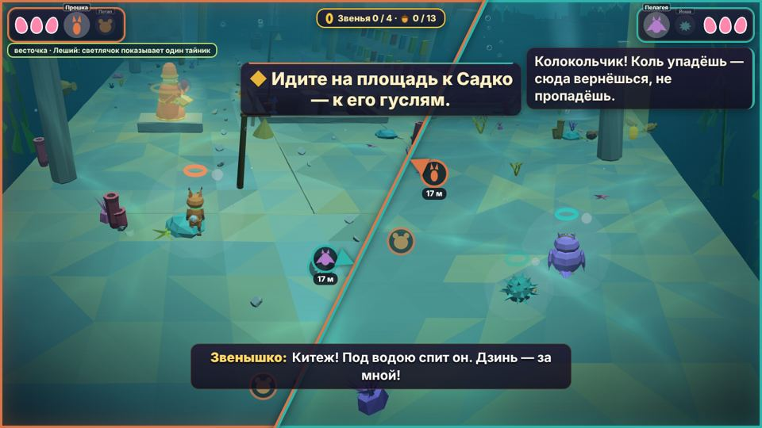
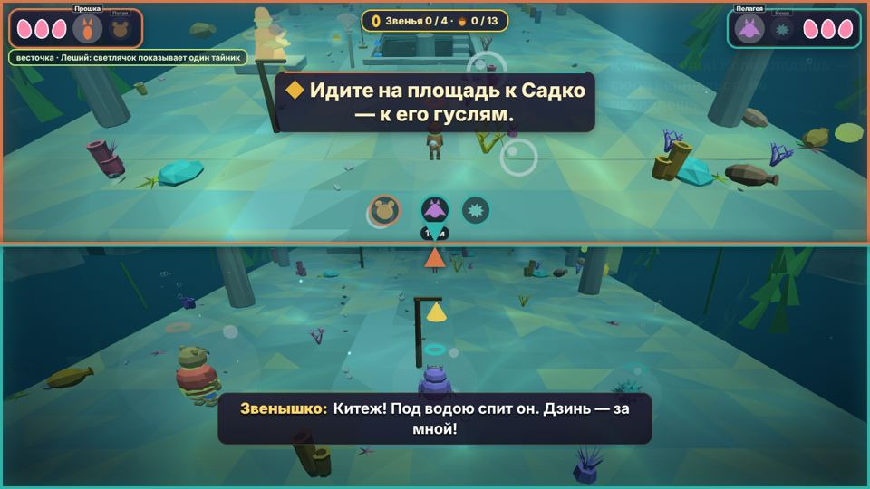
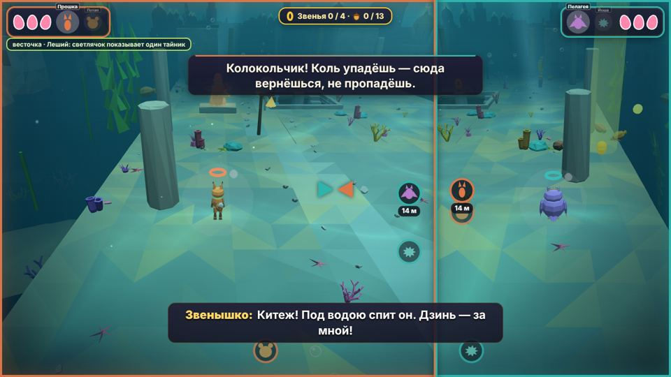

# Экран на двоих: разбор референсов и новая система раздела

Как устроен раздел экрана в играх для двоих за одним экраном, чем была слаба наша система и что сделано по каждому из десяти пунктов.

Где лежит код:
- ядро — `proto/engine/08_zven_tasks_camera.js` (объект `SPLIT`, `decideSplit`, `splitLayout`, `render`, `splitDom`);
- иконки и всплывающий текст — `proto/engine/09_hud_cine.js`;
- релиз — `zlataya_cep/build/late_89b_split.js`: наклонная линия, тени для каждой панели, настройки.

Бот — `tfin_split`.

## Референсы

| Игра | Схема | Что взято |
|---|---|---|
| **LEGO** (TT Games, начиная с LEGO Star Wars) | Пока герои рядом, экран общий. Когда расходятся, его делит линия **под любым углом**: она перпендикулярна направлению между героями, толщина растёт с расстоянием. В момент разделения обе половины показывают ровно общий кадр. В The LEGO Movie Game в настройках можно выбрать динамический или вертикальный раздел | наклонная линия, бесшовный переход, выбор раскладки в настройках, толщина линии |
| **LEGO Skywalker Saga** | Отказались от динамического раздела в пользу постоянного вертикального: у каждого своя свободная 3D-камера, и общий угол линии теряет смысл. Игроки жаловались на укачивание от вращающейся линии | при повороте своей камеры наклонная линия становится прямой; угол линии сглажен и не реагирует на мелкие повороты |
| **A Way Out / It Takes Two / Split Fiction** (Hazelight) | Экран разделён всегда. Доли **меняются**: панель растёт у того, у кого важный момент, второй продолжает играть. Бывает горизонтальный раздел. В погонях и 2D-участках панели сливаются | режим «у каждого свой», доля экрана (фокус), горизонтальный раздел |
| **Super Mario 3D World** | Только общий экран, камера отъезжает. Ушедшего за кадр уносит пузырём к ведущему; при входе в трубу остальных переносит к вошедшему | режим «всегда общий» с переносом отставшего |
| **DKC Returns / LittleBigPlanet / NSMB Wii** | Отставших переносит к остальным (DKC), долго находящийся за кадром погибает (LBP), у краёв кадра невидимые стены (NSMB) | для детей выбран мягкий перенос (как в DKC), без наказания |

## Как было и что мешало
- Экран делился, когда герои дальше 8 м по земле, и сливался ближе 6 м. Линия была только вертикальной, **Игрок 1 всегда слева**.
- **Перекрёст.** Если в общем кадре Игрок 1 стоял справа, при разделении левая половина сначала показывала Игрока 2 и полсекунды ехала через весь экран.
- **Высота не учитывалась** (`hd` — расстояние по земле). Порог не зависел от того, влезают ли оба героя в кадр.
- **Бой сливал экран при любом расстоянии.** Отъезд общей камеры был без предела (`7,2 + 0,8·sep`): при 40 м между героями — 39 м назад и 24 м вверх.
- Половина экрана — узкое окно 8 : 9: обзор по горизонтали около 54° против 85° на общем экране, а камера стояла на тех же 7,2 м.
- Одна карта теней на середину пары, до ±40 м: в разделённом экране тени вдвое мутнее.
- Ничего промежуточного: ни доли экрана, ни режимов, ни выбора раскладки.

## Что сделано (по пунктам)
1. **Стороны по кадру.** Пока экран общий, линия смотрит туда, где на экране общей камеры стоит Игрок 2: кто левее, у того левая панель; при горизонтальном разделе кто выше, у того верхняя. Сторона держится до слияния. Направление считается по позе общей камеры без поворота правым стиком: при разделении все камеры возвращаются к этой позе.
2. **Порог по кадру и высоте.**
   - Расстояние для решения — `√(по земле² + (1,3·по высоте)²)` (`splitSep`).
   - Экран делится и тогда, когда ноги или макушка героя дольше 0,5 с за краем кадра общей камеры (`splitFrame` > 1).
   - Слияние — ближе 6 м, оба в кадре с запасом (< 0,85) и без стены между ними.
   - После каждой смены — задержка 1 с, чтобы экран не мигал на границе.
3. **Бой и потолок отъезда.**
   - Бой сводит экран, только если герои ближе 16 м (`cfg.fightMax`); дальше экран остаётся разделённым.
   - Отъезд общей камеры считается не дальше чем для 24 м между героями (`cfg.sepCap`): камера не дальше 26,4 м назад и 16 м вверх. Нужен там, где экран не делится: `W.noSplit`, «всегда общий».
4. **Наклонная линия, как в LEGO** (`G.splitLayout='dynamic'`; «сама» — на высокой графике).
   - Линия поперёк направления от Игрока 1 к Игроку 2 на экране общей камеры.
   - Угол сглажен (~0,3 с) и не меняется, пока направление повернулось меньше чем на 6°.
   - Каждая панель — многоугольник; её камера смотрит на своего героя, а центр кадра сдвинут в центр тяжести панели. В начале перехода сдвиг нулевой, и обе панели — ровно общий кадр.
   - Отрисовка: панель Игрока 1 — прямо на экран своей рамкой, панель Игрока 2 — в текстуру размером с холст (WebGL2 — MSAA ×4). Текстура ложится поверх по своей стороне линии полноэкранным шейдером.
   - Повернул кто-то свою камеру правым стиком больше чем на 15–25° — линия плавно уходит к прямой.
   - Прямая линия рисуется двумя окнами, без текстуры.
5. **Доля экрана.**
   - `splitFocus(pi, доля, сек)` — уровню, когда у одного игрока своё событие (доля 0,5–0,7).
   - Сама: когда бьётся только один из двоих (враг ближе 14 м к нему и не к другу), у него 60 %.
   - Доля меняется плавно (~0,5 с).
6. **Режимы и раскладка в «Настройках».**
   - «Экран на двоих»:
     - «сам делится» — как раньше, но с новыми правилами;
     - «всегда общий» — дальше 18 м через 1,2 с того, кто меньше ходил, Звенышко переносит к другу. Перенос не идёт сквозь закрытые ворота, `W.noCarry` и `W.pullMax`, если герой держит плиту, если упал или у друга нет опоры;
     - «у каждого свой» — как у Hazelight.
   - «Линия раздела»: «сама» / «наклонная» / «слева и справа» / «сверху и снизу».
   - Ролики, сценарные камеры, боевые зоны и `W.noSplit` — общий экран в любом режиме, `W.forceSplit` — разделённый.
7. **Узкий экран.** «Сама» при соотношении сторон меньше 1,25 : 1 (4 : 3, планшет, портрет) делит экран сверху и снизу.
8. **Камера в половине.**
   - Вертикальный раздел: камера на 0,8 м дальше и на 0,32 м выше, угол обзора 64° (был 60°).
   - Горизонтальный: 70°, +0,4 м.
   - Наклонный: 58°, +0,4 м.
9. **Тени.** На высокой графике перед каждой панелью карта теней заново строится вокруг её героя (±20 м); на средней и низкой — одна, как раньше.
10. **Линия — подсказка.**
    - Толщина 6–12 px растёт с расстоянием (8–38 м).
    - Иконка напарника у края своей панели (у линии), под ней — сколько до него метров; иконка напарника — поверх остальных.
    - «Ко мне!» подсвечивает линию цветом позвавшего (~1,2 с), а его иконка в панели друга пульсирует.

## Интерфейс в раздельном экране
- **`PANES`** — `{cam, x, w, h, pi, poly, A, box, real}`.
  - `cam` проецирует точку мира на весь экран (`x + (ndc.x·0,5+0,5)·w`), так что прежние формулы работают.
  - Видна ли точка в своей панели — `paneHas(P, x, y, отступ)`, край панели по лучу из её центра — `paneEdge`, панорама звука панели — `panePan(pi)`.
  - На них переведены иконки героев за кадром, всплывающий текст, пузыри кнопок, стрелка-подсказка (`late_79d`), стрелки к другу и звук зова (`late_91c`), панорама ударов и сердца, кромка боли по форме панели (`late_91b`).
- **Панели героев и карточки подсказок** остаются в своих углах: Игрок 1 — слева, Игрок 2 — справа, как в LEGO. Чья панель где, видно по цветной рамке и линии.

## Настройка
`SPLIT.cfg`:

| Параметр | Значение | Что задаёт |
|---|---|---|
| `split` / `merge` | 8 / 6 м | порог разделения и слияния |
| `dy` | 1,3 | вес высоты в расстоянии |
| `fightMax` | 16 м | ближе — бой сводит экран |
| `sepCap` | 24 м | потолок отъезда общей камеры |
| `leash` | 18 м | порог переноса в «всегда общий» |
| `autoFocus` | 0,6 | доля того, кто бьётся (0 — выкл) |
| `dz` | 6° | мёртвая зона угла наклонной линии |

## Проверка
- `tfin_split` — на ровном дне у старта 2-1 и у жемчужницы там же. Проверяет:
  - стороны по кадру в обе стороны;
  - 7 м — общий экран, расстояние с высотой;
  - сверху и снизу;
  - наклонную линию (текстура, угол), мёртвую зону и плавный доворот;
  - уход к прямой при повороте камеры стиком;
  - долю 65 %;
  - «Ко мне!» (свечение, метры);
  - «у каждого свой» и «всегда общий» (перенос);
  - потолок отъезда;
  - бой: 22 м — разделён, 12 м — общий.
- Старые боты камеры: `tsplit`, `tfin_cam`, `tfin_fadesplit`.
